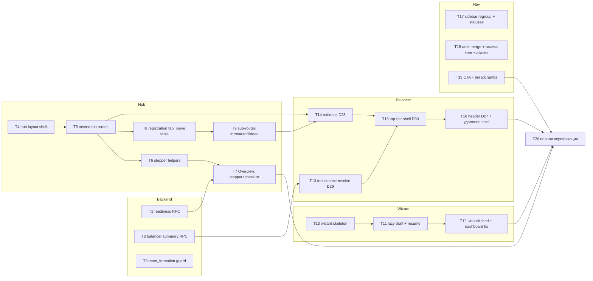

# Admin/Balancer UX Redesign — Phase 1 Implementation Plan

> **For Claude:** REQUIRED SUB-SKILL: Use superpowers:executing-plans to implement this plan task-by-task.

**Goal:** Каркас v3.1-дизайна: турнирный хаб с URL-табами и living checklist, wizard создания, балансер-инструмент без shell, переезд registrations в хаб.

**Architecture:** Next.js App Router nested routes заменяют useState-табы хаба; клиентский layout держит гейт/realtime/общие запросы; балансер сжимается до одной страницы-инструмента с top-bar, контекст резолвится через новый balancer-summary RPC; checklist питается новым readiness RPC (app-service, shared models). Серверная авторизация не меняется.

**Tech Stack:** Next.js 16 App Router, TanStack Query v5, zustand, shadcn/ui, vitest; backend — FastAPI-style FastStream RPC (RabbitMQ) за Go-gateway, SQLAlchemy shared models, pytest.

**Дизайн-источник (обязателен к прочтению исполнителем):** `docs/plans/admin-balancer-ux-redesign.md` (v3.1 APPROVED, решения D1–D30) + `docs/plans/admin-balancer-ux-inventory.md` (as-is карта).

**Правила для всех задач:**
- Коммит после каждой задачи (`rtk git add … && rtk git commit -m "…"`), conventional commits.
- Тесты писать ТОЛЬКО там, где задача создаёт новый контракт (helpers, endpoints, redirect-маппинг, предикаты). Перенос компонентов тестируется существующими тестами + smoke.
- Не запускать полный проектный lint/test-suite в середине потока — только точечные файлы; полная верификация — T20.
- Frontend-команды из `frontend/`: `rtk npx vitest run <path>` (точечно), `rtk tsc --noEmit` (типы). Backend: `rtk python -m pytest <service>/tests -k <name>` из `backend/`.
- Любой перенесённый компонент: НЕ переписывать, только перепроводка контекста (D25).

---

## Граф зависимостей



Параллелить можно: {T1,T2,T3}, {T4→…}, {T10→…}, {T17,T18,T19}. Балансер-цепочка (T13–T16) — строго после T9+T14 (SK-O7: сначала новые адреса, потом redirect'ы, потом снос shell).

---

## Workstream A — Backend

### Task T1: Readiness RPC (D13, §7.1)

**Files:**
- Create: `backend/app-service/src/services/dashboard/readiness.py`
- Modify: `backend/app-service/src/rpc/statistics.py` (новый subscriber рядом с dashboard-stats)
- Test: `backend/app-service/tests/test_tournament_readiness.py`
- Modify: `gateway/internal/*` — маршрут `GET /api/v1/admin/tournaments/{id}/readiness` → топик `rpc.app.statistics.tournament_readiness` (найти реестр по образцу существующего dashboard-маршрута: `rtk grep -n "statistics" gateway/internal -r`)

**Контракт ответа** (поля маскируются по правам вызывающего — G-O1/D16):

```python
class TournamentReadiness(BaseModel):
    tournament_id: int
    status: str                       # state machine status
    team_formation: str               # "balancer" | "draft"
    # видимо при tournament.read:
    schedule_configured: bool | None
    grid_selected: bool | None
    stages_total: int | None
    stage_slots_filled: bool | None
    bracket_generated: bool | None
    encounters_total: int | None
    encounters_with_logs: int | None
    logs_used: bool | None            # ≥1 лог загружен (§3: иначе "Logs: not used")
    # видимо при team.read (иначе None → чеклист рисует no-access):
    registration_form_configured: bool | None
    registration_open: bool | None
    registrations_pending: int | None
    registrations_approved: int | None
    registrations_checked_in: int | None
    registrations_ranked: int | None  # по СОХРАНЁННЫМ rank-данным, НЕ autofill-preview (SK-O12)
    pool_ready: int | None
    pool_need_fix: int | None
    balance_saved: bool | None
    balance_exported_at: str | None
    draft_session_status: str | None
```

**Step 1: Failing test** — счётчики и маскировка:

```python
async def test_readiness_counts(session, seeded_tournament):
    r = await compute_readiness(session, seeded_tournament.id)
    assert r.registrations_approved == 3
    assert r.logs_used is False

async def test_readiness_masks_fields_without_team_read(...):
    # user только с tournament.read → registrations_* is None
```

Run: `rtk python -m pytest app-service/tests/test_tournament_readiness.py -v` → FAIL (модуль не существует).

**Step 2: Реализация** `compute_readiness(session, tournament_id, *, can_tournament_read, can_team_read)` — одиночные `select(func.count())` по shared-моделям (образец агрегатов: `backend/app-service/src/services/dashboard/service.py`; там же паттерн `is_hidden`-фильтров). Права проверять как в соседних subscriber'ах (`c.require_workspace_permission` с ANY-семантикой: пробовать `tournament.read`, иначе `team.read`; обе неудачи → forbidden).

**Step 3:** тест зелёный → **Step 4:** gateway-маршрут (по образцу соседнего) → **Step 5:** commit `feat(app-service): tournament readiness endpoint`.

### Task T2: Balancer tournament-summary RPC (D29, §7.3)

**Files:**
- Modify: `backend/balancer-service/src/rpc/admin.py`
- Test: `backend/balancer-service/tests/test_admin_summary.py` (рядом с существующими)
- Modify: gateway — `GET /api/balancer/tournaments/{id}/summary`

**Step 1: Failing test** — hidden-турнир виден при `team.read`, workspace_id не-nullable:

```python
async def test_summary_returns_hidden_tournament_for_team_read(...):
    resp = await call_rpc("admin.tournament_summary_get", tournament_id=hidden_t.id, user=organizer_with_team_read)
    assert resp == {"id": hidden_t.id, "name": hidden_t.name,
                    "status": hidden_t.status, "workspace_id": hidden_t.workspace_id}
```

**Step 2: Реализация** — копия паттерна `_tournament_config_get` (admin.py:57-68): `require_admin_panel` → `_get_tournament_workspace_id` → `require_workspace_permission(..., "team", "read")` → вернуть `{id, name, status, workspace_id}` из tournament-строки (не из config — non-nullable по построению):

```python
@broker.subscriber("rpc.balancer.admin.tournament_summary_get")
async def _tournament_summary_get(data: dict, msg: RabbitMessage) -> dict:
    async def op(session: Any) -> Any:
        user = c.active_actor(data)
        c.require_admin_panel(user)
        tournament_id = c.require_id(data)
        ws_id = await _get_tournament_workspace_id(session, tournament_id)
        c.require_workspace_permission(data, user, ws_id, "team", "read")
        t = await admin_balancer.get_tournament_row(session, tournament_id)  # id/name/status
        return {"id": t.id, "name": t.name, "status": t.status, "workspace_id": ws_id}
    return await c.envelope(logger, "admin.tournament_summary_get", op, session_factory=_SF)
```

**Steps 3–5:** тест зелёный, gateway-маршрут, commit `feat(balancer-service): tournament summary RPC for tool context`.

### Task T3: Guard смены team_formation при активной draft-сессии (§7.4, SK-O2)

**Files:**
- Modify: сервис admin-update турнира — ОБА write-path'а (mid-extraction, CG-O6): `backend/tournament-service/src/services/admin/tournament.py` и `backend/parser-service/src/services/admin/tournament.py`
- Test: `backend/tournament-service/tests/` (рядом с существующими admin-тестами)

**Step 1: Failing test** — PATCH `team_formation` при draft-сессии в статусе не-`cancelled`/`completed` → ошибка валидации.
**Step 2:** в update-функции: если `team_formation` меняется — `select(DraftSession).where(session.tournament_id == id, status.notin_(("cancelled","completed")))`; найдено → raise business-error (по образцу соседних валидаций файла). Продублировать в parser-service (или вынести в shared-хелпер, если оба уже импортируют общий модуль — предпочесть shared).
**Steps 3–5:** зелёный → commit `feat(tournament): forbid team_formation change during active draft`.

---

## Workstream B — Hub каркас

### Task T4: Client-layout хаба (§1.1)

**Files:**
- Create: `frontend/src/app/admin/tournaments/[id]/layout.tsx` (server, тонкий)
- Create: `frontend/src/app/admin/tournaments/[id]/TournamentHubShell.tsx` (client)
- Modify: `frontend/src/app/admin/tournaments/[id]/page.tsx` (усохнет до redirect в T5)

**Шаги:**
1. Вынести из текущего `page.tsx` в `TournamentHubShell`: 17-флаговый гейт (`page.tsx:253-276`), header (`TournamentWorkspaceHeader`), маунт `useTournamentRealtime` (`:188-191`), общие запросы (tournament, counts, stages) с ТЕМИ ЖЕ query-keys (`tournamentWorkspace.queryKeys.ts`) — иначе сломается patch-in-cache.
2. Layout: `export default function Layout({children, params})` → `<TournamentHubShell tournamentId={…}>{children}</TournamentHubShell>`.
3. Пока табы ещё в page.tsx — shell оборачивает старую страницу (промежуточно рабочее состояние).
4. Проверка: открыть хаб в браузере (`hub`-процесс dev-сервера), убедиться: header/гейт/realtime живы, вкладки работают по-старому.
5. Commit `refactor(hub): extract client layout shell`.

### Task T5: Nested tab routes (D2, D20)

**Files:**
- Create: `frontend/src/app/admin/tournaments/[id]/{overview,teams,stages,matches,settings,draft,veto,logs}/page.tsx` — по одному тонкому файлу: `dynamic()`-импорт существующего tab-компонента из `[id]/components/` (маппинг из инвентаризации: overview→TournamentSetupTab БЕЗ StageManager-переноса — StageManager остаётся внутри TournamentSetupTab до T5.4, matches→TournamentMatchesTab, logs→TournamentLogsTab, teams→TournamentTeamsTab, veto→TournamentMapVetoTab, settings→TournamentSettingsTab, draft→DraftSessionDashboard)
- Create: `frontend/src/app/admin/tournaments/[id]/stages/page.tsx` — StageManager **as-is** (вынуть из TournamentSetupTab; SK-O9: Overview не уплотняется)
- Modify: `frontend/src/app/admin/tournaments/[id]/page.tsx` → `redirect("overview")` (relative → `./overview` через `redirect(\`/admin/tournaments/${id}/overview\`)`)
- Create: `frontend/src/app/admin/tournaments/[id]/tab-guards.ts` + test

**Route-guards** (`tab-guards.ts`, чистая функция — тестируемый контракт):

```ts
export type TabKey = "overview"|"registration"|"teams"|"stages"|"matches"|"settings"|"draft"|"veto"|"logs";
export function allowedTab(tab: TabKey, p: {
  canUpdateTournament: boolean; canUpdateEncounter: boolean;
  canTeamRead: boolean; teamFormation: "balancer"|"draft";
}): boolean {
  switch (tab) {
    case "settings": return p.canUpdateTournament;
    case "veto":     return p.canUpdateEncounter;
    case "registration": return p.canTeamRead;
    case "draft":    return p.teamFormation === "draft";
    default:         return true;
  }
}
```

**Шаги:**
1. Failing test `tab-guards.test.ts` (таблица случаев из текущего условного рендера `page.tsx:310-321,404-427`) → зелёный.
2. Создать route-файлы; таб-бар в shell — `<Link>`-ы вместо `setActiveTab`, активная вкладка из `usePathname`; недоступные — скрыты; guard в shell: недоступный pathname → `router.replace(…/overview)`.
3. Императивные переходы: `onEditClick` в header → `router.push(…/settings)`; переходы из DraftSessionDashboard — аналогично.
4. Per-tab запросы: `enabled`-условия из `page.tsx:113-115` перевывести из pathname (в shell — `const tab = usePathname().split("/").at(-1)`), запросы данных остаются на своих местах.
5. Smoke в браузере: пройти все 8 вкладок по URL напрямую (включая прямой заход на `/settings` без права — redirect), refresh на каждой.
6. Commit `feat(hub): URL-addressable tabs with route guards`.

### Task T6: Stepper-хелперы эффективных фаз (D19)

**Files:**
- Create: `frontend/src/app/admin/tournaments/[id]/overview/effective-phases.ts` + `.test.ts`

**Step 1: Failing tests** (порядок машины из `backend/shared/core/tournament_state.py`: `REGISTRATION → [CHECK_IN] → [DRAFT] → LIVE → PLAYOFFS → COMPLETED → [ARCHIVED]`):

```ts
test("balancer tournament skips draft phase", () =>
  expect(effectivePhases({ teamFormation: "balancer", schedule: ["registration","check_in","live"] })
    .map(p => p.key)).toEqual(["registration","check_in","live","playoffs","completed","archived"]));
test("check_in optional flag set when absent from schedule", ...);
test("drift status not in chain is appended as current", ...); // форс-переходы, циклы completed↔archived
```

**Step 2:** реализация `effectivePhases(...): {key, optional, reached}[]`. **Steps 3–5:** зелёный, commit `feat(hub): effective phase chain helper`.

### Task T7: Overview — stepper + living checklist (§3)

**Files:**
- Create: `frontend/src/app/admin/tournaments/[id]/overview/PhaseStepper.tsx`
- Create: `frontend/src/app/admin/tournaments/[id]/overview/LifecycleChecklist.tsx`
- Create: `frontend/src/app/admin/tournaments/[id]/overview/checklist-model.ts` + `.test.ts`
- Modify: overview/page.tsx (встроить над TournamentSetupTab-контентом); `frontend/src/services/admin.service.ts` (+`getTournamentReadiness`)
- Modify: shell (T4) — подписка на `tournament:{id}:balancer` по образцу `useTournamentRealtime` → invalidate readiness-query (+refetchOnWindowFocus, БЕЗ 60s-интервала — CG-O4)

**`checklist-model.ts` — контракт (D22, D16):** чистая функция `buildChecklist(readiness, perms): Item[]`, `Item = {key, phase, state: "done"|"todo"|"warn"|"skipped"|"no-access", href}`. Предикаты применимости — таблица §3 дизайна. Ключевые случаи в failing-тестах:

```ts
test("registration items are no-access when readiness registration fields are null", ...);
test("check-in item skipped when phase absent from schedule", ...);
test("logs item neutral when logs_used=false", ...);
test("formation items follow team_formation", ...);
test("archived never warns", ...);
```

`href` пунктов — на финальные адреса вкладок (D20): `…/registration`, `…/teams`, `…/stages`, `…/matches?tab=logs`.

**Шаги:** failing tests → model → компоненты (стилистика существующих Setup Health-тайлов) → smoke в браузере (турнир balancer-типа и draft-типа) → commit `feat(hub): lifecycle stepper and living checklist`.

### Task T8: Вкладка registration — переезд таблицы (D25)

**Files:**
- Create: `frontend/src/app/admin/tournaments/[id]/registration/page.tsx`
- Move: `frontend/src/app/balancer/registrations/page.tsx` → `frontend/src/app/admin/tournaments/[id]/registration/RegistrationsTable.tsx` (git mv, компонент as-is) + `_components/*` → рядом
- Modify: перепроводка контекста внутри перенесённого файла

**Перепроводка (единственные разрешённые правки):**
1. `useSearchParams().get("tournament")` → `tournamentId` prop из route-параметра.
2. Каталоги статусов/сабролей: читаются от `currentWorkspaceId` — в хабе store уже выровнен по workspace турнира существующим `useSyncActiveWorkspace` (прецедент подтверждён Арбитром); правок не требуется, но ДОБАВИТЬ комментарий-ссылку на D25.
3. Кнопка «Autofill ranks» и ссылки Form/Feed → относительные `registration/rank-autofill` и т.д.
4. Старый `/balancer/registrations/page.tsx` пока остаётся (dual availability до T14) — новый файл импортирует тот же компонент: `export { default } from "…/RegistrationsTable"` c адаптером props. Проще: компонент — в НЕЙТРАЛЬНОЕ место `frontend/src/components/balancer/registrations/RegistrationsTable.tsx`, оба роута рендерят его (старый передаёт tournament из query, новый — из path). Так и делать.

**Проверка:** существующие vitest-тесты registrations-колонок/группировок проходят без правок (`rtk npx vitest run src/components/balancer/registrations` — пути тестов поправить при move); браузер-smoke: модерация (approve, check-in, bulk) из НОВОГО адреса. Commit `feat(hub): registrations table as hub tab (dual availability)`.

### Task T9: Sub-routes form / rank-autofill / feed (D25)

**Files:** аналогично T8 — по одной задаче-переносу на страницу:
- `frontend/src/app/admin/tournaments/[id]/registration/{form,rank-autofill,feed}/page.tsx`
- Компоненты → `frontend/src/components/balancer/{form,rank-autofill,feed}/…` (нейтральное место, dual availability)
- Back-кнопки страниц → `…/registration` хаба; i18n rank-autofill работает под admin-layout (NextIntlClientProvider в корне — проверено GuardianDelta)

**Проверка:** smoke каждой страницы с нового адреса (сохранение формы, preview autofill, sheet-маппинг); `rtk tsc --noEmit`. Commit `feat(hub): registration builders as hub sub-routes`.

---

## Workstream W — Wizard

### Task T10: Wizard-скелет `/admin/tournaments/new` (§2, D3)

**Files:**
- Create: `frontend/src/app/admin/tournaments/new/page.tsx`
- Create: `frontend/src/app/admin/tournaments/new/wizard-model.ts` + `.test.ts`
- Create: шаги `steps/{BasicsStep,ScheduleStep,RulesStep,RegistrationStep,ReviewStep}.tsx`

**Паттерн — копия `[id]/components/draft/setup-model.ts` + `DraftSetupWizard.tsx`** (степпер, per-step валидация, кликабельный «назад», sticky Continue). Поля шагов — из `TournamentFormFields` (Basics/Challonge), `TournamentSettingsTab` (Schedule/Rules секции — переиспользовать под-компоненты, НЕ копировать), form-builder Status-карточка (шаг 4, виден при `team.import` — D17).

**`wizard-model.ts` failing tests:**

```ts
test("step 1 is the only required step", ...);
test("create-now available after step 1 valid", ...);
test("step 4 hidden without team.import", ...);
```

Commit `feat(wizard): tournament creation wizard skeleton`.

### Task T11: Ленивый черновик + Create now + resume (D4)

**Files:**
- Modify: `wizard-model.ts`, `new/page.tsx`
- Modify: `frontend/src/services/admin.service.ts` (create принимает `is_hidden: true`; тип `TournamentCreateInput` дополнить полем — CG отметил его отсутствие)

**Поведение (тестируемое в wizard-model + smoke):**
1. Шаги 1–3 — client-state. Первое действие, требующее id (вход в шаг 4 | Challonge-импорт | Create now | Review) → `POST` с `is_hidden: true` (паттерн `ensureSession` из DraftSetupWizard.tsx:205-233).
2. «Create now» = создать с дефолтами 2–4 → redirect в хаб overview.
3. Review & Create → снять `is_hidden` (публикация) → redirect.
4. Resume: `new/page.tsx` при маунте ищет незавершённый Unpublished-черновик (created_by = я, is_hidden, нет стадий/регистраций — простейший признак: последний is_hidden своего workspace) → prompt «Continue setup / Start new».
5. Ссылка «полный form builder» из шага 4 → `…/{draftId}/registration/form` (внутренняя, D25).
6. Commit `feat(wizard): lazy unpublished draft, create-now, resume`.

### Task T12: Unpublished-бейдж + удаление диалогов + dashboard-фильтр

**Files:**
- Modify: `frontend/src/app/admin/tournaments/page.tsx` — колонка/бейдж «Unpublished» (`is_hidden`), row-click по черновику → prompt «Continue setup / Open hub»; **удалить** create-диалог и edit-диалог (кнопка Create → `router.push("tournaments/new")`; правка — Settings хаба); delete остаётся
- Modify: `frontend/src/app/admin/page.tsx:106` — `tournaments.find(t => !t.is_finished && !t.is_hidden)` (SK-O4.3)
- Modify: `frontend/src/components/dashboard/GreetingBar.tsx` — CTA «New Tournament» → `/admin/tournaments/new`

Проверка: smoke списка (бейдж, prompt), дашборда (черновик не захватывает ActiveTournamentCard). Commit `feat(admin): unpublished badge, wizard entry points, drop legacy dialogs`.

---

## Workstream C — Балансер-инструмент

### Task T13: Контекст-резолв инструмента (D29)

**Files:**
- Create: `frontend/src/app/balancer/useToolContext.ts`
- Modify: `frontend/src/services/balancer-admin.service.ts` (+`getTournamentSummary`)
- Modify: `frontend/src/app/balancer/BalancerLayoutClient.tsx`

**Поведение:**
1. `useToolContext()`: читает `?tournament=` → `getTournamentSummary(id)` (T2) → при `workspace_id !== currentWorkspaceId` → `setCurrentWorkspace(workspace_id)` существующим механизмом (`useSyncActiveWorkspace`-паттерн; глобальная инвалидация WorkspaceBootstrap — приемлемое сегодняшнее поведение, НЕ чинить — D29/Арбитр).
2. Гейт layout'а: после резолва — существующий `adminEntryPermissions ∨ isOrganizer`, но `workspaceId` = из summary, не из store (BalancerLayoutClient.tsx:114-118).
3. Нет/невалиден `?tournament=` → экран-указатель: заголовок + одна ссылка «Open a tournament» → `/admin/tournaments` (A-O5). Гейт-рендер до резолва — LoadingState.
4. **Store-выравнивание строго до первых data-запросов пула** (`apiFetch` инжектит workspace — Риск 1): data-хуки главной получают `enabled: contextReady`.

Проверка: smoke — диплинк на турнир чужого workspace (store переключается, пул грузится верно), на Unpublished-черновик (открывается), без параметра (указатель). Commit `feat(balancer): tool context resolution via summary endpoint`.

### Task T14: Redirect'ы D28 + удаление мёртвого кода

**Files:**
- Create: `frontend/src/app/balancer/redirect-map.ts` + `.test.ts`
- Modify: `frontend/src/app/balancer/{registrations,registrations/form,registrations/rank-autofill,registrations/feed,statuses,pool,applications}/page.tsx` → тонкие redirect-страницы
- Delete: `frontend/src/app/balancer/components/BalancerTournamentSelect.tsx` (мёртвый — подтверждено)

**`redirect-map.ts` (контракт, failing test first):**

```ts
export function balancerRedirectTarget(path: string, params: URLSearchParams): string {
  const t = params.get("tournament");
  const carry = new URLSearchParams();                       // SK-O5
  for (const k of ["status","source","group"]) { const v = params.get(k); if (v) carry.set(k, v); }
  const q = carry.size ? `?${carry}` : "";
  if (path.startsWith("/balancer/statuses")) return "/admin/balancer";
  if (!t) return "/admin/tournaments";
  const base = `/admin/tournaments/${t}/registration`;
  if (path === "/balancer/registrations") return `${base}${q}`;
  if (path === "/balancer/registrations/form") return `${base}/form`;
  if (path === "/balancer/registrations/rank-autofill") return `${base}/rank-autofill`;
  if (path === "/balancer/registrations/feed") return `${base}/feed`;
  if (path === "/balancer/pool" || path === "/balancer/applications")
    return t ? `${base}${path === "/balancer/applications" ? "?source=google_sheets" : ""}` : "/admin/tournaments";
  return "/admin/tournaments";
}
```

Тест-кейсы: с/без `?tournament=`, перенос `status/source/group`, statuses. Старые page.tsx → `redirect(balancerRedirectTarget(...))`. Dual availability T8/T9 заканчивается здесь: нейтральные компоненты остаются, балансер-роуты становятся redirect'ами. Commit `feat(balancer): permanent redirects to hub routes`.

### Task T15: Top-bar инструмента (D30)

**Files:**
- Create: `frontend/src/app/balancer/BalancerToolTopBar.tsx`
- Modify: `frontend/src/app/balancer/BalancerLayoutClient.tsx` — заменить SidebarProvider+BalancerSidebar+breadcrumb на top-bar
- Modify: `frontend/src/app/balancer/components/BalancerPresenceStack.tsx` — убрать `useSidebar()` (бросает вне SidebarProvider — SK-O4), рендер в top-bar

**Top-bar обязан содержать (D30):** `#balancer-header-slot` (PresetRunPanel портирует только сюда, без fallback — контейнер обязателен); presence-host; «← Tournament hub» → `/admin/tournaments/{id}/teams` (уважая `?return=` из wizard); имя+статус турнира (из T13 summary); кнопка «Rank autofill» → `…/registration/rank-autofill`.

Проверка: smoke главной — Run-контролы в top-bar, presence виден, run job идёт, back-link ведёт в teams. `rtk npx vitest run src/app/balancer` (существующие тесты селекторов). Commit `feat(balancer): standalone tool top-bar, drop sidebar shell`.

### Task T16: Header D27 + зачистка shell

**Files:**
- Modify: `frontend/src/components/Header.tsx:84-87` — удалить пункт `balancer`; предикат пункта `admin`: `canAccessAdmin || isOrganizer` (тот же, что открывал балансер, строки 140-148)
- Delete: `frontend/src/components/balancer/BalancerSidebar.tsx`, `frontend/src/components/balancer/balancer-navigation.ts`, sidebar-cookie чтение в `frontend/src/app/balancer/layout.tsx`
- Modify: тексты пустых состояний, ссылающиеся на «balancer header/switcher» (`rtk grep -rn "balancer header" frontend/src`)

Проверка: `rtk tsc --noEmit` (оборванные импорты); smoke Header под organizer-ролью. Commit `feat(nav): admin entry covers organizers, remove balancer header item and shell leftovers`.

---

## Workstream N — Навигация админки

### Task T17: Sidebar-группы + Balancer Statuses (§5, D12)

**Files:**
- Modify: `frontend/src/components/admin/admin-navigation.ts` — перегруппировка: Overview / Tournaments / Data browser (Teams, Players, Encounters, Standings) / Workspace (Divisions, **Balancer Statuses** → `/admin/balancer`, Achievements, Members, Branding) / Game Content / Administration; префикс-гейт `/admin/balancer`: `team.import` → `team.read` (строка ~281)
- Modify: `frontend/src/components/admin/admin-navigation.test.ts` — обновить + добавить кейс «team.read видит /admin/balancer»
- Modify: `frontend/src/app/admin/balancer/page.tsx` — мутации скрыты без `team.update` (серверная матрица)

Тесты навигации first (существующий файл — расширить), затем правки. Commit `feat(admin-nav): lifecycle-oriented sidebar groups, statuses entry`.

### Task T18: Rank-merge + Access-пункт + алиасы палитры (D11, D10)

**Files:**
- Move: контент `frontend/src/app/admin/settings/page.tsx` (Rank Collection config + Rank Mapping) → таб в `frontend/src/app/admin/rank/page.tsx`; settings/page.tsx → `redirect("/admin/rank")`
- Modify: `admin-navigation.ts` — Access как один пункт (внутренние табы `access/layout.tsx` остаются единственной внутренней навигацией); удалить пункт Settings; переименования «Player Identities» / «Staff Access»
- Modify: `frontend/src/components/admin/AdminCommandPalette.tsx` — поле `aliases?: string[]` у nav-item (`"users"→оба Users-пункта, "settings"→Rank Collection`), поиск учитывает алиасы (+тест в admin-navigation.test.ts или отдельный)

Commit `feat(admin-nav): merge rank settings, single access entry, palette aliases`.

### Task T19: Breadcrumbs с именами + перекрёстные ссылки Users

**Files:**
- Modify: breadcrumb-логика в `frontend/src/app/admin/AdminLayoutClient.tsx` — для `/admin/tournaments/[id]/*` подставлять имя турнира (из кэша query — он уже загружен shell'ом), для team detail — имя команды; fallback «Details»
- Modify: `frontend/src/app/admin/users/page.tsx` + `frontend/src/app/admin/access/users/page.tsx` — перекрёстная ссылка в карточке/диалоге пользователя (D9)

Commit `feat(admin): entity-name breadcrumbs, cross-links between identity and access users`.

---

## Task T20: Полная верификация Фазы 1

1. `cd frontend && rtk tsc --noEmit && rtk lint && rtk npx vitest run` — весь фронт.
2. `cd backend && rtk python -m pytest app-service/tests balancer-service/tests tournament-service/tests` (точечные сервисы задач A).
3. **Сквозной browser-smoke (обязателен, чеклист):**
   - Wizard: Create now → хаб overview → checklist активен; полный путь 5 шагов с Challonge-off.
   - Хаб: 6 вкладок по прямым URL; guard settings без права; deep-link из checklist в registration.
   - Registration: модерация из хаба; form/autofill/feed sub-routes.
   - Инструмент: «Open balancer» из teams → пул → run → top-bar контролы → back-link; диплинк с чужим workspace; без параметра — указатель.
   - Redirect'ы: старые `/balancer/*` адреса с query.
   - Header: organizer видит admin-пункт; дашборд-CTA → wizard; Unpublished не в ActiveTournamentCard.
4. Обновить `docs/plans/admin-balancer-ux-redesign.md`: статус Фазы 1 → done, зафиксировать отклонения от плана.
5. Commit `chore: phase 1 verification fixes` (если были правки).

---

## Фазы 2–3 — каркас (детализировать ПОСЛЕ посадки Фазы 1)

**Фаза 2 (консолидация):** Teams mode-панель + Draft-слияние (redirect `draft→teams`; fallback `/draft-live` при тесноте Control Room); StageManager — извлечение логики в модули + характеризационные тесты (D23, прецедент `divisions/*.behavior.test.tsx`) → декомпозиция → Map Veto секцией (redirect `veto→stages`); Matches+Logs (redirect `logs→matches`); ChallongeSyncPanel → Settings/Integrations. Порядок redirect'ов — как в D20.

**Фаза 3 (полировка):** паттерн-свод §6 (row-click/«…»/AlertDialog/window.confirm ×3 в StageManager/серверная пагинация/`workspaceService` в workspaces-delete); `is_finished`-дедупликация (D14: обе admin-схемы + реконсиляционная миграция + 4 фронтовых писателя); токены design-book в админке и `--aqt-*`-миграция драфта.
