# Admin match surfaces + result consolidation — Implementation Plan

> **For Claude:** REQUIRED SUB-SKILL — use `superpowers:executing-plans` to implement this plan task by task.
> TDD is mandatory (`superpowers:test-driven-development`) for every task that creates a new contract.

**Goal:** Give admins two new surfaces — captain match reports and log-parsed matches — on top of a single, non-contradictory encounter-result model.

**Architecture:** Phase 0 collapses the two competing result-finalization mechanisms into one shared primitive plus one atomic admin write, enforced by a DB CHECK constraint, and gives `matches.match` a real FK to its log record. Phases 1 and 2 then add read surfaces and a single write action each. Nothing about the captain-facing report flow, the bracket engine, the balancer, or the draft changes.

**Tech stack:** Python 3.12 / SQLAlchemy 2 / FastStream (RabbitMQ RPC workers), Alembic, Go 1.22 gateway (`edge.RouteSpec` tables), Next.js App Router + TanStack Query/Table + shadcn/ui, vitest, pytest.

**Design source (mandatory reading for the implementer):** `docs/plans/2026-08-03-admin-match-surfaces-design.md`.
Supporting context: `docs/plans/admin-balancer-ux-redesign.md` §6 (pattern set), `docs/plans/2026-07-18-encounter-captain-reports-rework.md`, `docs/design-book.md`.

**Rules for all tasks:**
- Commit after each task, conventional commits.
- Tests **only** where the task creates a new contract. Do not add tests to already-covered infrastructure.
- No project-wide lint or test runs mid-flow — run only the files the task touched. Full verification is the last task of each phase.
- Commands: `rtk python -m pytest backend/<svc>/tests -k <name>`, `rtk npx vitest run <path>`, `rtk npx tsc --noEmit`, `rtk go test ./gateway/...`.
- Every new HTTP route requires the full five-step checklist: `edge.RouteSpec` → `apidocs/groups.go` → `openapi_schemas.py` + `openapi_docs.py` → regenerate `gateway/internal/openapi/schemas.json` (`backend/scripts/export_openapi_schemas.sh`) → `gateway/internal/edge/apiv1_guard_test.go` if a new table was added. A missing manifest entry degrades silently to a generic `object` — verify, do not assume.
- The admin panel is **not** translated. New admin strings are hardcoded English, matching every existing admin screen.

---

## Invariants (MUST NOT break)

1. `result_status = CONFIRMED` **⟺** `status = COMPLETED` on `tournament.encounter`, after `encres0001`. Enforced by `ck_encounter_result_status_matches_status`.
2. Exactly one `finalize_encounter_score` exists in the tree, under `backend/shared/services/encounter/`.
3. The elimination draw guard (`_NO_DRAW_STAGE_TYPES`) fires on **every** finalization path, including parser-service.
4. Every transition into `COMPLETED` emits exactly one `EncounterCompletedEvent` and enqueues exactly one tournament recalculation.
5. Captain-facing behaviour is unchanged: `POST /api/v1/encounters/{id}/report` keeps its contract, its guards, and its auto-confirm/auto-dispute semantics.
6. `advance_winner` stays idempotent; bracket propagation and veto-session sync remain in the caller's transaction.
7. Workspace scoping: no admin list may return a row from a workspace the caller lacks `match.read` on.
8. `matches.match` rows are never created, deleted or renumbered by this work. Only `log_record_id` is added.
9. `AdminDataTable` is not modified — new lists consume it as-is.
10. Every result transition appends exactly one `EncounterResultAudit` row — the audit is append-only and is never updated or deleted outside the encounter's `ON DELETE CASCADE`.
11. `submitted_by_id`, `submitted_at` and `confirmed_by_id` do not survive Phase 0 anywhere: model, schemas, frontend type, OpenAPI manifest.

---

## New / changed API surface

| Kind | Method | Path | RPC subject | Gate |
|---|---|---|---|---|
| NEW | POST | `/api/v1/admin/encounters/{encounter_id}/result` | `rpc.tournament.encounter_set_result` | `match.update` |
| NEW | POST | `/api/v1/admin/encounters/{encounter_id}/result/reopen` | `rpc.tournament.encounter_reopen_result` | `match.update` |
| NEW | GET | `/api/v1/admin/encounter-reports` | `rpc.tournament.admin_encounter_reports_list` | `match.read` |
| NEW | GET | `/api/v1/admin/encounter-reports/stats` | `rpc.tournament.admin_encounter_reports_stats` | `match.read` |
| NEW | GET | `/api/v1/admin/matches` | `rpc.tournament.admin_matches_list` | `match.read` |
| NEW | GET | `/api/v1/admin/matches/{match_id}` | `rpc.tournament.admin_match_get` | `match.read` |
| NEW | GET | `/api/v1/admin/encounters/{encounter_id}/result-audit` | `rpc.tournament.encounter_result_audit` | `match.read` |
| ENRICH | GET | `/api/v1/encounters/{id}/reports` | `rpc.tournament.captain_reports` | unchanged — gains a typed response |
| REMOVE | POST | `/api/v1/admin/encounters/{id}/confirm-result` | `rpc.tournament.encounter_confirm_result` | — |
| REMOVE | PATCH | `/api/v1/admin/encounters/bulk` | `rpc.tournament.encounter_bulk_update` | — |

All new routes go into the existing `gateway/internal/tournament/admin_misc_routes.go` table, so `gateway/cmd/gateway/main.go` needs no new `Register` call. Within the table, place the literal `/api/v1/admin/matches` before `/api/v1/admin/matches/{match_id}`.

---

## Dependency graph

```mermaid
graph LR
  T1[T1 shared finalize] --> T2[T2 set_result + reopen]
  T1 --> T4[T4 challonge]
  T2 --> T3[T3 lock down update/create/bulk]
  T3 --> T5[T5 encres0001 migration]
  T2 --> T5
  T4 --> T5
  T5 --> T6[T6 consumers -> result_status]
  T1 --> T7[T7 delete mechanism C]
  T8[T8 log FK model+migration] --> T9[T9 parser writes FK]
  T5 --> T10[T10 frontend cutover]
  T6 --> T11[T11 Phase 0 verification]
  T9 --> T11
  T10 --> T11
  T11 --> T12[T12 report schemas]
  T12 --> T13[T13 reports list+stats RPC]
  T13 --> T14[T14 reports gateway+openapi]
  T14 --> T15[T15 reports hub sub-tab]
  T15 --> T16[T16 resolve dialog]
  T16 --> T17[T17 reports data browser]
  T11 --> T18[T18 match schemas + list/get RPC]
  T18 --> T19[T19 matches gateway+openapi]
  T19 --> T20[T20 maps sub-tab + Sheet]
  T20 --> T21[T21 matches data browser]
  T17 --> T22[T22 nav + routes + guards]
  T21 --> T22
  T22 --> T23[T23 full verification + docs]
```



Parallelisable: **T7** and **T8** are independent of the T1→T6 chain and of each other. **T12/T13** and **T18** are independent once T11 lands. **T15–T17** and **T20–T21** are independent tracks.

---

# PHASE 0 — Result consolidation (prerequisite)

## Task T1: Single `finalize_encounter_score` (D12, D13, §7.1)

**Files:**
- Create: `backend/shared/services/encounter/__init__.py`, `backend/shared/services/encounter/finalize.py`
- Modify: `backend/tournament-service/src/services/encounter/finalize.py` → thin re-export that binds `post_advance=veto_session_service.sync_veto_session_after_team_change`
- Delete: `backend/parser-service/src/services/encounter/finalize.py`
- Modify: `backend/parser-service/src/services/challonge/sync.py` (import the shared finalize, pass the veto hook)
- Test: `backend/shared/tests/test_finalize_encounter_score.py`

**Contract:**
```python
async def finalize_encounter_score(
    session: AsyncSession,
    encounter_id: int,
    *,
    home_score: int,
    away_score: int,
    source: FinalizeSource,            # now recorded, not `del`-ed
    encounter: Encounter | None = None,
    status: EncounterStatus = EncounterStatus.COMPLETED,
    result_status: EncounterResultStatus | None = None,
    confirmed_at: datetime | None = None,
    post_advance: Callable[[AsyncSession, Encounter], Awaitable[None]] | None = None,
) -> FinalizedEncounterScore
```

**Step 1 — failing test.** Assert: a drawn score on a `SINGLE_ELIMINATION` stage raises 400; `post_advance` is awaited once per advanced encounter; passing `post_advance=None` skips it without error; the function still does not commit. Run `rtk python -m pytest backend/shared/tests/test_finalize_encounter_score.py` → FAIL (module does not exist).

**Step 2 — move.** Copy `backend/tournament-service/src/services/encounter/finalize.py:1-111` verbatim into the shared module; replace the direct `veto_session_service` import with the `post_advance` parameter; replace `del source` with recording `source` on the returned `FinalizedEncounterScore`. Keep `_load_encounter_for_update` and `_load_stage_type` private in the shared module. Models come from `shared.models`, not `src.models`.

**Step 3 — rebind callers.** tournament-service's module becomes a re-export that partially applies the veto hook, so its existing call sites are untouched. parser-service's Challonge sync imports the shared function directly and passes the same hook — this is the fix for the missing draw guard and veto sync (F3).

**Step 4 — green.** `rtk python -m pytest backend/shared/tests/test_finalize_encounter_score.py backend/tournament-service/tests -k encounter`.

**Step 5 — commit.** `refactor(encounter): single shared finalize_encounter_score with post_advance hook`

---

## Task T2: `set_encounter_result` + `reopen_encounter_result` (D14, D15, §7.2, §7.3)

**Files:**
- Modify: `backend/shared/models/tournament/encounter_result_audit.py` — new `EncounterResultAudit` model + `EncounterResultAuditAction` enum (create the file; register it in `shared/models/__init__.py`)
- Modify: `backend/shared/models/tournament/encounter.py` — drop `submitted_by_id`, `submitted_at`, `confirmed_by_id` and the `submitted_by`/`confirmed_by` relationships (D29, D30); add the `result_audit` relationship
- Modify: `backend/tournament-service/src/services/encounter/captain.py` — replace `admin_confirm_result` with `set_encounter_result`; add `reopen_encounter_result`; both append an audit row; route the `confirmed` branch of `_recompute_encounter_result` through the same argument set and have it append `auto_confirm`/`auto_dispute` (§7.4)
- Modify: `backend/shared/services/bracket/advancement.py` — `_reset_stale_result` stops writing the dropped columns and appends a `cascade_reset` audit row
- Modify: `backend/tournament-service/src/schemas/admin/encounter.py` — add `EncounterSetResultInput`, `EncounterResultRead`, `EncounterResultAuditRead`
- Modify: `backend/tournament-service/src/schemas/encounter.py` and `backend/parser-service/src/schemas/encounter.py` — `EncounterRead` loses the three columns
- Modify: `backend/tournament-service/src/rpc/admin_misc.py` — replace `_encounter_confirm_result` with `_encounter_set_result`; add `_encounter_reopen_result` and `_encounter_result_audit`
- Modify: `gateway/internal/tournament/admin_misc_routes.go` — replace the `confirm-result` spec with `result`, `result/reopen` and `result-audit`
- Modify: `backend/tournament-service/src/openapi_schemas.py`, `src/openapi_docs.py`
- Test: `backend/tournament-service/tests/test_encounter_set_result.py`, `backend/tournament-service/tests/test_encounter_result_audit.py`

**Contract:**
```python
class EncounterSetResultInput(BaseModel):
    home_score: int | None = Field(None, ge=0)
    away_score: int | None = Field(None, ge=0)
    closeness: int | None = Field(None, ge=1, le=10)
    adopt_report_team_id: int | None = None

class EncounterResultRead(BaseModel):
    id: int
    status: EncounterStatus
    result_status: EncounterResultStatus
    home_score: int
    away_score: int
    closeness: float | None
    confirmed_at: datetime | None

class EncounterResultAuditRead(BaseModel):
    id: int
    encounter_id: int
    actor_user_id: int | None       # NULL = machine actor
    actor_name: str | None
    action: EncounterResultAuditAction   # confirm|reopen|auto_confirm|auto_dispute|import|cascade_reset
    from_result_status: EncounterResultStatus | None
    to_result_status: EncounterResultStatus
    home_score_before: int | None
    away_score_before: int | None
    home_score_after: int
    away_score_after: int
    adopted_team_id: int | None
    source: str
    created_at: datetime
```

**Step 1 — failing test**, one case per branch:
- explicit scores win over everything;
- `adopt_report_team_id` adopts that team's report;
- no body + two agreeing reports adopts their score;
- no body + current non-zero score keeps it;
- no body + `0-0` + no usable report → `422 result_score_unresolved`;
- already `confirmed` → `409`;
- exactly one audit row with `action=confirm`, `actor_user_id` = the acting admin, correct before/after scores and `adopted_team_id` when branch (b) was taken;
- exactly one `EncounterCompletedEvent`;
- `reopen` clears score/`closeness`/`confirmed_at`, sets `open`/`none`, appends `action=reopen`, keeps captain reports, cascades downstream when the previous result had advanced, and `409`s on `none`;
- a confirm → reopen → confirm sequence leaves exactly three audit rows in chronological order, and `GET .../result-audit` returns them newest-first;
- captain auto-confirm appends `auto_confirm` with the second reporting captain as actor; a mismatch appends `auto_dispute`.

Run `rtk python -m pytest backend/tournament-service/tests/test_encounter_set_result.py` → FAIL.

**Step 2 — implement** per design §7.2/§7.3. Load `FOR UPDATE` with `selectinload(captain_reports → map_codes)`. The guard widens relative to `admin_confirm_result` (`captain.py:433-440`): accept every non-`confirmed` value.

**Step 3 — wire** the RPC handlers (`ensure_workspace_permission(user, ws_id, "match", "update")`, mirroring `admin_misc.py:110`), then the gateway specs, then `openapi_schemas.py`/`openapi_docs.py`, then regenerate the manifest.

**Step 4 — green** + `rtk go build ./gateway/...`.

**Step 5 — commit.** `feat(encounter): atomic admin result endpoint replacing confirm-result`

---

## Task T3: Lock down the status-only writers (D16, D17)

**Files:**
- Modify: `backend/tournament-service/src/schemas/admin/encounter.py` — `EncounterUpdate.status` / `EncounterCreate.status` validator rejecting `completed`; delete `BulkEncounterUpdate`
- Modify: `backend/tournament-service/src/services/admin/encounter.py` — `update_encounter` no longer calls finalize; `create_encounter` rejects `completed`; delete `bulk_update_encounters`
- Modify: `backend/tournament-service/src/rpc/admin_misc.py` — delete `_encounter_bulk_update`
- Modify: `gateway/internal/tournament/admin_misc_routes.go` — delete the bulk spec
- Test: `backend/tournament-service/tests/test_encounter_admin_update_guards.py`

**Step 1 — failing test.** `PATCH` with `status=completed` → `409 use_result_endpoint` naming `/result`; `POST` create with `status=completed` → `409`; a `PATCH` that changes an unrelated field on an already-completed encounter triggers **no** advancement and **no** `EncounterCompletedEvent` (fixes F7); `rpc.tournament.encounter_bulk_update` is no longer registered.

**Step 2 — implement.** Removing the finalize call from `update_encounter` also removes the `completed_by_this_update` post-state test at `admin/encounter.py:286` that caused F7. Keep the veto sync on team change (`:281-284`).

**Step 3 — green.** `rtk python -m pytest backend/tournament-service/tests -k "encounter_admin or bulk"`.

**Step 4 — commit.** `feat(encounter)!: status=completed only via the result endpoint; drop bulk update`

---

## Task T4: Challonge import joins the single mechanism (D18)

**Files:**
- Modify: `backend/tournament-service/src/services/challonge/sync.py` — `_upsert_encounter_from_challonge` passes `result_status=CONFIRMED` and `confirmed_at=now`; `import_tournament` calls `enqueue_encounter_completed` per newly-completed encounter and appends an `action=import`, `actor_user_id=NULL`, `source='challonge'` audit row; the conflict predicate consults `result_status`
- Modify: `backend/parser-service/src/services/challonge/sync.py` — same three changes
- Test: `backend/tournament-service/tests/test_challonge_result_confirmation.py`

**Step 1 — failing test.** An imported completed match ends `CONFIRMED` with `confirmed_at` set and exactly one `action=import` audit row whose `actor_user_id` is NULL; `EncounterCompletedEvent` is emitted (fixes F4); a remote score differing from a local `CONFIRMED` is **skipped** and recorded in the sync log rather than overwritten, appending **no** audit row (fixes F9); a local `DISPUTED` is likewise protected.

**Step 2 — implement.** Conflict predicate: `was_completed or result_status in (CONFIRMED, DISPUTED, PENDING_CONFIRMATION)`. `_advance_completed_challonge_matches` keeps its unconditional re-finalize — `advance_winner` is idempotent (invariant 6) — but must now pass the same `result_status`.

**Step 3 — green.** `rtk python -m pytest backend/tournament-service/tests -k challonge`.

**Step 4 — commit.** `fix(challonge): imported results are confirmed results and emit completion events`

---

## Task T5: Migration `encres0001` (§9)

**Files:**
- Create: `backend/migrations/versions/encres0001_consolidate_encounter_result_status.py`
- Test: `backend/tournament-service/tests/test_encres0001_migration.py`

**Step 1 — failing test.** Seed `completed + none`, `completed + disputed`, `completed + pending_confirmation`, an `open + confirmed` row, a non-confirmed row carrying stale `closeness`, and a row with a non-NULL `confirmed_by_id`. After upgrade: every `completed` row is `confirmed`; the stale `closeness` is NULL; the audit table exists and holds exactly one seeded `action='confirm'` row for the encounter that had `confirmed_by_id`, with `created_at = confirmed_at`; the three columns and their two FK constraints are gone; the constraint exists and rejects a violating insert. A deliberately unclassifiable row makes the pre-constraint assert raise with the offending count in the message.

**Step 2 — implement** the seven steps of design §9 in order, with the `pg_enum` check that `encounterstatus` stores the member name (`COMPLETED`), not `.value` — the constraint expression depends on it. The audit seed runs **before** the columns are dropped. Downgrade re-adds the three columns as nullable and drops the constraint and the audit table; say so in the docstring.

**Step 3 — green.** `rtk python -m pytest backend/tournament-service/tests/test_encres0001_migration.py`.

**Step 4 — commit.** `feat(db): backfill encounter result_status and enforce completed<->confirmed`

---

## Task T6: One completion predicate (D20, fixes F2)

**Files:**
- Modify: `backend/shared/services/tournament_utils.py:31-40` — drop the `status==COMPLETED` disjunct
- Modify: `backend/tournament-service/src/services/standings/service.py:127-128` — drop the redundant `status` conjunct
- Modify: `backend/shared/services/bracket/advancement.py:175-182` — `_reset_stale_result` also clears `closeness` (D19, fixes F6). The dropped-column removal and its `cascade_reset` audit row land in T2; this task only adds the `closeness` clear
- Test: `backend/shared/tests/test_completion_predicate.py`

**Step 1 — failing test.** Under the T5 constraint, `tournament_utils.completed` and the standings filter classify identically for every combination; `_reset_stale_result` leaves `closeness IS NULL`.

**Step 2–4.** Implement, run `rtk python -m pytest backend/shared/tests backend/tournament-service/tests -k "standings or completed or advancement"`, commit `refactor(encounter): result_status is the single completion predicate`.

---

## Task T7: Delete Mechanism C (D21) — *parallelisable*

**Files:**
- Delete: `backend/parser-service/src/services/encounter/captain.py`, `backend/parser-service/src/services/admin/encounter.py`
- Delete: `backend/parser-service/tests/test_captain_match_report.py`, `tests/test_encounter_write_locks.py`, `tests/test_bulk_encounter_update.py`
- Modify: `backend/parser-service/src/services/encounter/service.py` — delete `update_encounter_result` (`:445-471`, zero callers)
- Modify: `backend/parser-service/src/services/encounter/flows.py` — delete the dead `create_match` wrapper (`:232-265`, zero callers)

**Step 1.** Re-verify zero production importers before deleting: `rtk grep -rn "services.encounter.captain\|services.admin.encounter\|update_encounter_result" backend/parser-service/src`. Expect no hits outside the files being deleted.

**Step 2.** Delete. **Step 3.** `rtk python -m pytest backend/parser-service/tests` (the suite must stay green with three fewer files). **Step 4.** Commit `chore(parser): delete the superseded single-slot encounter result mechanism`.

---

## Task T8: `match.log_record_id` model + migration (D22, D23) — *parallelisable*

**Files:**
- Modify: `backend/shared/models/matches/match.py` — `log_record_id` + `log_record` relationship (`lazy="raise"`)
- Create: `backend/migrations/versions/mtchlog001_add_match_log_record_fk.py`
- Test: `backend/parser-service/tests/test_mtchlog001_migration.py`

**Step 1 — failing test.** Seed a record with a bare filename and a match with the same basename; a record with a full S3 key `logs/<tid>/<name>` and a match with the basename; two duplicate records where one is `done`; a match with a synthetic `log_name` matching nothing. After upgrade: the first three link correctly, the `done` duplicate wins, the fourth stays NULL, `record.filename` values are normalised to basenames, and the migration does not fail on the residual NULL.

**Step 2 — implement** design §9 `mtchlog001`, in the stated order — the basename normalisation of `record.filename` runs **after** the join.

**Step 3–4.** Green, commit `feat(db): link matches.match to its log record`.

---

## Task T9: Parser writes the FK (§7.6, D24)

**Files:**
- Modify: `backend/parser-service/src/services/s3/service.py:11-12` — `get_logs_by_tournament` returns basenames
- Modify: `backend/parser-service/src/services/match_logs/log_records.py` — normalise `filename` to a basename in `set_processing` and `upsert_log_record`
- Modify: `backend/parser-service/src/services/match_logs/flows.py` — thread the resolved record into `MatchLogProcessor`; set `log_record_id` on the create branch (`:968-977`) and the update branch (`:989-998`)
- Modify: `backend/parser-service/src/services/encounter/service.py:474-504` — `create_match` accepts `log_record_id`
- Modify: `backend/tournament-service/src/schemas/admin/encounter.py` — remove `log_name` from `MatchUpdate`
- Test: `backend/parser-service/tests/test_match_log_record_link.py`

**Step 1 — failing test.** Parsing a log sets `log_record_id` on a newly created match and on an updated one; the tournament sweep and the upload path now produce identical `record.filename`; `MatchUpdate` rejects `log_name`.

**Step 2–4.** Implement, run `rtk python -m pytest backend/parser-service/tests -k "log or match"`, commit `feat(parser): persist the match -> log record link`.

---

## Task T10: Frontend cutover for the removed endpoints (D14, D16, D17)

**Files:**
- Modify: `frontend/src/services/admin.service.ts` — `+ setEncounterResult`, `+ reopenEncounterResult`, `+ getEncounterResultAudit`; `− confirmEncounterResult`, `− bulkUpdateEncounters`
- Modify: `frontend/src/types/admin.types.ts` — `+ EncounterSetResultInput`, `+ EncounterResultRead`, `+ EncounterResultAuditRead`; `MatchUpdateInput` loses `log_name`; `EncounterUpdateInput.status` narrows to `"OPEN" | "PENDING"`
- Modify: `frontend/src/types/encounter.types.ts` (`:40-42`) — `Encounter` loses `submitted_by_id`, `submitted_at`, `confirmed_by_id` (D29, D30)
- Modify: the four fixtures that set those fields to `null` — `src/app/(site)/encounters/_components/encounters-redesign.helpers.test.ts:38-40`, `src/components/bracket-view.helpers.test.ts:37-39`, `src/lib/tournament-match-order.test.ts:31-33`, and `frontend/src/app/docs/diagrams.ts:594-595` (the ERD mirror)
- Modify: `frontend/src/components/tournaments/EncounterEditDialog.tsx` (`:113`, `:123`), `frontend/src/app/admin/encounters/page.tsx` (`:207`), `frontend/src/app/admin/tournaments/[id]/components/TournamentMatchesTab.tsx` (`:253`) — drop the `COMPLETED` option from status selects and route completion through the confirm control, which now calls `setEncounterResult`

**Steps.** Implement; `rtk npx tsc --noEmit`; `rtk npx vitest run src/components/admin src/app/admin/tournaments/[id]/components`. Commit `feat(admin): route encounter completion through the single result endpoint`.

---

## Task T11: Phase 0 verification

1. `rtk grep -rn "def finalize_encounter_score" backend/` → exactly one hit, under `shared/`.
2. `rtk grep -rn "confirm-result\|bulkUpdateEncounters\|encounter_bulk_update" backend/ frontend/ gateway/` → no hits.
3. `rtk grep -rn "confirmed_by_id\|submitted_by_id\|submitted_at" backend/ frontend/src gateway/` → only the `encres0001` migration.
4. `rtk python -m pytest backend/shared/tests backend/tournament-service/tests backend/parser-service/tests`.
5. `rtk npx tsc --noEmit` + `rtk npx vitest run` + `rtk go test ./gateway/...`.
6. Apply both migrations against a scratch database; assert the constraint holds, the audit seed landed, and log the residual `log_record_id IS NULL` count.
7. Browser smoke: edit an encounter's metadata (no advancement fires), complete it through the confirm control, reopen it, confirm the bracket and standings follow both times and that each step left an audit row.
8. Commit `chore: phase 0 verification fixes`.

---

# PHASE 1 — Match reports surface

## Task T12: Report schemas (D26)

**Files:**
- Create: `backend/tournament-service/src/schemas/admin/encounter_reports.py`
- Modify: `backend/tournament-service/src/services/encounter/captain.py` — `serialize_captain_report` (`:186-190`) returns `CaptainReportRead`
- Modify: `backend/tournament-service/src/rpc/public_rpc.py` — `captain_reports` returns the typed list
- Modify: `backend/tournament-service/src/openapi_schemas.py` — manifest entry for `rpc.tournament.captain_reports`

**Contract:** `EncounterMapCodeRead{id, map_index, map_id, code}`; `CaptainReportRead{id, encounter_id, team_id, side, reporter_user_id, reporter_name, home_score, away_score, closeness, map_codes, created_at, updated_at}`; `EncounterReportsRow{encounter fields…, home_team, away_team, home_report, away_report, reported_count, scores_match, series_score_valid, last_resolution}`; `LastResolution{action, actor_user_id, actor_name, created_at} | None`; `EncounterReportsStats{by_result_status, mismatch_count, awaiting_second_count}`.

**Note:** the frontend's existing `CaptainReport` type (`encounter.types.ts:61-73`) is the contract the public consumers already expect — the new model must serialise to the same shape so `CaptainReportsView` keeps working untouched.

Commit `feat(encounter): typed captain report schemas`.

---

## Task T13: Reports list + stats RPC (§7.7)

**Files:**
- Create: `backend/tournament-service/src/services/admin/encounter_reports.py`
- Modify: `backend/tournament-service/src/rpc/admin_misc.py`
- Test: `backend/tournament-service/tests/test_admin_encounter_reports_list.py`

**Step 1 — failing test.** `Paginated` envelope; workspace scoping (another workspace's encounter never appears); each filter (`tournament_id`, `stage_id`, `result_status[]`, `mismatch_only`, `reported_count`, free text); `scores_match` is `None` with fewer than two reports; `series_score_valid` false for a `3-0` on a BO3; `last_resolution` carries the newest audit row and is `None` when the audit is empty; the stats endpoint's counts equal the filtered list totals; `per_page` capped at 100. Assert the query count is constant across page sizes — `last_resolution` must come from the window-function subquery, not N+1.

**Step 2 — implement** per §7.7, gated with `ensure_workspace_permission(user, ws_id, "match", "read")`. Return the explicit `{results, total, page, per_page}` dict, following `backend/app-service/src/rpc/users_admin.py:132-149`.

**Step 3–4.** Green, commit `feat(admin): encounter reports list and stats`.

---

## Task T14: Reports gateway + OpenAPI

**Files:** `gateway/internal/tournament/admin_misc_routes.go`, `gateway/internal/apidocs/groups.go` (already includes `AdminMiscRoutes` — verify, do not duplicate), `backend/tournament-service/src/openapi_schemas.py`, `src/openapi_docs.py`, regenerated `gateway/internal/openapi/schemas.json`.

Two specs with `AllQuery: true`, `Auth: edge.AuthRequired`. Verify with `rtk grep -n "admin_encounter_reports" gateway/internal/openapi/schemas.json` that both carry a `response` ref. `rtk go test ./gateway/...`. Commit `feat(gateway): expose admin encounter reports`.

---

## Task T15: Reports hub sub-tab (D1, D2)

**Files:**
- Create: `frontend/src/app/admin/tournaments/[id]/matches/reports/page.tsx` (thin shell, `next/dynamic`, `tabFallback`)
- Create: `frontend/src/app/admin/tournaments/[id]/components/TournamentReportsTab.tsx`
- Create: `frontend/src/components/admin/AdminReportPairCell.tsx`
- Create: `frontend/src/components/admin/encounter-reports.helpers.ts` + `.test.ts`
- Modify: `frontend/src/services/admin.service.ts`, `frontend/src/types/admin.types.ts`

Columns: encounter (name + stage/round), teams, `home | away` report pair via `AdminReportPairCell`, series score validity marker, `result_status`, **Resolved by** (`last_resolution.actor_name` + relative time, «—» when the audit is empty), updated. `StatTileGrid` KPI row fed by the stats endpoint. `ToggleGroup` status filter with server counts, following `TournamentLogsTab.tsx:134-137`. Row click opens the resolve dialog (T16). `MatchLogIndicator` for the log column.

**Only the pure helpers are tested** (`series-score validity`, `report pair derivation`, `last_resolution` formatting) — house convention. `src/components/admin/**/*.test.ts` already covers this path in `vitest.config.ts`; no config change needed for this file.

Commit `feat(admin): match reports sub-tab in the tournament hub`.

---

## Task T16: Resolve-result dialog (D4, D14)

**Files:**
- Create: `frontend/src/components/admin/ResolveResultDialog.tsx`
- Modify: `frontend/src/components/tournaments/EncounterEditDialog.tsx` — reuse the same dialog for its confirm control instead of the bespoke mutation

Radio: adopt home report / adopt away report / enter manually; optional closeness override; a preview of the resulting score; the existing `CaptainReportsView` embedded as evidence; a collapsed **change history** from `getEncounterResultAudit`, rendered as «no recorded changes» when empty (design R5b). One `setEncounterResult` call. Blocks submit on a drawn score when the stage is single/double elimination. Surfaces `422 result_score_unresolved` and `409` verbatim. For an already-`confirmed` encounter the primary action becomes **Reopen** behind an `AlertDialog`, calling `reopenEncounterResult`. Invalidates per design §11.

Commit `feat(admin): one-call dispute resolution dialog`.

---

## Task T17: Reports Data browser page (D1, D9)

**Files:** `frontend/src/app/admin/match-reports/page.tsx` — `AdminPageHeader` + `AdminDataTable` over the same endpoint with `tournament_id` unset, plus a `TournamentCombobox` filter in the table's `actions` slot. Reuses `AdminReportPairCell` and `ResolveResultDialog`.

Commit `feat(admin): cross-tournament match reports browser`.

---

# PHASE 2 — Parsed matches surface

## Task T18: Match schemas + list/get RPC (D5, §7.7, NFR 3)

**Files:**
- Create: `backend/tournament-service/src/schemas/admin/matches.py`, `backend/tournament-service/src/services/admin/matches.py`
- Modify: `backend/tournament-service/src/rpc/admin_misc.py`
- Test: `backend/tournament-service/tests/test_admin_matches_list.py`

**Contract:** `LogRecordRef{id, filename, status, source, uploader_name, created_at, started_at, finished_at, error_message}`; `AdminMatchRow{id, encounter{id,name}, tournament{id,name}, map{id,name,gamemode}, home_team, away_team, score, time, code, log_name, log_record}`; `AdminMatchDetail = AdminMatchRow + {rounds, stats_counts{statistics, kill_feed, events}}`.

**Step 1 — failing test.** `Paginated` envelope; workspace scoping; filters `tournament_id`, `encounter_id`, `map_id`, `log_status[]`, `unlinked_only`, free text over `log_name`/`code`/team names; **the list response contains no stat counts** (guards NFR 3); the detail response does, each from one indexed `COUNT(*)`; `log_record` is `null` for an unlinked match.

**Step 2–4.** Implement, green, commit `feat(admin): parsed matches list and detail`.

---

## Task T19: Matches gateway + OpenAPI

Same five-step checklist as T14. Ordering matters inside the table: literal `/api/v1/admin/matches` before `/api/v1/admin/matches/{match_id}`. Commit `feat(gateway): expose admin parsed matches`.

---

## Task T20: Maps sub-tab + provenance Sheet (D5, D7, D25, D28)

**Files:**
- Create: `frontend/src/app/admin/tournaments/[id]/matches/maps/page.tsx`
- Create: `frontend/src/app/admin/tournaments/[id]/components/TournamentParsedMatchesTab.tsx`
- Create: `frontend/src/components/admin/ParsedMatchSheet.tsx`
- Modify: `frontend/src/services/admin.service.ts`, `frontend/src/types/admin.types.ts`

Columns: encounter, map (+ gamemode), score, duration, log status badge (`STATUS_META`/`TONE_CLASS` from `components/admin/tone.ts`), `MatchLogIndicator`. Row click opens `ParsedMatchSheet`, which lazily fetches the detail (`enabled: open`, the pattern documented in `EncounterMatch.tsx:20-26,38-43`).

Sheet content: match meta; provenance block from `log_record`, or an explicit **«provenance unresolved»** state when it is `null` — never a blank or a zero (design book, D28); stat counts; **Download log** (`matchLogDownloadUrl`) and **Re-parse** (`retryLogRecord`), the latter disabled with a stated reason when `log_record` is `null`, and showing the record's `error_message` when the log was deleted on a validation failure.

Commit `feat(admin): parsed matches sub-tab with log provenance`.

---

## Task T21: Matches Data browser page (D1, D9)

**Files:** `frontend/src/app/admin/matches/page.tsx` — same shape as T17, `tournament_id` unset, `TournamentCombobox` in `actions`, reusing `ParsedMatchSheet`.

Commit `feat(admin): cross-tournament parsed matches browser`.

---

## Task T22: Navigation, routes and guards (D2, D3, §10.2)

**Files:**
- Create: `frontend/src/app/admin/tournaments/[id]/matches/page.tsx` — redirect to `.../matches/results`
- Move: the current `matches/page.tsx` body to `matches/results/page.tsx`; the current `logs/page.tsx` body to `matches/logs/page.tsx`
- Create: `frontend/src/app/admin/tournaments/[id]/logs/page.tsx` — permanent redirect to `.../matches/logs`
- Modify: `frontend/src/app/admin/tournaments/[id]/tab-guards.ts` (+ `.test.ts`) — sub-tab keys and `allowedSubTab`; unknown or unpermitted → `.../matches/results`
- Modify: `frontend/src/components/admin/admin-navigation.ts` — two «Data browser» items and two `adminRoutePermissions` entries (`["match.read"]`)
- Modify: `frontend/src/components/admin/admin-navigation.test.ts` — update the Data-browser href assertion (`:52-60`) and re-check the uniqueness/alias assertions (`:108-121`)
- Modify: `frontend/vitest.config.ts` — add `src/app/admin/matches/**/*.test.ts` and `src/app/admin/match-reports/**/*.test.ts`; the `include` list is an explicit allow-list

Sidebar, command palette and breadcrumbs are derived — do **not** edit them.

Commit `feat(admin): matches sub-tab routing and data browser navigation`.

---

## Task T23: Full verification and documentation

1. `rtk npx tsc --noEmit`, `rtk npx eslint`, `rtk npx vitest run`.
2. `rtk python -m pytest backend/shared/tests backend/tournament-service/tests backend/parser-service/tests backend/app-service/tests`.
3. `rtk go test ./gateway/...`; confirm the gateway starts (a `ServeMux` pattern conflict panics at startup, and `apiv1_guard_test.go` is what catches it).
4. Manifest check: all seven new subjects and `rpc.tournament.captain_reports` carry a `response` ref in `gateway/internal/openapi/schemas.json`.
5. **Browser smoke — mandatory checklist** (design §14.5): the two redirects; the reports sub-tab with matching chip counts and a populated «Resolved by» column; a dispute resolved by adopting one side in a single request, with bracket and standings following and an audit row naming the admin; reopening that encounter; the maps sub-tab with a linked and an unlinked match; re-parse flipping the record to `pending`; both Data-browser pages and their Cmd+K entries; a `match.read`-only user seeing no write actions.
6. **Docs:** update `docs/database_erd.md` — add the missing `ENCOUNTER_CAPTAIN_REPORT` / `ENCOUNTER_MAP_CODE` entity blocks (design §6.5), the new `ENCOUNTER_RESULT_AUDIT` entity and its two relationships, the removal of `ENCOUNTER.submitted_by_id`/`confirmed_by_id` from the existing block, the `MATCH.log_record_id` FK and relationship, `ck_encounter_result_status_matches_status`, and the two new revisions in the changelog with the new head. Mirror the same three edits in `frontend/src/app/docs/diagrams.ts`. Mark the design document's phases as done and record any deviation.
7. Commit `chore: admin match surfaces verification and docs`.

---

## Later phases — outline only (detail after this one lands)

- Saved filter views over both lists, reusing `ENCOUNTER_SAVED_VIEW`.
- De-duplicate the two Challonge sync implementations (this plan removes only the finalization divergence).
- Retire `/admin/encounters` into the Data-browser shape once the hub sub-tabs carry the daily workflow.
- Backfill or reconcile the residual `log_record_id IS NULL` set once its production size is known.
