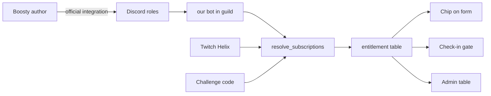

# Subscription Entitlements Design (Boosty + Twitch)

**Status:** approved for planning
**Date:** 2026-08-03
**Plan:** `docs/superpowers/plans/2026-08-03-subscription-entitlements.md`

---

## Understanding Summary

- **What:** a provider-agnostic module that answers one question — *does this site user
  have an active subscription to this workspace's author, and at what tier?* — plus the
  UI/config to surface and enforce that answer.
- **Why:** tournament organizers gate participation on supporting them. Today "Boosty" is a
  free-text custom field on the registration form: unverifiable, unenforceable, invisible to
  the admission flow.
- **Who:** two audiences. Registrants see their own subscription status on the registration
  form's first page and are blocked from check-in without it. Organizers configure the
  provider once per workspace and see per-registration status in admin tables.
- **Scope now:** Boosty and Twitch. The module interface must not assume either.
- **Enforcement point:** **check-in only.** Registration submission is never blocked.
  Status is *displayed* everywhere a provider is configured.
- **Non-goals:** payments/billing inside the platform, reverse-syncing subscribers to the
  provider, Boosty's Telegram integration (a later provider behind the same interface),
  proving ownership of a Boosty *handle*.

## Hard Constraint: Boosty has no OAuth

Boosty exposes **no** public API, **no** third-party OAuth, and **no** webhooks. Everything
circulating publicly is reverse-engineered from the mobile app's private API and requires an
`access_token` + `device_id` obtainable only from a browser session. **"Sign in with Boosty"
cannot be built.**

Boosty's officially supported integration surfaces:

1. **Boosty → Discord.** The author connects Boosty's own bot to their Discord server and
   maps subscription levels to Discord roles.
2. **Boosty → Telegram.** Official bot, private chats, enforces active subscription.
3. Private `api.boosty.to` subscriber list (author's session token) — unofficial.

Twitch, by contrast, is clean and official: `GET /helix/subscriptions/user` with the
`user:read:subscriptions` scope returns tier `1000/2000/3000`. Requires the broadcaster to be
Affiliate or Partner.

**Consequence:** the module is right, but Boosty's source of truth is not OAuth. Boosty
subscription state is derived from Discord roles (primary) or a challenge code (fallback).

## Verified Technical Facts

Load-bearing facts checked against primary sources, not assumed:

| Fact | Verdict | Source |
|---|---|---|
| `GET /guilds/{guild}/members/{user}` needs the privileged `GUILD_MEMBERS` intent | **No.** Discord explicitly names it as the intent-free alternative | [Get Guild Member](https://discord.com/developers/docs/resources/guild#get-guild-member), [You might not need a privileged intent](https://discord.com/developers/docs/events/gateway/you-might-not-need-a-privileged-intent#guild-members-intent) |
| `GET /guilds/{guild}/members` (list) needs it | **Yes** — do not use | [List Guild Members](https://discord.com/developers/docs/resources/guild#list-guild-members) |
| `discord.py` `Guild.fetch_member()` works with `Intents.members` disabled | **Yes** — no intent guard, unlike `fetch_members()` | `discord/guild.py` `fetch_member` vs `fetch_members` |
| Member object always carries `roles` | **Yes**, non-optional; omits implicit `@everyone` | [Guild Member object](https://discord.com/developers/docs/resources/guild#guild-member-object) |
| Rate limits | Per-route bucket keyed on `guild_id` — all member fetches in one guild share a bucket; global 50 req/s | [Rate Limits](https://discord.com/developers/docs/topics/rate-limits) |
| Twitch subscription check | `GET /helix/subscriptions/user`, scope `user:read:subscriptions`, user access token whose `user_id` must match | [Check User Subscription](https://dev.twitch.tv/docs/api/reference#check-user-subscription) |

Two consequences that shape the design:

- **No push.** Without `Intents.members` the bot never receives `GUILD_MEMBER_UPDATE`, so it
  cannot be told when Boosty changes a user's roles. Resolution is pull-based: on demand plus
  a TTL. This is the real constraint, not REST access.
- **No fan-out on render.** Per-guild bucketing means resolving hundreds of registrations
  live would serialize behind one bucket. Verdicts must be persisted and read from the DB for
  list views.

## Existing Foundations Reused

The codebase already contains every pattern this feature needs. Nothing here is new
machinery.

- **OAuth:** `identity-service` — `OAuthProviderBase` + registry, HMAC-signed `state` with
  csrf-binding and single-use nonce, cross-domain tickets, per-provider enable flags in
  `OAuthService._provider_settings`.
- **Token storage:** `auth.oauth_connections` already holds `access_token`, `refresh_token`,
  `token_expires_at`, `provider_data`. Unique on `(provider, provider_user_id)`.
- **Identity:** `SocialAccount` with `is_verified` + `provider_user_id`.
  `SocialProvider.BOOSTY` already exists and is deliberately absent from `OAUTH_PROVIDERS`
  (asserted by `shared/tests/test_social.py`) — that assertion stays true.
- **Discord bot:** `discord-service` already runs `discord.py` with a bot token
  (`settings.discord_token`) and `intents.guilds = True`, and is **already present in
  organizers' guilds** reading match-log attachments.
- **The exact gate precedent:** `shared/services/profile_visibility.py::resolve_profiles_open`
  returns tri-state `True/False/None` keyed by registration id, hard-blocks public check-in on
  a confirmed `False`, fails open on `None`, and feeds `ProfileStatusBadge` +
  `isAdmitted(...)`. This design is a deliberate copy of that shape.

## Design

### Module boundary

`backend/shared/subscriptions/` — lives in `shared` because tournament-service (public
check-in, participant list) and balancer/app-service (admin tables) both consume it, the same
reason `profile_visibility` lives there.

Two entry points. The first resolves raw per-provider verdicts:

```python
async def resolve_subscriptions(
    session: AsyncSession,
    *,
    workspace_id: int,
    auth_user_ids: Sequence[int],
    providers: Sequence[str],
) -> dict[int, dict[str, SubscriptionVerdict]]:
```

Outer key is the user, inner key the provider. Batched and tri-state — the shape
intentionally mirrors `resolve_profiles_open`, widened by one dimension because a tournament
may require several providers at once. One `entitlement` query covers every requested
provider (`provider.in_(...)`), never one query per provider.

```python
@dataclass(frozen=True, slots=True)
class SubscriptionVerdict:
    state: Literal["active", "inactive", "unknown"]
    tier_rank: int | None      # normalized, comparable against min_tier_rank
    tier_label: str | None     # "Уровень 2" / "Tier 1" — display only
    source: str                # discord_role | challenge_code | twitch_helix
    checked_at: datetime
    expires_at: datetime | None
```

`unknown` **fails open**, exactly like an unfetched profile: a provider outage must never
block a live check-in.

The second entry point composes those verdicts into one admission answer — see
*Composing requirements* below.

Providers sit behind a `Protocol` with a single `resolve()` method. Tier normalization and
requirement composition are both pure functions, unit-testable with no infrastructure — same
discipline as `OAuthService.encode_state`.

### Data model

Two tables in a new `subscriptions` schema.

**`subscriptions.provider_config`** — unique `(workspace_id, provider)`, plus `enabled` and
`config_json`:

- `discord_role`: `{guild_id, role_tiers: [{role_id, tier_rank, tier_label}]}`
- `challenge_code`: `{codes: [{code_sha256, tier_rank, tier_label, expires_at}]}`
- `twitch_helix`: `{broadcaster_login, broadcaster_id, tier_map}`

**`subscriptions.entitlement`** — unique `(workspace_id, auth_user_id, provider)`, plus
`state`, `tier_rank`, `tier_label`, `source`, `checked_at`, `expires_at`, `evidence_json`.

Persisted rather than Redis-only for three reasons: the admin table must render hundreds of
verdicts without N live provider calls (see per-guild bucketing above); admission decisions
need an audit trail; and this is precisely how `overwatch_rank.battle_tag_state` backs
`resolve_profiles_open`. Redis sits on top as a short-TTL hot cache.

Secrets discipline: challenge codes are stored as `sha256` only — never plaintext, mirroring
how `StatePayload` carries `csrf` and `guard_hash` as digests only.

### Providers

**`discord_role`** — primary Boosty path. The bot is already in the organizer's guild. The
player's `discord_user_id` comes from their existing verified
`OAuthConnection(provider="discord").provider_user_id`. **No new user-facing scope.**
`Guild.fetch_member()` → role ids → highest matching `tier_rank`.

- `active` — a mapped role is present.
- `inactive` — member exists, no mapped role. Also `404` (not in guild) → treated as
  `inactive`, not an error; 404s do not count toward Discord's invalid-request ban threshold.
- `unknown` — no linked Discord account, bot missing from guild (`403`), or `5xx`.

**`challenge_code`** — fallback for organizers without Discord. Author publishes a secret code
in a post restricted to level X; the player redeems it once, creating an entitlement row with
`expires_at` from config. Never `unknown`. Accepted weakness: a code leaks if one subscriber
shares it — mitigated by per-tournament codes and rotation. It proves *access to level ≥ X*,
not identity.

**`twitch_helix`** — `GET /helix/subscriptions/user` using **the player's** stored user access
token, refreshed on 401. Tier `1000/2000/3000 → 1/2/3`; `is_gift` recorded in
`evidence_json`. Requires adding `user:read:subscriptions` to the Twitch authorization scope
(currently `user:read:email` only), so **every pre-existing Twitch connection lacks it** —
that case resolves to `unknown` with a "reconnect Twitch" CTA rather than a silent failure.

### Form config and enforcement

A tournament may require a subscription on **one** provider, on **all** of several, or on
**any one of** several — and each provider carries its own threshold, because Boosty
"Уровень 2" and Twitch "Tier 2" are unrelated scales. That is a set of per-provider
requirements plus a combinator, so it does not fit in scalar columns.

The gate is check-in only, so `built_in_fields_json` stays untouched. Two new columns on
`balancer.registration_form`:

```
require_subscription: bool = false          -- master toggle
subscription_requirement_json: dict = {}    -- {mode, requirements}
```

```json
{
  "mode": "any",
  "requirements": [
    { "provider": "boosty", "min_tier_rank": 2 },
    { "provider": "twitch", "min_tier_rank": 1 }
  ]
}
```

`mode` is `"any"` or `"all"`. A single-provider requirement is a one-element list, where both
modes collapse to the same answer — no special case in the code. The master toggle mirrors
`require_open_profile` and, more precisely, `Workspace.branding_enabled`, which exists so a
workspace "can turn branding off without losing its saved colours": switching the requirement
off must not destroy the organizer's configuration.

### Composing requirements

This is the subtle part, and getting it wrong silently breaks fail-open.

Each requirement collapses to one of three values:

| Value | Meaning | When |
|---|---|---|
| `T` | confirmed satisfied | `state == active` and `tier_rank >= min_tier_rank` |
| `F` | confirmed refused | `state == inactive`, or `active` below the threshold |
| `U` | undetermined | `state == unknown` (outage, unlinked account, missing scope) |

Composition is **Kleene three-valued logic** — not boolean logic with `unknown` coerced to
either side:

- `all` → `F` if any `F`; else `U` if any `U`; else `T`.
- `any` → `T` if any `T`; else `U` if any `U`; else `F`.

The gate blocks **iff the composed result is `F`** — i.e. only when we are certain no
requirement can be satisfied. `U` passes.

Why this and not the obvious shortcut: coercing `U → False` before composing would make
`any[boosty=F, twitch=U]` block, so a Twitch outage would lock out every Boosty-less patron
who *was* subscribed on Twitch. Coercing `U → True` would make `all[boosty=F, twitch=U]`
pass, letting a confirmed non-subscriber through. Kleene is the only mapping that preserves
"block only on certainty" in both directions.

| Requirement | Result | Check-in |
|---|---|---|
| `all[T, T]` | `T` | pass |
| `all[T, U]` | `U` | pass — Boosty check is down, don't punish the patron |
| `all[T, F]` | `F` | **block** |
| `any[T, F]` | `T` | pass |
| `any[F, U]` | `U` | pass — Twitch might have satisfied it |
| `any[F, F]` | `F` | **block** |
| `any[U, U]` | `U` | pass |

A requirement naming a provider that is not configured or is disabled for the workspace
resolves to `U`, not `F`: an organizer's misconfiguration must not be indistinguishable from
a patron's missing subscription.

The gate goes into `public_rpc._reg_pub_check_in` immediately beside the existing
`require_open_profile` block, with identical semantics: block only on a confirmed refusal.

### UI

**An honest split that must be stated plainly:** the Boosty *handle* stays self-declared
(`SocialAccount(provider="boosty", is_verified=False)`) — neither the Discord path nor the code
path reveals it. What gets verified is the **subscription**, not the handle. The handle is
cosmetic; the entitlement is what is enforced. There will be no "Sign in with Boosty" button,
because none can exist.

`AccountStep` gains a `boosty` row: an optional handle input plus a per-provider subscription
chip. Chips are per row, not one global chip — the Boosty row carries the Boosty verdict, the
Twitch row the Twitch verdict — so a patron can see exactly which side is missing. Above them
sits one summary line stating the actual rule: *"Требуется подписка на Boosty **или**
Twitch"* vs *"**и**"*, driven by `mode`. Without that line an `any` requirement reads as two
independent failures.

The player's required action depends on the provider — Discord: nothing (automatic; if
unlinked, the existing `onLinkAccounts` CTA); code: a "paste the code from the subscriber-only
post" input; Twitch: a "reconnect Twitch" CTA.

Admin tables get one `SubscriptionStatusBadge` column showing the **composed** outcome, with
the per-provider breakdown in the row detail — one column per provider would not scale as
providers are added. `isAdmitted()` learns the same confirmed-refusal-only rule it already
applies to `profilesOpen`, evaluated over the composed result.



## Assumptions

Marked explicitly; none are verified facts.

- `[ASSUMPTION]` Provider config is per **workspace** (one Boosty blog / one Twitch channel
  per organizer); requirements are per **tournament**.
- `[ASSUMPTION]` Entitlement TTL ~15 min; check-in forces a fresh resolve for the acting user
  only.
- `[ASSUMPTION]` Volume is tens-to-hundreds of checks per tournament — nothing to optimize
  beyond avoiding render-time fan-out.
- `[ASSUMPTION]` Organizers using the Discord path already run a Discord server with Boosty's
  bot connected; this is Boosty's own recommended setup.

## Risks

- **Discord dependency for a Boosty feature.** An organizer without Discord falls back to
  challenge codes, which are weaker. Accepted.
- **Role mapping drift.** If the organizer renames or re-creates roles, `role_id` mappings
  break silently and everyone reads `inactive`. Mitigation: the config UI validates that each
  mapped role still exists in the guild, and the resolver distinguishes "role missing from
  guild" (→ `unknown`) from "role exists, user lacks it" (→ `inactive`).
- **Twitch scope migration.** Existing connections resolve `unknown` until re-consent. Fails
  open, so nothing breaks; visible as a CTA.
- **Stale verdicts.** No push from Discord means a cancelled subscription stays `active` for
  up to the TTL. Check-in forces a fresh resolve, which is exactly the moment that matters.

## Decision Log

| # | Decision | Alternatives considered | Why |
|---|---|---|---|
| 1 | No Boosty OAuth; derive Boosty state from Discord roles | Reverse-engineered `api.boosty.to` subscriber sync; challenge codes as the only path | Boosty has no OAuth at all. Discord path is fully official, proves account ownership through OAuth we already have, and yields the real tier. Subscriber sync needs the author's session token, matches on name/email instead of proven ownership, and likely breaches Boosty's ToS |
| 2 | Challenge code as fallback, not primary | Discord-only | Unblocks organizers without a Discord server at low cost; explicitly weaker (leakable, identity-agnostic), so it is secondary |
| 3 | Reject subscriber-list sync (option B) entirely | Ship it as a third provider | Unofficial API, storage of a highly privileged author session token, unproven ownership, probable ToS breach. Poor security-per-unit-value |
| 4 | Module in `shared/subscriptions/`, mirroring `profile_visibility` | Standalone microservice; inline in tournament-service | Two services consume it, exactly like `profile_visibility`. A new service buys nothing for tens of calls per tournament; inlining blocks admin reuse |
| 5 | Tri-state verdict, `unknown` fails open | Boolean with `False` default | Matches the established `resolve_profiles_open` contract. A boolean would make a Discord outage indistinguishable from a cancelled subscription and block live check-ins |
| 6 | Persist verdicts in `subscriptions.entitlement` | Redis-only cache | Per-guild rate-limit bucketing forbids render-time fan-out; admission needs an audit trail; mirrors `battle_tag_state` |
| 7 | Enforce at check-in only; display everywhere | Also gate registration submission | User's explicit call. Also safer: a provider outage during open registration cannot lock people out of signing up |
| 8 | New columns on `registration_form`, not entries in `built_in_fields_json` | Model it as a built-in field with `require_verified` | It is an admission rule, not a form field. `require_open_profile` sets the precedent for exactly this |
| 9 | Boosty handle stays `is_verified=False` | Attempt to derive the handle | Neither viable path exposes the Boosty handle. Marking it verified would be a lie; the entitlement carries the trust instead |
| 10 | `fetch_member` (REST) over `guilds.members.read` OAuth scope | Per-user OAuth to read own member object | REST with the existing bot token needs no per-user consent or token refresh. The OAuth scope is only better for guilds the bot is absent from, which is not our case |
| 11 | Store challenge codes as `sha256` only | Plaintext codes in config | Same discipline as `csrf`/`guard_hash` in `StatePayload`: never persist a raw secret |
| 12 | Requirement is `{mode, requirements[]}` JSON, not scalar columns | `subscription_provider` + `min_tier_rank` scalars; a join table | The rule is a set plus a combinator, and each provider needs its own threshold because tiers are per-platform scales. Scalars cannot express "any one of N". JSON matches how this table already stores `built_in_fields_json`/`custom_fields_json`; a join table adds a migration and a query for config that is always read whole |
| 13 | Compose with Kleene three-valued logic | Coerce `unknown` to `False` before composing; coerce to `True` | Coercing to `False` makes `any[F, U]` block, so one provider's outage locks out patrons subscribed via the other. Coercing to `True` makes `all[F, U]` pass, admitting a confirmed non-subscriber. Kleene preserves "block only on certainty" in both modes |
| 14 | Keep `require_subscription` as a master toggle beside the JSON | Treat empty `requirements` as "off" | Mirrors `Workspace.branding_enabled`, which exists so settings survive being switched off. An organizer disabling the gate mid-tournament must not lose the role mappings and thresholds |
| 15 | Unconfigured/disabled provider in a requirement resolves to `U`, not `F` | Treat it as a refusal | An organizer's misconfiguration would otherwise be indistinguishable from a patron having no subscription, and would block everyone silently |
