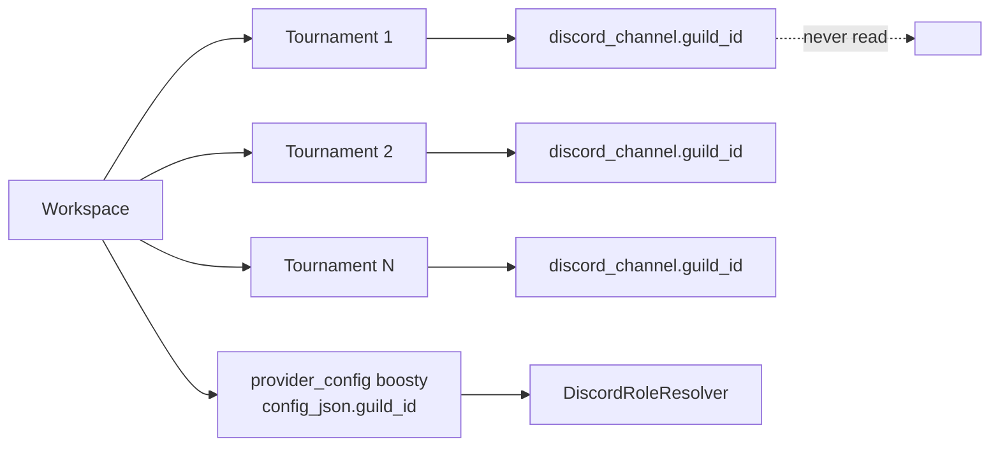

# Workspace Discord Guild — Design

**Status:** accepted (2026-08-04)
**Plan:** `docs/superpowers/plans/2026-08-04-workspace-discord-guild.md`
**Related:** `docs/superpowers/specs/2026-08-03-subscription-entitlements-design.md`

---

## 1. Understanding Summary

- **What:** one source of truth for the organizer's Discord guild id, owned by `Workspace`. Features read it; none of them store a copy.
- **Why:** the snowflake is retyped by hand for **every tournament** and, separately, inside the Boosty provider blob. A divergence between the two silently changes subscription admission, because a missing/wrong guild resolves `unknown` and the gate fails open.
- **Who:** workspace admins (the `/admin/workspaces/[id]` screen already owns branding, domains, timezone), and any future Discord-shaped feature.
- **Constraints:**
  - A Discord snowflake exceeds `2**53`, so it must cross the wire as a string.
  - `Workspace` is a flat typed-column model in the `public` schema. No JSON bag.
  - `settings` is a **global** key/value table (`unique(key)`), not workspace-scoped.
  - Alembic with hand-written revision ids; `alembic heads` is authoritative.
- **Non-goals:** validating that the bot is actually a member of the guild; a Discord bot-install/OAuth flow; moving `broadcaster_id`/`broadcaster_login`; moving `channel_id`.

## 2. Current State (verified against code)

`guild_id` lives in two unrelated places.

| Location | Scope | Type | Who reads it |
| --- | --- | --- | --- |
| `subscriptions.provider_config.config_json["guild_id"]` | workspace + provider (`boosty` only) | `str` inside JSON | `DiscordRoleResolver.resolve` (`shared/subscriptions/providers/discord_role.py:96`) |
| `log_processing.discord_channel.guild_id` | **tournament** (one row per tournament), `BigInteger NOT NULL` | `int` | **nobody** |

The second is pure duplication:

- the bot's `load_active_channels` (`backend/discord-service/main.py:145-178`) builds `{channel_id: tournament_id}` and never touches `guild_id`;
- the parser RPC only persists it (`backend/parser-service/src/rpc/misc.py:128`);
- the frontend requires it in the create form and renders it as a read-only `DetailField` (`TournamentIntegrationsPanel.tsx:213`, `:160`).

Aggravating factor: `SubscriptionProvidersCard` — the screen where the Boosty guild is edited — is mounted **inside a tournament's registration-form builder** (`RegistrationFormBuilder.tsx:436`, passing `workspaceId`). A workspace-scoped setting is edited from a tournament screen.



### 2.1 Fact table

| Claim | Verified where |
| --- | --- |
| `discord_channel.guild_id` has no reader anywhere in the repo | `grep guild_id` across `backend/`, `frontend/`, `gateway/`; only writes + one display |
| `ProviderConfigRow` is built in exactly one production place | `SqlEntitlementStore.load_configs`, `backend/shared/services/subscription_store.py:36-52` |
| That place already receives `workspace_id` | same, signature `load_configs(self, workspace_id: int, providers: Sequence[str])` |
| A missing guild fails open, it does not block | `discord_role.py:101-102` → `unknown("guild_not_configured")`; Kleene composition treats `unknown` as pass |
| `WorkspaceRead` is served on two **public `AuthNone`** routes | `gateway/internal/app/routes.go:42,44` |
| `WorkspaceRead` already exposes non-secret admin config publicly, deliberately | `app-service/src/schemas/workspace.py:48-53` — `custom_domain_verification_token`, with the comment "it is not a secret (the TXT record IS public DNS)" |
| Workspace writes are owned by **app-service** (not tournament-service) | `app-service/src/schemas/workspace.py`, `src/services/workspace/registry.py` |
| Alembic head at time of writing | `subs0003` (scan of 132 revisions — a **hint only**, `alembic heads` is authoritative) |

## 3. Assumptions

| # | Assumption | Confirmed |
| --- | --- | --- |
| A1 | A workspace has exactly one Discord guild: the Boosty patron-roles server and the match-log server are the same server | yes |
| A2 | Clean cutover — no per-feature override, no fallback chain | yes |
| A3 | Production data exists; a backfill is required, not an empty column | yes |
| A4 | Tens of workspaces; performance is irrelevant. Cost is the migration plus front/back coordination | yes |

## 4. Design

### 4.1 Data

```python
# backend/shared/models/tenancy/workspace.py
# The organizer's Discord guild. ONE per workspace: the server where Boosty's bot
# assigns patron roles and the server holding match-log channels are the same one.
# String, not BigInteger: there is no arithmetic, no range query and no FK, while
# both consumers (DiscordRoleResolver, the HTTP boundary) want `str` — a numeric
# column would only buy a conversion at every edge, which is exactly the tax
# `DiscordChannelRead.coerce_snowflake_to_str` was paying.
discord_guild_id: Mapped[str | None] = mapped_column(String(32), nullable=True)
```

Migration `wsguild0001` (`down_revision` from `alembic heads`, **never** hardcoded):

1. `add_column workspace.discord_guild_id String(32) NULL`
2. **Backfill**, in precedence order:
   1. `subscriptions.provider_config.config_json ->> 'guild_id'` where `provider = 'boosty'` — this is the value that is actually read today, so it wins;
   2. otherwise the most recent non-null `log_processing.discord_channel.guild_id` among that workspace's tournaments.
3. **Strip** `guild_id` out of `provider_config.config_json` — leaving it would keep two sources of truth and make the injection order in §4.2 ambiguous.
4. `drop_column log_processing.discord_channel.guild_id`

`downgrade` re-adds `discord_channel.guild_id` as `BigInteger NOT NULL server_default='0'`, backfills from `workspace.discord_guild_id` through the tournament join, then drops the server default, restoring the original schema exactly. Rows with no resolvable guild get `0` — precisely as meaningful as the value was before, since nothing read it. It also writes the guild back into the Boosty `config_json`.

### 4.2 Read path — one chokepoint, resolver untouched

`SqlEntitlementStore.load_configs` is the only production site that constructs `ProviderConfigRow`, and `workspace_id` is already a parameter:

```python
cfg = models.SubscriptionProviderConfig
rows = await self._session.execute(
    sa.select(cfg.provider, cfg.enabled, cfg.config_json, models.Workspace.discord_guild_id)
    .join(models.Workspace, models.Workspace.id == cfg.workspace_id)
    .where(cfg.workspace_id == workspace_id, cfg.provider.in_(list(providers)))
)
return {
    provider: ProviderConfigRow(
        provider=provider,
        enabled=bool(enabled),
        # Guild comes from the workspace, never from the blob. Injected here (the
        # single place configs are born) so the resolver's `config["guild_id"]`
        # contract — and its whole decision table — stays untouched.
        config={**(config or {}), "guild_id": guild_id or ""},
    )
    for provider, enabled, config, guild_id in rows.all()
}
```

Consequences, and the reason this shape was chosen:

- `DiscordRoleResolver` and **all of its unit tests are unchanged.** `str(config.get("guild_id") or "").strip()` still yields `unknown("guild_not_configured")` for a workspace with no guild, so the fail-open guarantee is preserved byte for byte rather than re-argued.
- `redeem_challenge_code` also goes through `load_configs`; it reads only `verification_method` and the code tiers, so the extra key is inert.
- The join cannot drop rows: `provider_config.workspace_id` is a `NOT NULL` FK to `workspace`.

### 4.3 Write path

| File | Change |
| --- | --- |
| `backend/app-service/src/schemas/workspace.py` | `WorkspaceUpdate.discord_guild_id: str \| None` (`^\d{17,20}$`, blank → `None`); `WorkspaceRead.discord_guild_id` with a comment citing the `custom_domain_verification_token` precedent |
| `backend/tournament-service/src/schemas/registration.py:290,351` | drop `guild_id` from `SubscriptionProviderConfigUpsert` / `…Read` |
| `…/services/registration/subscription_config.py:58-59,98` | stop writing and reading `guild_id` |
| `…ConfigListResponse` | **add** `discord_guild_id: str \| None`, read from `Workspace` in `list_provider_configs`, so the Boosty card can warn when it is unset |
| `backend/parser-service/src/schemas/admin/discord_channel.py`, `src/rpc/misc.py:128` | drop `guild_id` from `DiscordChannelUpsert` / `…Read` and from the upsert |

`WorkspaceUpdate` keeps the existing `exclude_unset` semantics: omitted means untouched, explicit `None` clears — identical to the brand colours (`test_workspace_branding_schema.py::test_update_allows_explicit_none_to_clear`).

### 4.4 UI

- **`/admin/workspaces/[id]`** — a "Discord" section beside branding/domains. `EditFormData`, `formFromWorkspace`, and the PATCH payload each gain one field; the input is digits-only.
- **`SubscriptionProviderCard.tsx`** — the Guild input and `guildId` state are removed. In their place a read-only row showing `discord_guild_id`, plus a warning linking to workspace settings when `enabled && role_tiers.length && !discord_guild_id`. `rolesMissing` (`:174-175`) moves from `guildId.trim()` to the new source. i18n keys `subscriptionProviders.guild.*` are rewritten in **both** `en.json` and `ru.json`.
- **`TournamentIntegrationsPanel.tsx`** — the Guild ID field (`:213-227`), the `DetailField label="Guild"` (`:160`), and `guild_id` in form state are removed; the dialog description drops "guild and".

### 4.5 Verification strategy

The fail-open path is the most fragile property of the subscription feature, so it is proved rather than assumed:

1. A workspace with no guild yields `unknown` / `guild_not_configured`, and check-in still succeeds.
2. A stale `config_json.guild_id` cannot outrank the workspace value (regression guard for the injection order in §4.2).
3. The injection itself only exists once real Postgres executes the join, so it is covered in the DSN-gated integration file whose stated purpose is "things only real Postgres has an opinion about". That test **must actually be run with `SUBSCRIPTIONS_IT_DSN` set** — leaving it skipped proves nothing.

Tests that must change: `test_subscription_provider_config.py` (8 `guild_id` assertions), `test_subscription_config_integration.py`, `test_verification_method_integration.py:112`, `test_subscription_store_integration.py:90,108`, `SubscriptionProviderCard.behavior.test.tsx` (4 assertions).

Tests that must **not** change: the resolver's fake-store suites seeded with `{"guild_id": "9"}` (`shared/tests/test_resolve_subscriptions.py`, `test_subscription_check_log.py`, `test_subscription_provider_discord.py`). They assert a contract this design deliberately preserves; that they stay green untouched is the evidence the chokepoint was chosen correctly.

### 4.6 Gateway and docs

No new routes, so there is no `edge.RouteSpec`, no `apidocs/groups.go` entry and no `apiv1_guard_test.go` change — only a regenerated manifest via `bash backend/scripts/export_openapi_schemas.sh`.

`docs/database_erd.md` and its mirror `frontend/src/app/docs/diagrams.ts` move `guild_id` off the `DISCORD_CHANNEL` block (`:1391` / `:1408`) and onto `WORKSPACE`. Note that `WORKSPACE` appears seven times in each file — once fully specified (`database_erd.md:284`, `diagrams.ts:354`) and six times as an `{ int id PK }` stub inside other diagrams. Only the full block gains the column; the stubs elide columns by design. The alembic head these files record was itself badly stale (`captrep0001`, predating the whole `subs*` chain), so it is bumped in both places it appears.

Docstrings to correct: `SubscriptionProviderConfig` (`subscription.py:45`), the `discord_role.py` header, `verification.py:13`.

## 5. Decision Log

| Decision | Alternatives considered | Why |
| --- | --- | --- |
| Typed column on `Workspace` | `tenancy.workspace_integration(workspace_id, kind, config_json)`; workspace-scoped rows in `settings` | Matches how this model already works (11 × `brand_*`, `subdomain`, `custom_domain`, `timezone`). A new JSON blob would reintroduce the untyped-config problem being removed; a join per read path, its own CRUD and its own RBAC are unjustified for one field. `settings` is `unique(key)` and globally scoped — adding a nullable `workspace_id` would blur a table whose contract is "one row per global section", and its admin surface is a generic JSON editor |
| `String(32)` | `BigInteger` | Both consumers want `str`; no arithmetic, no range query, no FK. `BigInteger` buys nothing and costs a conversion at every boundary |
| Inject in `load_configs` | Change the resolver signature to take `guild_id` explicitly | The resolver and ~20 of its tests stay untouched, and `workspace_id` is already in scope. Cleaner typing is not worth re-litigating the fail-open decision table |
| Expose in the public `WorkspaceRead` | A separate admin-only read model plus a route | Precedent: `custom_domain_verification_token` is already public with an explicit justification. A guild id is public by construction — every message link is `discord.com/channels/<guild_id>/<channel_id>/<message_id>`. See Risks: a genuinely secret integration value would need the admin-only model instead |
| Drop `discord_channel.guild_id` | Keep it as a denormalized cache | It has no reader; the bot keys on `channel_id` alone. A cache nobody reads is a divergence waiting to happen |
| Strip `guild_id` from `config_json` in the migration | Leave the stale key | Two sources of truth would make the injection order in §4.2 load-bearing and untestable |
| Backfill prefers the Boosty config over `discord_channel` | Prefer the tournament value; prefer the newest of either | The Boosty value is the one the running system actually reads, so preferring it cannot change current behaviour |

## 6. Risks

- **Backfill precedence is a judgement call.** If a workspace's Boosty guild differs from its tournaments' guild, the migration keeps the Boosty one. Mitigation: query both **before** running and confirm they agree; the migration logs the divergence.
- **Public exposure sets a precedent.** Justified for a guild id, wrong for a secret. If a future integration value is secret (a bot token, a webhook URL with an embedded key), it must not follow this path — it needs an authenticated admin read model.
- **Fail-open widens silently if the backfill misses a workspace.** A workspace that ends up with `NULL` admits everybody on a Boosty-gated tournament, exactly as a wrong guild does today. Mitigation: the new UI warning (§4.4) makes it visible on the screen that owns it, and §4.5.1 pins the behaviour.
- **`dev` env may point at production.** Migrations are verified by `alembic upgrade <rev> --sql` render plus a round-trip against an explicitly named scratch database, never by a bare `alembic upgrade head` from a dev shell.

## 7. Exit Criteria

Understanding Lock confirmed; approach A accepted; assumptions A1–A4 confirmed; risks recorded; Decision Log complete.
