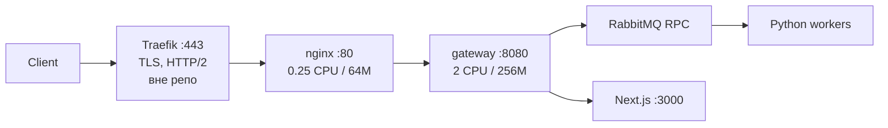

# nginx DoS hardening — design

**Дата:** 2026-08-06
**Статус:** design (реализация не начата)
**Область:** `nginx/nginx.conf`, `docker-compose.yml`, `docker-compose.production.yml`, `docker-compose.monitoring.yml`, `monitoring/promtail/promtail.yml`, `monitoring/prometheus/*` + ops-рекомендации вне репозитория (Traefik, sysctl, firewall)

---

## 1. Understanding Summary

- **Что строим:** слой защиты от L7-DoS на внешнем edge (nginx), поверх уже существующей защиты в Go-gateway.
- **Зачем:** сейчас nginx практически прозрачен для флуда — единственный барьер стоит на `/api/auth/`. Всё остальное (`/api/v1/*`, SSR-страницы, `/ws`, 60 МБ upload-пути) упирается сразу в gateway с лимитом 256 МБ RAM и per-process token bucket.
- **Для кого:** публичный сайт турниров — большая доля анонимных чтений, всплески во время матчей, live-WebSocket.
- **Ключевые ограничения:** Cloudflare не используется (`gateway/internal/clientip/clientip.go:18-20`), origin-IP открыт; nginx ограничен 0.25 CPU / 64 МБ; один и тот же `nginx.conf` обслуживает dev и prod; данных о реальном профиле трафика нет.
- **Non-goals:** WAF/ModSecurity, CAPTCHA/JS-challenge, распределённый rate-limit в Redis, изменения кода gateway (кроме включения уже существующего env-флага на фазе 3).

### Подтверждённые решения пользователя

| Вопрос | Решение |
|--------|---------|
| Область | L7 на nginx + рекомендации по Traefik/провайдеру (§8) |
| Строгость | Сбалансированно: ~5-10x от нормального пика, whitelist внутренних сетей |
| Калибровка | Данных нет → консервативные оценки + **фаза наблюдения через `dry_run`** |
| Наблюдаемость | Входит в объём: логи nginx в Loki + nginx-exporter + алерты |

---

## 2. Что есть сейчас (baseline)



**nginx** (`nginx/nginx.conf`): `realip` из XFF (доверяет только RFC1918 + loopback, рекурсивно), лог без query-string, `limit_req_zone auth_limit 10r/s` + `burst=20 nodelay` **только на `/api/auth/`**, `client_max_body_size 12m` (60m на 2 upload-пути), `proxy_read/send_timeout 180s` (3600s на 2 WS-локации), `proxy_buffering off`, `worker_connections 4096`, runtime-DNS резолв gateway.

**gateway** (`gateway/internal/ratelimit`, `gateway/internal/config/config.go`): in-memory token bucket **на процесс**.

| Механизм | Значение по умолчанию | Комментарий |
|---|---|---|
| `GATEWAY_AUTH_RATE_LIMIT` | 10 / 60s | На `/refresh` — `WrapFailures`: токен тратится только на 401/403 |
| `GATEWAY_ANON_RATE_LIMIT` | **0 — выключен** | Готовый рычаг, не включён |
| `GATEWAY_WS_MAX_ANON_CONNS_PER_IP` | 64 | Только анонимные; аутентифицированные WS **не ограничены** |
| `GATEWAY_WS_CUSTOM_DOMAIN_RATE_LIMIT` | 30 / 10s | Только pre-handshake lookup |
| `GATEWAY_RPC_MAX_INFLIGHT` | 64 | Bulkhead на очередь, 503 при насыщении |

---

## 3. Threat model

### 3.1 Что nginx закрыть **может** (в объёме работ)

| # | Вектор | Текущее состояние | Средство |
|---|--------|-------------------|----------|
| 1 | Request flood по публичным API/страницам | Не ограничено | `limit_req` (§5.3) |
| 2 | Исчерпание `worker_connections` конкурентными запросами | Не ограничено | `limit_conn` (§5.4) |
| 3 | Slowloris по заголовкам | Дефолт `client_header_timeout 60s` | 10s + `reset_timedout_connection` |
| 4 | Slowloris по телу | Дефолт `client_body_timeout 60s`, `keepalive_timeout 75s` | 15s / 30s (§5.5) |
| 5 | WebSocket-флуд: handshake-шторм и удержание соединений | `proxy_read_timeout 3600s`, нет лимитов | `limit_req req_ws` + `limit_conn conn_ws` |
| 6 | Amplification через 60 МБ upload-пути | Только `client_max_body_size 60m` | `limit_req req_upload` + `limit_conn 2` |
| 7 | Brute-force аутентификации | `auth_limit` есть | Сохраняем, дополняем `limit_conn` |
| 8 | Атака невидима | Логи внутри контейнера, нет exporter | §7 |

### 3.2 Что nginx закрыть **не может** (принимаемый риск / §8)

- **L3/L4** — SYN-flood, UDP-amplification, объёмная атака на канал. Только провайдер или CDN перед Traefik.
- **HTTP/2** (HPACK-bomb, Rapid Reset CVE-2023-44487, stream flood) — TLS и h2 терминирует **Traefik**, до nginx доходит HTTP/1.1. Ревью `docs/reviews/2026-07-03-...md:261` фиксирует рабочий PoC HPACK-bomb — это зона Traefik, см. §8.1.
- **Distributed L7** с тысяч IP — per-IP лимиты по определению не помогают. Нужен CDN/поведенческий анализ.

### 3.3 Скрытая уязвимость самого защитного слоя

**nginx был ограничен 0.25 CPU / 64 МБ.** Под флудом контейнер попадает в CFS-throttling, и лимитер не успевает работать — защита отказывает раньше, чем защищаемое. Плюс shared-memory зоны `limit_req`/`limit_conn` **выделяются заранее**: набор зон из §5.2 (~27 МБ) в контейнере на 64 МБ приводит к OOM. **Повышение ресурсов nginx — не оптимизация, а предусловие работоспособности дизайна** (§5.7). ✅ Снято: лимиты подняты до 1.00 CPU / 256 МБ, остальной дизайн ещё не реализован.

---

## 4. Рассмотренные подходы

### A. Только тюнинг таймаутов + `limit_conn` (минимум)
Дёшево, нулевой риск ложных срабатываний, закрывает slowloris и исчерпание соединений. **Не закрывает** request-flood и скрейпинг — главный вектор. Отклонено как недостаточное.

### B. ★ Многослойный per-IP бюджет с фазой наблюдения (рекомендуется)
Единый бюджет запросов на IP для обычного трафика + отдельные зоны для качественно иных путей (auth / WS / upload), лимиты соединений, ужатые таймауты. Раскатка через `dry_run` → калибровка по реальным данным → включение. Наблюдаемость едет **первой**, а не последней.
Риск ложных срабатываний снят структурно: dry-run фаза даёт данные, которых у нас нет.

### C. B + GeoIP2/ASN-скоринг, кастомный образ nginx
Точнее по ботам и дата-центровым ASN. Требует сборки своего образа (модуля нет в стоковом alpine), обновления MaxMind-баз, ещё одного артефакта в CI. Для текущего масштаба — преждевременно. Оставлено как возможное развитие.

**Выбран B.**

---

## 5. Дизайн

### 5.1 Whitelist через пустой ключ

nginx штатно **не учитывает запросы с пустым ключом** зоны. Это и есть механизм исключения — без `if`, без дублирования локаций.

```nginx
# Внутренние сети и loopback: healthcheck контейнера, межсервисные вызовы.
# geo вычисляется по $remote_addr ПОСЛЕ realip (realip работает в фазе
# POST_READ, geo-переменная ленивая и берётся в PREACCESS), поэтому здесь
# уже настоящий клиентский IP, а не docker-хоп.
geo $limit_exempt {
    default        0;
    10.0.0.0/8     1;
    172.16.0.0/12  1;
    192.168.0.0/16 1;
    127.0.0.1      1;
}

# Пустой ключ => запрос не учитывается ни в limit_req, ни в limit_conn.
map $limit_exempt $limit_key {
    0 $binary_remote_addr;
    1 "";
}
```

**Спуфинг невозможен:** чтобы попасть в exempt-ветку, нужно, чтобы `$remote_addr` был приватным. `real_ip_recursive` идёт по XFF справа налево и останавливается на первом **недоверенном** адресе. Клиент, приславший `X-Forwarded-For: 10.0.0.1`, получит цепочку `10.0.0.1, <его-реальный-IP>` (Traefik дописывает, а не перезаписывает) → `$remote_addr` = его реальный публичный IP → не exempt.

**Поисковые боты — сознательно НЕ в whitelist.** Обоснование в Decision Log D-4; при необходимости готовый рецепт в §10.

### 5.2 Зоны

```nginx
# Один общий бюджет на весь обычный трафик одного IP: страницы и API — это
# один и тот же посетитель, разделять их бюджеты нет смысла и это лишняя зона.
limit_req_zone $limit_key zone=req_edge:8m   rate=40r/s;
limit_req_zone $limit_key zone=req_auth:4m   rate=10r/s;   # существующий auth_limit
limit_req_zone $limit_key zone=req_ws:2m     rate=1r/s;    # частота handshake
limit_req_zone $limit_key zone=req_upload:1m rate=10r/m;

limit_conn_zone $limit_key zone=conn_edge:8m;   # конкурентные in-flight запросы
limit_conn_zone $limit_key zone=conn_ws:4m;     # живые WS-соединения

limit_req_status  429;
limit_conn_status 429;
limit_req_log_level  warn;
limit_conn_log_level warn;

# ФАЗА 1: только учёт и логирование, отказов нет. Снять после калибровки.
limit_req_dry_run  on;
limit_conn_dry_run on;
```

Ёмкость: `limit_req` ≈ 16 000 состояний на 1 МБ (64-bit), `limit_conn` ≈ 32 000. `req_edge:8m` → ~128k уникальных IP; при переполнении nginx вытесняет LRU-состояния и пишет предупреждение. Суммарно ~27 МБ преаллокации.

### 5.3 Лимиты запросов по локациям

`limit_req` **не наследуется**, если на текущем уровне объявлен хотя бы один — поэтому в специальных локациях перечисляем обе зоны явно, иначе `/api/auth/` выпадет из общего бюджета.

| Путь | Зоны | Расчёт |
|------|------|--------|
| `/` (server-уровень, наследуется) | `req_edge` burst=80 nodelay | Тяжёлая загрузка страницы = 20-40 запросов за ~1s. Burst 80 покрывает всплеск, 40r/s — устойчивый потолок ≈ 10x от активного человека (2-5 r/s) |
| `/api/auth/` | `req_edge` burst=80 + `req_auth` burst=20 nodelay | Существующее значение сохранено — умную часть (метрить только 401/403) уже делает gateway |
| `/ws`, `/api/realtime/ws` | `req_edge` burst=80 + `req_ws` burst=10 nodelay | 10 мгновенных handshake, дальше 1/s. Покрывает reconnect-шторм нескольких вкладок, режет цикл connect/disconnect |
| `/api/v1/admin/logs/upload`, `/api/v1/teams/create/balancer` | `req_edge` burst=80 + `req_upload` burst=5 nodelay | Админские пути, 60 МБ. 10 заливок/мин с запасом |

`nodelay` везде: очередь с задержкой ставит запрос в ожидание и **держит соединение**, что при флуде играет против нас. Нужен немедленный 429.

### 5.4 Лимиты соединений

```nginx
# server-уровень: конкурентные in-flight запросы одного IP.
# Браузер физически не держит 100 одновременных запросов к одному origin.
limit_conn conn_edge 100;
```

В WS-локациях объявляется **только** `conn_ws` — объявление на уровне разрывает наследование `conn_edge`, что здесь и требуется: у долгоживущих сокетов своя экономика.

```nginx
limit_conn conn_ws 128;
```

128 выбрано **выше** `GATEWAY_WS_MAX_ANON_CONNS_PER_IP=64`: для анонимов связывающим остаётся gateway (он умнее — различает анонимных и аутентифицированных), а nginx закрывает то, что gateway не закрывает вовсе — **аутентифицированные WS-соединения не ограничены по IP нигде**. За общим NAT (кампус, офис, VPN) 128 живых сокетов достижимо, но это уже аномалия, достойная 429.

### 5.5 Таймауты (анти-slowloris)

```nginx
client_header_timeout 10s;   # было: дефолт 60s
client_body_timeout   15s;   # было: дефолт 60s — между операциями чтения, не суммарно
send_timeout          15s;
keepalive_timeout     30s;   # было: дефолт 75s
keepalive_requests    500;
reset_timedout_connection on;   # RST вместо FIN_WAIT — освобождает память сразу
```

Переопределения:
- WS-локации: `send_timeout 3600s;` — `send_timeout` действует только во время активной записи, у простаивающего туннеля не срабатывает, но при пачке сообщений медленному клиенту 15s мало.
- Upload-локации: `client_body_timeout 30s;` — 60 МБ по слабому каналу.

`proxy_request_buffering` остаётся включённым (дефолт): nginx полностью буферизует тело до отправки в gateway, то есть медленное тело держит nginx, а не Go-процесс. Это уже работающая защита, её нельзя случайно отключить вместе с `proxy_buffering off` (та директива про **ответы**).

### 5.6 Мелочи

```nginx
server_tokens off;
worker_rlimit_nofile 16384;   # worker_processes auto × worker_connections 4096
```

### 5.7 Ресурсы контейнера (обязательно)

```yaml
# docker-compose.production.yml (в docker-compose.yml лимитов у nginx нет вовсе)
nginx:
  deploy:
    resources:
      limits:
        cpus: '1.00'      # было 0.25 — под флудом CFS-throttling отключает лимитер
        memory: 256M      # было 64M — ~27M зон преаллокации + воркеры + temp-буферы тел
      reservations:
        cpus: '0.25'
        memory: 64M
```

**Применено** в `docker-compose.production.yml` (коммит с bump'ом ресурсов). Взято выше
исходно заложенных 0.50 CPU: хост восьмиядерный, `worker_processes auto` поднимает
8 воркеров, и смысл лимита именно в том, чтобы лимитер не throttling'овался первым.

Пол по памяти — 128 МБ; 256 МБ берём с запасом, т.к. тела до 60 МБ спулятся во временные файлы, а `client_body_buffer_size` дефолтный.

> `worker_processes auto` читает число ядер **хоста**, а не cgroup-квоту: при 8 ядрах
> это 8 воркеров на 1 CPU квоты. Работает, но с лишними переключениями контекста —
> при реализации §6 зафиксировать `worker_processes` под квоту.

---

## 6. Полная целевая конфигурация (скелет)

```nginx
worker_processes auto;
worker_rlimit_nofile 16384;

events { worker_connections 4096; }

http {
    include /etc/nginx/mime.types;
    default_type application/octet-stream;
    sendfile on; tcp_nopush on; server_tokens off;
    gzip on;
    gzip_types text/plain application/json application/javascript text/css;

    # --- realip: без изменений (см. комментарий в текущем файле) ---
    set_real_ip_from 10.0.0.0/8;
    set_real_ip_from 172.16.0.0/12;
    set_real_ip_from 192.168.0.0/16;
    set_real_ip_from 127.0.0.1;
    real_ip_header    X-Forwarded-For;
    real_ip_recursive on;

    # --- whitelist через пустой ключ (§5.1) ---
    geo $limit_exempt { default 0; 10.0.0.0/8 1; 172.16.0.0/12 1; 192.168.0.0/16 1; 127.0.0.1 1; }
    map $limit_exempt $limit_key { 0 $binary_remote_addr; 1 ""; }

    # --- зоны (§5.2) ---
    limit_req_zone  $limit_key zone=req_edge:8m   rate=40r/s;
    limit_req_zone  $limit_key zone=req_auth:4m   rate=10r/s;
    limit_req_zone  $limit_key zone=req_ws:2m     rate=1r/s;
    limit_req_zone  $limit_key zone=req_upload:1m rate=10r/m;
    limit_conn_zone $limit_key zone=conn_edge:8m;
    limit_conn_zone $limit_key zone=conn_ws:4m;

    limit_req_status 429;  limit_conn_status 429;
    limit_req_log_level warn;  limit_conn_log_level warn;
    limit_req_dry_run  on;   # ФАЗА 1 → снять на фазе 2
    limit_conn_dry_run on;

    # --- JSON-лог для Loki. $uri, НЕ $request: на /ws приходит ?token=<jwt>,
    #     токен не должен попадать в логи. Инвариант сохранён. ---
    log_format edge_json escape=json '{'
        '"time":"$time_iso8601","remote_addr":"$remote_addr",'
        '"method":"$request_method","uri":"$uri","status":$status,'
        '"bytes":$body_bytes_sent,"rt":$request_time,'
        '"ua":"$http_user_agent","ref":"$http_referer",'
        '"limit_req":"$limit_req_status","limit_conn":"$limit_conn_status"}';
    access_log /var/log/nginx/access.log edge_json;
    error_log  /var/log/nginx/error.log warn;

    map $http_upgrade $connection_upgrade { default upgrade; '' close; }
    map $http_x_forwarded_proto $forwarded_proto { default $http_x_forwarded_proto; '' $scheme; }
    resolver 127.0.0.11 valid=10s ipv6=off;

    # --- stub_status для nginx-exporter; порт не публикуется наружу ---
    server {
        listen 8081;
        access_log off;
        location = /stub_status {
            stub_status;
            allow 10.0.0.0/8; allow 172.16.0.0/12; deny all;
        }
    }

    server {
        listen 80;
        server_name _;

        client_max_body_size 12m;
        client_header_timeout 10s;
        client_body_timeout   15s;
        send_timeout          15s;
        keepalive_timeout     30s;
        keepalive_requests    500;
        reset_timedout_connection on;

        limit_req  zone=req_edge burst=80 nodelay;
        limit_conn conn_edge 100;

        set $gateway_upstream gateway;
        proxy_http_version 1.1;
        proxy_set_header Upgrade    $http_upgrade;
        proxy_set_header Connection $connection_upgrade;
        proxy_set_header Host              $host;
        proxy_set_header X-Real-IP         $remote_addr;
        proxy_set_header X-Forwarded-For   $proxy_add_x_forwarded_for;
        proxy_set_header X-Forwarded-Proto $forwarded_proto;
        proxy_buffering off;
        proxy_read_timeout 180s;
        proxy_send_timeout 180s;

        location = /ws {
            limit_req  zone=req_edge burst=80 nodelay;
            limit_req  zone=req_ws   burst=10 nodelay;
            limit_conn conn_ws 128;
            send_timeout 3600s;
            proxy_read_timeout 3600s;
            proxy_send_timeout 3600s;
            proxy_pass http://$gateway_upstream:8080;
        }
        location = /api/realtime/ws { ...идентично... }

        location /api/auth/ {
            limit_req zone=req_edge burst=80 nodelay;
            limit_req zone=req_auth burst=20 nodelay;
            proxy_pass http://$gateway_upstream:8080;
        }

        location = /api/v1/admin/logs/upload {
            client_max_body_size 60m;
            client_body_timeout 30s;
            limit_req  zone=req_edge   burst=80 nodelay;
            limit_req  zone=req_upload burst=5  nodelay;
            limit_conn conn_edge 2;
            proxy_pass http://$gateway_upstream:8080;
        }
        location = /api/v1/teams/create/balancer { ...идентично... }

        location / { proxy_pass http://$gateway_upstream:8080; }
    }
}
```

---

## 7. Наблюдаемость

### 7.1 Логи в Loki

Promtail монтирует `./logs:/var/log/app:ro` (`docker-compose.monitoring.yml:249`). Достаточно смонтировать логи nginx в тот же каталог:

```yaml
# docker-compose.production.yml + docker-compose.yml, service nginx
volumes:
  - ./nginx/nginx.conf:/etc/nginx/nginx.conf:ro
  - ./logs/nginx:/var/log/nginx
```

Отдельный promtail-job (существующий `app_services` парсит Loguru-формат и на nginx-JSON сломается — исключить его путь так же, как исключён gateway):

```yaml
- job_name: nginx
  static_configs:
    - targets: [localhost]
      labels: { job: nginx, __path__: /var/log/app/nginx/*.log }
  pipeline_stages:
    - json:
        expressions:
          status: status
          uri: uri
          limit_req: limit_req
          limit_conn: limit_conn
          remote_addr: remote_addr
          timestamp: time
    - labels: { status:, limit_req:, limit_conn: }
    - timestamp: { source: timestamp, format: RFC3339 }
    - drop: { source: uri, expression: "^/health$" }
```

### 7.2 Метрики

```yaml
# docker-compose.monitoring.yml
nginx-exporter:
  image: nginx/nginx-prometheus-exporter:1.4.1
  command: ["--nginx.scrape-uri=http://nginx:8081/stub_status"]
  restart: unless-stopped
  networks: [app-network]
```

`stub_status` даёт `nginx_connections_{active,reading,writing,waiting}` и `nginx_http_requests_total` — этого достаточно для детекции насыщения и slowloris. **Счётчиков по статусам он не даёт** — 429 берём из Loki.

### 7.3 Алерты

| Алерт | Источник | Условие |
|---|---|---|
| `NginxRateLimitSpike` | Loki (Grafana alert) | `sum(rate({job="nginx"} \| json \| limit_req="REJECTED" [5m])) > N` (на фазе 1 — `REJECTED_DRY_RUN`) |
| `NginxConnectionsSaturated` | Prometheus | `nginx_connections_active` > 70% от `worker_processes × worker_connections` |
| `NginxSlowlorisSuspect` | Prometheus | Устойчивый рост `nginx_connections_reading` при плоском `nginx_http_requests_total` |
| `NginxZoneOverflow` | Loki | `{job="nginx"} \|= "limiting requests, excess"` / переполнение зоны в error.log |

Дашборд Grafana: 429/сек по путям, топ-IP по `REJECTED`, распределение `remote_addr` (страховка от тихой поломки `realip` — см. §11).

---

## 8. Вне репозитория (ops) — **применено на dd-new 2026-08-06**

### 8.1 Traefik — ✅ применено (с отклонениями от исходного плана)

Traefik на dd-new — процесс systemd (`/etc/traefik/traefik.yml`, dynamic-провайдер
с `watch: true`), обслуживающий **несколько проектов** одного хоста (dudeduck,
remnawave, grafana, pm-specs), а не только OWT. Это изменило два решения:

**Защита от HTTP/2 не нужна — h2 уже выключен.** В `dynamic/main.yml`:

```yaml
tls:
  options:
    default:
      alpnProtocols: ["http/1.1"]
```

Клиент не может договориться на HTTP/2, поэтому HPACK-bomb и Rapid Reset из ревью
2026-07-03 неприменимы. `http2.maxConcurrentStreams` из первоначального плана —
мёртвая настройка здесь; не добавлялась.

**`respondingTimeouts` НЕ добавлены — сознательно.** Исходный план предлагал
`readTimeout: 30s` / `writeTimeout: 60s`; на этой топологии это сломало бы прод:

- `readTimeout` в Traefik ограничивает чтение **всего запроса вместе с телом** —
  60 МБ match-log upload по слабому каналу не уложится;
- `writeTimeout` рвёт долгоживущие WebSocket-соединения (`/ws` живёт до часа);
- entryPoint один на все проекты хоста, отдельного для OWT нет.

Slowloris закрыт слоем ниже (nginx: 10s/15s/30s), где таймауты можно задать
по-локационно. Это осознанный компромисс: медленный клиент может занять
соединение Traefik, но не воркер nginx и не gateway.

**Что добавлено** — `/etc/traefik/dynamic/owt-ratelimit.yml`, подключённый только
к роутерам `owt` и `custom-domains-catchall` (не к entryPoint — иначе задело бы
чужие проекты):

```yaml
http:
  middlewares:
    owt-ratelimit:
      rateLimit: { average: 200, period: 1s, burst: 400 }
    owt-inflight:
      inFlightReq: { amount: 400 }
```

Числа **заведомо выше** nginx-овских (40 r/s / burst 80 / 100 in-flight): nginx —
основной настраиваемый лимитер и пока в dry-run; будь Traefik строже, он молча
стал бы связывающим и начал отдавать реальные 429, обессмыслив фазу наблюдения.
`sourceCriterion` оставлен по умолчанию — `forwardedHeaders.trustedIPs` доверяет
только приватным хопам, так что клиентский `X-Forwarded-For` в ключ не попадает.

> **Известный пробел.** `/etc/traefik/dynamic/custom-domains.yml` генерируется
> автоматически из `workspace.custom_domain`, и его роутеры middleware не
> получают. Верифицированные кастом-домены прикрыты только слоем nginx (он ловит
> любой Host — `server_name _`). Чтобы закрыть — добавить `middlewares` в шаблон
> генератора.

### 8.2 Обход Traefik — ✅ закрыто

Проблема была реальной: **опубликованные Docker'ом порты не проходят через
filter-цепочки ufw**, поэтому `ports: "${APP_PORT}:80"` (bind `0.0.0.0:8888`)
нельзя было считать закрытым тем, что ufw не разрешает 8888.

На dd-new это дополнительно перехватывала цепочка `DOCKER-USER → DD-INGRESS`:

```
-A DD-INGRESS -m conntrack --ctstate RELATED,ESTABLISHED -j RETURN
-A DD-INGRESS -i enp1s0 -m conntrack --ctstate NEW -j DROP
```

Тем не менее защита опиралась на одну цепочку iptables. Теперь порт биндится в
loopback (`APP_BIND`, дефолт `127.0.0.1`), что совпадает с тем, куда Traefik и так
ходит (`owt-svc → http://127.0.0.1:8888`). Проверено: `ss -lntp` показывает
`127.0.0.1:8888`, сайт через Traefik отвечает 200.

### 8.3 Ядро хоста — ✅ уже настроено, менять нечего

Все рекомендованные значения уже стоят персистентно в `/etc/sysctl.d/99-tuning.conf`:
`tcp_syncookies=1`, `tcp_max_syn_backlog=8192`, `somaxconn=8192`, `tcp_fin_timeout=15`,
`nf_conntrack_max=262144`, `netdev_max_backlog=16384` (плюс BBR/fq). Использование
conntrack на момент проверки — 439 из 262144.

### 8.4 Провайдер

Уточнить наличие L3/L4-scrubbing у Vultr. Без него объёмная атака кладёт канал вне зависимости от любых настроек nginx — это принимаемый риск (D-6).

### 8.5 Ротация логов nginx — ✅ применено

Замена stdout-симлинков образа на реальные файлы забрала у nginx ротацию, которую
раньше делал docker json-file. Остальные сервисы стека ротируются сами (Loguru и
собственная ротация gateway — отсюда `*.log.gz` рядом с их логами), поэтому
logrotate добавлен **только** для nginx: `/etc/logrotate.d/owt-nginx`, daily,
14 копий, `copytruncate` (nginx в контейнере держит fd, сигналить с хоста нечем).

Имена ротированных файлов (`access.log.1`, `access.log.2.gz`) не подпадают под
promtail-глоб `/var/log/app/nginx/*.log`, так что повторной загрузки старых строк
в Loki не будет. Проверено `logrotate -d`.

---

## 9. План раскатки

| Фаза | Содержание | Критерий перехода |
|------|-----------|-------------------|
| **0. Видимость** | Монтирование логов, JSON-формат, promtail-job, exporter, дашборд. Лимиты **не трогаем**. | В Grafana виден трафик nginx; `nginx_connections_active` пишется |
| **1. Наблюдение** | Все зоны и лимиты + `dry_run on`. Ресурсы контейнера подняты. | 7-14 дней. Собрана статистика `REJECTED_DRY_RUN` по путям и IP |
| **2. Калибровка** | Поднять зоны, где отказы получали легитимные IP (сверка по `remote_addr` + `ua`). Задокументировать финальные цифры. | Ноль отказов у известных легитимных источников за 48 ч наблюдения |
| **3. Включение** | `dry_run off`. | 48 ч без роста жалоб и без всплеска 429 у авторизованных пользователей |
| **4. Внутренний слой** | Включить `GATEWAY_ANON_RATE_LIMIT` (сейчас 0) со значением, выведенным из данных фазы 1. | — |

Откат на любой фазе — вернуть `dry_run on` и `docker compose restart nginx` (конфиг — bind-mount, пересборка образа не нужна).

**Ускорение фазы 1.** В репозитории уже есть Locust-стенд (`loadtests/`), бьющий ровно
в путь `nginx → gateway` с реалистичной моделью трафика (анонимный браузинг, профили,
статистика, поиск). Прогон с **удалённого** хоста даёт синтетический профиль нагрузки на
зоны до появления реальных данных. Локальный прогон для этого не годится: он приходит
с приватного адреса docker-моста и попадает в whitelist — лимитер не задействуется вовсе
(`loadtests/README.md` обновлён этим замечанием).

---

## 10. Отклонённый рецепт: whitelist поисковых ботов

Если после фазы 3 в Search Console появятся ошибки краулинга:

```nginx
map $http_user_agent $ua_bot {
    default 0;
    "~*(googlebot|bingbot|yandexbot|duckduckbot|applebot)" 1;
}
map "$limit_exempt:$ua_bot" $edge_key { "0:0" $binary_remote_addr; default ""; }
map "$limit_exempt:$ua_bot" $bot_key  { "0:1" $binary_remote_addr; default ""; }
limit_req_zone $bot_key zone=req_bot:2m rate=10r/s;
```

Обязательно **отдельная зона, а не исключение**: User-Agent подделывается тривиально, и полное исключение превращает один заголовок в универсальный обход всей защиты. Здесь подделка даёт лишь более широкий, но всё равно ограниченный бюджет. Настоящая верификация Googlebot требует reverse-DNS, которого в core-nginx нет.

---

## 11. Риски

| Риск | Вероятность | Митигация |
|------|-------------|-----------|
| Ложные срабатывания за общим NAT/VPN | Средняя — на `/api/auth/refresh` это **уже происходило** (см. `WrapFailures`) | Фаза dry-run; лимиты 5-10x от пика; `conn_ws` выше gateway-порога |
| Зоны преаллоцируются → OOM nginx | Высокая при текущих 64 МБ | §5.7 — предусловие, а не опция |
| Тихая поломка `realip` → все IP приватные → **все запросы exempt, защита молча выключена** | Низкая, но последствие максимальное | Панель распределения `remote_addr` в Grafana; алерт на аномальную долю приватных адресов |
| Переполнение зоны при распределённой атаке (>128k IP) | Низкая | LRU-вытеснение + предупреждение в error.log → алерт `NginxZoneOverflow` |
| Один `nginx.conf` на dev и prod: строгие таймауты мешают отладке | Низкая | Dev-трафик идёт с приватных адресов → exempt от `limit_req`/`limit_conn`. Таймауты действуют в обеих средах — это осознанно (одинаковое поведение) |
| Расхождение версий образа: dev `1.27-alpine`, prod `1.31-alpine` | Низкая | Все используемые директивы доступны с 1.17.6; выровнять при случае |

---

## 12. Decision Log

| # | Решение | Альтернативы | Обоснование |
|---|---------|--------------|-------------|
| D-1 | Whitelist через пустой ключ (`geo`+`map`) | `if` + отдельные локации; дублирование конфига | Штатный документированный механизм nginx, ноль дублирования, невозможно обойти подделкой XFF |
| D-2 | Один общий бюджет `req_edge` для страниц и API | Отдельные зоны `req_page` и `req_api` | Это один и тот же посетитель; отдельные бюджеты дают лишнюю зону и не отражают реальность. Экономия ~8 МБ преаллокации |
| D-3 | Раскатка через `limit_req_dry_run` | Сразу боевые лимиты; синтетическое нагрузочное тестирование | Данных о профиле трафика нет. Dry-run даёт реальные данные с нулевым риском — это точный ответ на «данных нет» |
| D-4 | Поисковые боты **не** в whitelist | Whitelist по User-Agent | UA подделывается; полное исключение = универсальный обход. Общий лимит 40r/s кратно выше любой реальной скорости краулинга. Рецепт отдельной зоны — в §10 на случай необходимости |
| D-5 | `nodelay` во всех `limit_req` | Отложенная очередь (по умолчанию) | Очередь удерживает соединение — под флудом это работает на атакующего. Нужен немедленный 429 |
| D-6 | L3/L4 — принимаемый риск, только рекомендации | Внедрить Cloudflare | Пользователь выбрал область «L7 + рекомендации». Cloudflare требует смены DNS, пересмотра `realip` (CF-сети + `CF-Connecting-IP`, сейчас явно не доверяются — `clientip.go:18-20`) и проверки WS через CF. Отдельная задача |
| D-7 | `conn_ws 128` > `GATEWAY_WS_MAX_ANON_CONNS_PER_IP=64` | Значение ниже gateway-порога | Для анонимов связывающим остаётся более умный лимит gateway; nginx закрывает пробел, который gateway не закрывает вовсе — аутентифицированные WS не ограничены по IP нигде |
| D-8 | Повышение ресурсов nginx — часть дизайна | Оставить 0.25 CPU / 64 МБ | Зоны преаллоцируются (OOM), под флудом CFS-throttling отключает сам лимитер. Защита не может быть менее доступной, чем защищаемое |
| D-9 | Наблюдаемость — фаза 0, а не последняя | Сначала лимиты | Без метрик лимиты нельзя ни откалибровать, ни подтвердить срабатывание. Сейчас логи nginx вообще не покидают контейнер |
| D-10 | JSON-лог сохраняет `$uri` вместо `$request` | `$request` (стандарт) | Существующий инвариант безопасности: на `/ws` приходит `?token=<jwt>`, токен не должен попадать в логи |

---

## 13. Проверка

### Выполнено (изолированный стенд: реальный `nginx.conf` + фиктивный upstream под алиасом `gateway`)

| # | Проверка | Результат |
|---|----------|-----------|
| 1 | `nginx -t` на `nginx:1.31-alpine` | ✅ syntax ok |
| 2 | `promtool check config` + `check rules` | ✅ 6 rule files, 6 правил в `nginx.yml` |
| 3 | `promtail -check-syntax` | ✅ valid |
| 4 | `docker compose config` / YAML-парс всех изменённых файлов | ✅ |
| 5 | realip: запрос с `X-Forwarded-For: 203.0.113.7` через доверенный хоп | ✅ `remote_addr=203.0.113.7`, `limit_req=PASSED` |
| 6 | Флуд 250 запросов с публичного IP, `dry_run on` | ✅ 250×200, в логе `PASSED:90 / REJECTED_DRY_RUN:160` — учёт есть, отказов нет |
| 7 | Тот же флуд с внутреннего пира (без XFF) | ✅ `remote_addr=172.20.0.1`, `limit_req=""` ×250 — whitelist через пустой ключ работает |
| 8 | Флуд с `dry_run off` | ✅ `200:89 / 429:161`, в логе `REJECTED` — enforcement работает |
| 9 | Whitelist при включённом enforcement | ✅ 250×200, ни одного 429 |
| 10 | `/api/auth/login`, burst 20 | ✅ `200:22 / 429:98` — своя зона поверх общей |
| 11 | `/api/v1/admin/logs/upload`, burst 5 | ✅ `200:6 / 429:24` |
| 12 | Утечка токена: `GET /ws?token=Bearer.SUPERSECRET123` | ✅ строки нет в логе, записан `uri=/ws` |
| 13 | Slowloris: незавершённые заголовки в сыром сокете | ✅ соединение закрыто через 10.1 с (было бы 60 с) |

### Выполнено в проде (dd-new, 2026-08-06)

| Проверка | Результат |
|----------|-----------|
| `nginx -t` на файле хоста | ✅ syntax ok |
| Пересоздание `owt-nginx-1` | ✅ `Up (healthy)`, порт `127.0.0.1:8888->80` |
| Сайт через Traefik | ✅ `https://owt.craazzzyyfoxx.me` → 200 |
| Остальные роутеры хоста не задеты | ✅ grafana 302, pm-specs 200, кастом-домен 200, dudeduck 404 (норма). `panel.vpn` 502 — **было до правки**, на `127.0.0.1:3100` никто не слушает |
| Память nginx | ✅ 20.4 MiB из 256 MiB (зоны mmap'ятся лениво) |
| Логи в файле | ✅ JSON, реальные клиентские IP, `limit_req`/`limit_conn` заполнены |
| WS живой | ✅ 40 ответов `101` в первых 2720 строках лога |
| Loki | ✅ `job` values: `app_services`, `gateway`, `nginx` |
| Prometheus targets | ✅ `nginx` и `promtail` — `health: up`, `nginx_up == 1` |
| Правила | ✅ группы `nginx-recording` / `nginx-alerts`, алерты `NginxDown`, `NginxRateLimitSpike`, `NginxSlowlorisSuspect`, `NginxConnectionsHigh` |
| Ложных алертов нет | ✅ firing только преднастроенные `RedisHighMemory` / `RedisMemoryCritical` (не связаны) |
| Traefik rate limit активен | ✅ 2400 запросов в 40 потоков (~1900 rps) с одного IP → 1757 × 429. nginx в dry-run 429 отдавать не может, значит это Traefik |
| Сквозной учёт nginx в проде | ✅ тот же прогон дал 514 × `REJECTED_DRY_RUN` по `/api/v1/health` с одного IP |
| Реальный трафик | ✅ 1576 `PASSED`, 630 exempt (внутренние), **0 отказов на живых пользователях** |

### Осталось проверить

1. **Upload не сломан:** файл ~50 МБ на `/api/v1/admin/logs/upload` в пределах `client_body_timeout 30s` — нужен реальный админский лог, синтетикой не проверялось.
2. ~~**Ротация** `logs/nginx/*.log`~~ — ✅ сделано, см. §8.5.
3. **Фаза 2:** через 7-14 дней снять статистику `REJECTED_DRY_RUN` (исключив собственные нагрузочные прогоны по `remote_addr`), поправить зоны, затем `dry_run off`.
