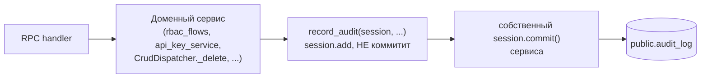

# Platform Audit Log — design (v2, после состязательного ревью)

> Статус: design. Understanding Lock подтверждён 2026-08-12. Прошёл ревью тремя мандатами
> (Skeptic / Constraint Guardian / User Advocate) — все три вернули REVISE, 6 блокеров.
> v2 — результат арбитража. Диспозиция: **APPROVED** (см. §15).
>
> Связанные документы:
> - `docs/architecture.md` §3 (RPC), §5 (мультитенантность, RBAC)
> - `docs/database_erd.md` — конвенция «append-only шины без FK»
> - `docs/plans/2026-08-03-admin-match-surfaces-design.md` D30 — прецедент выделенной audit-таблицы
> - `docs/superpowers/specs/2026-08-04-code-mirrors-registry.md` — почему v2 отказалась от седьмой копии `envelope`

---

## 0. Что изменилось в v2 и почему

v1 предлагала **два** пути записи: автоматический best-effort из broker-middleware по allow-list плюс атомарный явный вызов. Ревью доказало, что автоматический путь не может корректно заполнить шесть колонок из семнадцати:

| Колонка | Почему middleware её не знает |
| --- | --- |
| `actor_auth_user_id` | identity-svc **не проходит** через `edge/dispatch.go`: его гейтвей-пакет рукописный, тела собираются как `map[string]any{"access_token": token, ...}` (`gateway/internal/identity/handler.go:580-658`) — ключа `identity` там нет вовсе. А это ровно те 40+ методов, ради которых журнал и строится |
| `entity_type` | `rpc.tournament.admin.{create,update,delete}` мультиплексирует 9 сущностей через `data["entity"]`, `rpc.app.admin.*` — воркспейс и метадату. Один `AuditSpec` на routing key даёт константу, которая для пяти сущностей из шести неверна |
| `entity_id` | ни один аудируемый identity-метод не присылает `id`: там `role_id`, `permission_id`, `api_key_id`, `player_id`, `connection_id` (`handler.go:411-575`). А `data["id"]` вообще появляется только при `spec.IDParam != ""` |
| `workspace_id` | у PATCH/DELETE турнир-админки его нет ни в теле, ни в query; тела identity плоские (нет `payload`). Fail closed → строка видна только суперадмину → организатор не увидит удаление собственного турнира, что прямо ломает FR5 |
| `source` | не заполнялся вообще ни одним описанным механизмом: `AuditSpec` его не несёт, сборка черновика не упоминает, `record_audit` не принимает |
| `correlation_id` | единственный воркерный сеттер — `observe_message_processing`, `@asynccontextmanager`, входимый **внутри** тела subscriber'а, то есть после middleware. На момент `consume_scope` `get_correlation_id()` возвращает None |

Плюс три структурных дефекта: `except` во всех конвертах стоит **снаружи** `async with` (сессия закрыта, «откатить и записать» неисполнимо); интерлок `consumed` давал **ноль** строк при откате доменной транзакции после `record_audit` — а `commit()` → `except IntegrityError: rollback(); raise` это установленный паттерн (`oauth_service.py:1159-1163`); и седьмая точка хука `CrudDispatcher._envelope` (`shared/rpc/crud.py:253-265`) — `@staticmethod` **без сессии**, куда `flush_audit(session, ...)` не прикладывается принципиально, хотя именно она владеет мутациями 15 админских сущностей.

**Арбитраж: автоматический путь удалён целиком.** Он продавал «покрытие даром», а ревью показало, что покрытие не даром и не покрытие. Остаётся один путь — явный `record_audit(session, ...)` внутри доменной транзакции.

Это разворачивает ответ пользователя на вопрос «какие события пишем» (был выбран гибрид). Разворот сделан осознанно: выбор делался по презентации, которая утверждала, что middleware заполнит строку корректно.

Что это чинит бесплатно, помимо шести колонок:

- **Секреты.** `payload_json` **удалён**. Сырой вход не захватывается никогда, `before_json`/`after_json` собирает вызывающий из именованных доменных полей. FR6 выполняется структурно, а не denylist'ом. Это снимает оба класса дефектов редакции сразу: ложноотрицательные (`SettingUpsert.value: dict` — непрозрачный JSON; `data["content_b64"]` — до 12 MiB сырых данных, то есть ~16 МБ base64 в одной JSONB-строке, что само по себе перекрывало годовой бюджет NFR 4) и ложноположительные (подстроки `code` и `key` вырезали коды кастомок, `country_code`, булев `code_accepted`, ключи каталога, `idempotency_key`, `SettingRead.key` — имя изменённой настройки — и `custom_domain_verification_token`, который комментарием рядом объявлен не секретом).
- **Границу объёма.** v1 писала строку на каждый 403/409/422, а гейтвей аутентифицированный трафик не лимитирует (`AnonRateLimit` по умолчанию 0, bearer-запросы проходят без учёта). Любой залогиненный пользователь без прав был неограниченным писателем строк. В v2 отказ по правам поднимается до доменного сервиса и строки не оставляет — см. §4 NFR 4 и D11.
- **Наблюдаемость отказа.** Не нужна: `record_audit` живёт в транзакции мутации, его отказ роняет мутацию. Громко по построению, счётчик не требуется.
- **Седьмую копию зеркального кода.** Реестр зеркал прямо фиксирует, что семейство `src/rpc/_common.py` + `_helpers.py` — 5 копий, 159 избыточных строк, `envelope` совпадает лишь в одной паре, и что ни одно из 62 зеркал не защищено контракт-тестом. v1 добавляла туда седьмую копию и брала в страховку документ, который сам себя называет справочником.

---

## 1. Задача

Ответить на вопрос «кто это сделал» одним запросом, для всей платформы.

Шесть существующих журналов (`tournament.encounter_result_audit`, `balancer.draft_audit_event`, `players.user_merge_audit`, `tournament.challonge_sync_log`, `subscriptions.check_log`, `achievements.evaluation_run`) покрывают свои домены и **не трогаются**.

Не покрыто ничем: смена ролей и прав, `user_permission_deny`, выдача и отзыв API-ключей, отзыв сессий, удаление аккаунта, привязка и отвязка игрока, правка и удаление турнира, настройки воркспейса, брендинг, кастомные домены, Discord-гильдия. Единственный след — stdout → Loki, где нет ни актора в структурированном виде, ни фильтра по воркспейсу.

## 2. Скоуп

**В скоупе**

- Таблица `public.audit_log` — append-only.
- Один путь записи: `record_audit(session, ...)` внутри доменной транзакции.
- Курируемый набор call-site'ов (§7.2).
- Чтение: `GET /api/v1/admin/audit` + переиспользуемый `AuditTrail` на карточках сущностей.
- Право `audit.read`, workspace-scoped.
- `ip_address` / `user_agent` для identity-методов (§7.4).

**Вне скоупа**

- Undo / rollback.
- Консолидация шести существующих журналов.
- Автоматическое покрытие всех мутирующих RPC (удалено в v2, см. §0).
- Запись провалившихся попыток (см. D11).
- Логирование успешных входов и refresh (см. D9).
- Замена Loki/Sentry, realtime-лента, партиционирование, purge.

## 3. Функциональные требования

- **FR1.** Каждое инструментированное действие оставляет **ровно одну** строку, и она живёт или умирает вместе с мутацией. Откат мутации не оставляет строки; успех мутации без строки невозможен.
- **FR2.** Строка живёт дольше актора и сущности: удаление аккаунта, турнира или воркспейса не удаляет и не обнуляет историю.
- **FR3.** Машинный актор отличим от человеческого без догадок.
- **FR4.** Организатор видит активность только своего воркспейса; платформенные строки — только суперадмин.
- **FR5.** Секреты и сырые входные payload'ы в журнал не попадают никогда.
- **FR6.** История конкретной сущности достаётся тем же эндпоинтом, что и общий фид.

## 4. Нефункциональные требования

1. **Запись** — один INSERT в уже открытой транзакции мутации. Ноль дополнительных соединений, ноль дополнительных транзакций.
2. **Отказ записи** невозможен изолированно: он есть отказ мутации.
3. **Чтение** — offset-пагинация в контракте `PaginatedResponse` (`{page, per_page, total, results}`), потому что `AdminDataTable` считает из `total` и `totalPageCount`, и футер, и селектор размера страницы. Keyset из v1 этот компонент обслужить не мог.
4. **Объём** — только курируемые call-site'ы человеческих админских действий, провалы не пишутся. Ожидание < 300 строк/день, ~400 байт/строка → ~45 МБ/год. Purge и партиционирование — YAGNI.
5. **Владение** — модель в `shared/`, чтение в app-svc, запись в тех воркерах, где есть инструментированные call-site'ы.
6. **Один Alembic head.** Текущий — `mapidx01` (151 ревизия).

## 5. Архитектура



Ровно один механизм. Строка аудита — такой же участник транзакции, как и сама мутация.

### 5.1 Почему только так

**Хендлеры коммитят внутри себя.** `rbac_flows.py:229,257,383,432,461,579,634,688,855,957,987`, `api_key_service.py:270,287,304,330`, `oauth_service.py:891,1036,1046,1160,1207,1234`. Значит ни `envelope`, ни middleware не владеют транзакцией мутации, и атомарная запись возможна только явным вызовом внутри доменного сервиса — дословно как `shared/services/encounter/result_audit.py::record_result_transition`, чей докстринг формулирует тот же инвариант: «a rolled-back result leaves no trail of having happened».

**Инвариант «не коммитить» теперь единственный.** В v1 один модуль держал два взаимоисключающих правила: `record_audit` не коммитит никогда, а `flush_audit` безусловно коммитит чужую сессию — включая всё, что в ней ещё висело незакоммиченным. Второе правило удалено.

## 6. Модель данных

`shared/models/platform/audit.py`, рядом с `outbox.py`. Схема `public`.

| Колонка | Тип | Смысл |
| --- | --- | --- |
| `id` | `BigInteger` PK autoincrement | |
| `created_at` | `DateTime(tz)` `server_default now()` | **время начала транзакции** (`func.now()` = `transaction_timestamp`), поэтому порядок `id` и порядок времени не совпадают — сортировка идёт по `created_at DESC, id DESC`, см. §6.1 |
| `workspace_id` | `BigInteger NULL` | **без FK.** `NULL` = платформенное событие, видно только суперадмину |
| `actor_auth_user_id` | `BigInteger NULL` | **без FK.** `NULL` = машинный актор |
| `actor_label` | `String(255) NULL` | снимок имени актора |
| `source` | `String(16) NOT NULL` | `admin` \| `challonge` \| `discord` \| `scheduler` \| `system` — **обязательный keyword** `record_audit`, как у прецедента |
| `action` | `String(64) NOT NULL` | `role.assign`, `tournament.delete`, … |
| `entity_type` | `String(64) NULL` | |
| `entity_id` | `BigInteger NULL` | |
| `entity_label` | `String(255) NULL` | снимок имени сущности |
| `before_json` | `JSONB NULL` | собирается вызывающим из именованных полей |
| `after_json` | `JSONB NULL` | то же |
| `reason` | `Text NULL` | человеческая причина, где её требует контракт |
| `ip_address` | `String(45) NULL` | доверенный IP; §7.4 |
| `user_agent` | `String(255) NULL` | |
| `correlation_id` | `String(64) NULL` | `get_correlation_id()` в момент `record_audit` — вызывающий уже внутри `observe_message_processing`, где `correlation_id_ctx` выставлен |

**Нет колонки `payload_json`** — удалена в v2 (§0). Нет `method`: он обосновывался как форензический ключ, но ни фильтра, ни индекса, ни рендера у него не было — колонка была write-only. `action` несёт семантику, `correlation_id` — сшивку с Loki и Tempo.

**Без FK — сознательно**, по причине, уже записанной в `database_erd.md` про `event_outbox` и `workspace_event`. `ON DELETE SET NULL` не годится: он обнулил бы актора, а FR2 требует, чтобы строка осталась осмысленной. Отсюда парные `*_label`-снимки. Наследуется от `db.Base`, как `EventOutbox`: `updated_at` у append-only строки — ложь.

### 6.1 Индексы и порядок

```python
Index("ix_audit_log_workspace_created", "workspace_id", "created_at")
Index("ix_audit_log_entity_created", "entity_type", "entity_id", "created_at")
Index("ix_audit_log_actor_created", "actor_auth_user_id", "created_at")
```

Ведущая колонка сортировки — `created_at`, не `id`: `server_default=func.now()` даёт время **начала** транзакции (конвенция `shared/core/db.py:76`), поэтому длинная транзакция получает высокий `id` при раннем таймстемпе, и фид, отсортированный по `id`, показал бы события не в том порядке, в каком они произошли. Это прямая правка ошибочной посылки v1.

Фильтры по `action` и `source` остаются heap-фильтрами поверх префикса `workspace_id`. При ~45 МБ/год это осознанный потолок, а не недосмотр: составной индекс под каждый фильтр удорожал бы запись растущей таблицы — та же логика, что зафиксирована тестом `test_only_the_composite_index_exists` для `encounter_result_audit`. Апгрейд-путь, когда и если фид станет медленным: частичный индекс по горячим `action`.

### 6.2 Скоуп воркспейса

**Инвариант: скоуп аудита тождественен скоупу авторизации.** Строка записывает тот `workspace_id`, по которому проверялось право на саму мутацию — не выведенный заново, не извлечённый из конверта. Расхождение этих двух значений есть баг по определению: оно означало бы, что действие авторизовали в одном воркспейсе, а записали в другой.

Для generic-CRUD это буквально переиспользование готового значения: `CrudDispatcher` резолвит воркспейс до мутации ради `ensure_workspace_permission` — `cfg.resolve_ws_for_create(session, data)` при создании (`crud.py:168`) и `self._ws_from_id(cfg, session, obj_id)` при update и delete (`:201, :219`). `record_audit` получает тот же `ws_id`. Ни одной новой строки логики резолва: транзитивный путь `team → tournament → workspace` уже пройден авторизацией.

Отсюда три класса строк.

**1. Workspace-scoped.** Воркспейс однозначен: все 15 сущностей generic-CRUD, `ApiKey` (колонка `NOT NULL` — ключ всегда принадлежит воркспейсу), настройки и брендинг воркспейса, workspace-scoped роли и deny. Организатор видит.

**2. Платформенные (`workspace_id IS NULL`).** Воркспейса нет в природе: каталог игры (hero / map / gamemode), глобальные настройки, `players.user` как глобальная сущность, глобальные роли (`Role.workspace_id` nullable), глобальные deny (`UserPermissionDeny.workspace_id` nullable). Видит только суперадмин — и это согласовано с уже существующей видимостью: организатор и сегодня не может посмотреть, у кого какие глобальные роли, эта поверхность гейтится глобальными правами.

**3. Опасная середина: глобальное действие с эффектом внутри воркспейса.** Выдача **глобальной** роли или снятие **глобального** deny может дать человеку власть внутри чужого воркспейса, а строка при этом уйдёт в `NULL` и владельцу воркспейса будет невидима.

Мы **не** размножаем строку по затронутым воркспейсам и не добавляем вторую колонку `affects_workspace_id`. Причина не в лени: организатор не может увидеть глобальные роли и в остальной админке, поэтому строка аудита показала бы ему факт, значения которого он всё равно не может проверить, — и породила бы вопрос без поверхности для ответа. Граница названа здесь явно и повторена в §10 как ограничение фида, а не спрятана. Апгрейд-путь, когда появится нужда: `affects_workspace_id` + fan-out на резолве членства, и это отдельная работа с собственным решением.

**Суперадмин, действующий внутри воркспейса, виден организатору** — и это главный практический выигрыш инварианта. Он правит турнир, авторизация резолвит воркспейс турнира, строка получает этот `workspace_id`, организатор видит её в своём фиде. «Кто-то сверху поменял мне сетку» перестаёт быть неотвечаемым вопросом.

**Удаление воркспейса** строки не забирает: FK нет (§6), а `BIGSERIAL` идентификаторы не переиспользуются, поэтому осиротевшие строки не могут всплыть в чужом тенанте. Историю удалённого воркспейса читает суперадмин по `workspace_id`.

## 7. Запись

### 7.1 `record_audit`

`shared/services/audit.py`:

```python
async def record_audit(
    session: AsyncSession,
    *,
    action: str,
    source: str,                      # обязателен, как у record_result_transition
    actor: AuthUser | None,           # None = машинный актор
    actor_label: str | None = None,
    workspace_id: int | None = None,
    entity_type: str | None = None,
    entity_id: int | None = None,
    entity_label: str | None = None,
    before: dict | None = None,
    after: dict | None = None,
    reason: str | None = None,
) -> AuditLog:
```

`session.add(row)` и **никогда не коммитит**. `correlation_id` берётся из `get_correlation_id()`; `ip_address` и `user_agent` — **явные параметры**, а не чтение контекста: контекстный источник был бы третьим неявным механизмом рядом с двумя уже отвергнутыми (§0). Всё остальное передаёт вызывающий, потому что только он знает сущность, воркспейс и before/after.

**Порядок вызова — часть контракта:** `record_audit` обязан стоять до собственного `await session.commit()` соответствующего флоу. Поставленный после, он даёт строку в отдельной транзакции и теряет атомарность — при этом наивный тест «строка появилась» останется зелёным. Поэтому §12 требует теста «мутация откатилась → строки нет» на **каждом** call-site, а не только на самом `record_audit`.

### 7.2 Инструментируемые call-site'ы

Не карта, ключуемая по routing key — v1 ошиблась именно здесь. Вызовы ставятся в доменных сервисах, где сущность известна по имени:

| Область | Файл | Что пишем |
| --- | --- | --- |
| RBAC: роли, права, deny | `identity-service/src/services/rbac_flows.py` (11 точек коммита) | create/update/delete роли и права, assign/remove роли, add/remove deny, удаление аккаунта, привязка и отвязка игрока |
| API-ключи | `identity-service/src/services/api_key_service.py:270,287,304` | create / update / revoke |
| Сессии | `identity-service/src/services/auth_service.py` | админский отзыв сессии |
| Generic admin CRUD | `shared/rpc/crud.py::_create/_update/_delete` (`:167,200,218`) | по одной точке в каждом; `entity` известен из `EntityConfig`, поэтому `entity_type` и `action` **точны**, а не константны |
| Воркспейс | `app-service/src/services/workspace/` | настройки, брендинг, кастомный домен, Discord-гильдия |

`shared/rpc/crud.py` — тот самый диспетчер, чей session-less `_envelope` делал v1 нереализуемой. С явным вызовом проблема исчезает: сессии живут внутри `_create`/`_update`/`_delete`, и вызов ставится там же, где `EntityConfig` уже знает сущность.

### 7.3 Исполняемый гарант вместо реестра

Реестр зеркал прямо сообщает, что ни одно из 62 зеркал не защищено контракт-тестом и ~17 уже разошлись, а работающим инструментом называет «контракт-тест канона против рукописного артефакта» (`test_gateway_raw_sql_matches_models.py`, `test_encres0001_migration_matches_models.py`).

Поэтому дрейф покрытия ловится **тестом, а не документом**: `backend/tests/test_audit_coverage.py` держит явный реестр инструментированных операций и требует, чтобы каждая запись реестра указывала на существующий вызов `record_audit`, а каждая операция `CrudDispatcher` была либо в реестре, либо в явном `NOT_AUDITED`. Добавил админскую мутацию, не тронув реестр — красный тест.

### 7.4 `ip_address` для identity-методов

v1 предлагала одну правку в `gateway/internal/edge/dispatch.go:95` и утверждала, что это «единственное место, где в конверт кладётся identity». Ложно: `data["identity"] = id` есть также в `app/binary.go:184`, `balancer/binary.go:133`, `parser/binary.go:64,121`, а `identity/binary.go` строит тело по bearer-токену. И главное — аудируемые identity-методы **не проходят** через `Dispatcher.serve` вообще.

Правка ставится там, где она нужна: в четырёх сборщиках тел `gateway/internal/identity/handler.go` — `authedFields:580`, `authedAllQuery:616`, `authedMerge:631`, `authedNoBody:650` — добавляется `clientMeta(r)`, уже существующая функция, которую сегодня зовёт только `bodyWithMeta:721` (login / refresh / logout / oauth_callback). Имена полей — `ip_address` и `user_agent`, дословно те, что `serve.py:190,209` уже читают: словарь распространяется, синоним не вводится.

Безусловный инжект в `Dispatcher.serve` **не делается**: это общий путь всех роутов, включая горячие анонимные чтения турниров, а реальный `User-Agent` — 150–350 байт на каждое сообщение через RabbitMQ ради данных, которые публичное чтение использовать не может.

Проверено отрицательно и потому безопасно: ни одна модель с `extra="forbid"` не валидируется против конверта, а в `identity-service/src/schemas/` нет ни одного `model_config` — действует дефолтный `extra="ignore"`. Решающее доказательство уже в продакшене: `handler.go:730-732` кладёт `user_agent`/`ip_address` в тело, а `schemas.UserLogin.model_validate(data or {})` (`serve.py:183`) его принимает.

## 8. Безопасность и приватность

- **Сырой payload не захватывается нигде.** FR5 выполняется структурно: нечего редактировать, если ничего не собрано. Denylist из v1 удалён вместе с колонкой.
- `before_json` / `after_json` собирает вызывающий из **именованных** доменных полей. Секрет попадёт в журнал только если инструментирующий его туда впишет руками — это ревьюится в диффе, в отличие от подстрочного denylist'а, который молча пропускал непрозрачные `dict` и 16-мегабайтные base64-блобы.
- Чтение gated `audit.read`, workspace-scoped; строки с `workspace_id IS NULL` — только суперадмин.
- Публичного чтения журнала нет. `before/after` могут содержать email — наружу не выходят никогда.

## 9. Чтение

### 9.1 RPC и роут

| Метод | Путь | Queue | Право |
| --- | --- | --- | --- |
| GET | `/api/v1/admin/audit` | `rpc.app.audit_list` | `audit.read` |

Одна строка в существующую `gateway/internal/app/metadata_admin_routes.go` с `AllQuery: true` — таблица уже зарегистрирована и уже содержит не-метадату (`catalog-aliases`, `:30-32`), поэтому нового `Register` в `main.go` не нужно.

Параметры: `workspace_id`, `entity_type`, `entity_id`, `action`, `actor_user_id`, `page`, `per_page`, `sort`, `order`, `search`.

Сокращено с одиннадцати. Фактический house style админки — один поисковый input плюс слот `actions` в `flex ... shrink-0` на той же строке; потолок по факту два контрола (`/admin/aliases`), типично один (`/admin/access/sessions`). Ни одна из 19 таблиц с `AdminDataTable` не имеет date-range picker'а. Диапазон дат, `source` и `outcome` из фильтров убраны: `outcome` больше не существует (провалы не пишутся), `source` уходит в поиск, даты — в сортировку.

### 9.2 Скоупинг и пагинация

- Суперадмин: фильтр по воркспейсу не навязывается, строки с `NULL` видны.
- Иначе: `workspace_id` обязателен, `ensure_workspace_permission(user, workspace_id, "audit", "read")`, жёсткий фильтр. Один воркспейс за запрос — как и вся остальная админка с ambient workspace.

**Фильтр по воркспейсу не обходится ничем.** `entity_type` + `entity_id` из §9.1 — это фильтры **поверх** уже наложенного скоупа, а не альтернативный путь к строке: запрос `entity_type=tournament&entity_id=<чужой турнир>` возвращает пусто, а не чужую историю. То же для `actor_user_id`. Это единственный вектор утечки между тенантами в фиче, поэтому он закрыт порядком построения запроса — скоуп применяется первым и безусловно, — и закреплён тестом (§12).

Ответ — `PaginatedResponse` (`{page, per_page, total, results}`), сортировка `created_at DESC, id DESC`. Организатор получает тот же футер «1–15 of 240» и тот же селектор размера страницы, что на остальных 19 админских страницах.

### 9.3 RBAC-каталог

`shared/rbac/catalog.py`: `_permission("audit", "read", "Read the platform audit log")` в `PERMISSION_CATALOG`, привязка к `owner` и `admin` через `permission_names_for_workspace_role`. `ensure_permission_catalog` апсертит по имени.

### 9.4 OpenAPI

`AuditLogRead`, `AuditLogPage` в `backend/app-service/src/openapi_schemas.py` и `openapi_docs.py`, группа в `gateway/internal/apidocs/groups.go`, регенерация `gateway/internal/openapi/schemas.json`. Пропущенная запись молча деградирует до generic `object` — проверяется, не предполагается.

## 10. Фронтенд

- **`frontend/src/app/admin/audit/page.tsx`** — `AdminDataTable` в штатном контракте (§9.2). URL-состояние **не дублируется**: таблица уже владеет URL и применяет `replaceState` для поиска, размера страницы и сортировки, `pushState` только для смены страницы (`AdminDataTable.tsx:224-228`), а её `popstate`-обработчик (`:157-179`) ресинхронизирует только собственное состояние. v1 предлагала обратное правило (`push` на каждый фильтр) — это сломало бы «Назад» относительно всех соседних страниц и разошлось бы с состоянием таблицы.
- **`frontend/src/components/admin/AuditTrail.tsx`** — пропсы `{ entityType, entityId }`, тот же RPC. Встраивается в карточки турнира, команды и воркспейса.

  Карточки пользователя **нет**: под `frontend/src/app/admin/` не существует ни `users/[id]`, ни `access/users/[id]`, а модалка «Manage access» жёстко размечена `grid-cols-4` с вкладками под `max-h-[60vh]` — пятая вкладка либо ломает разметку, либо прячет историю в пятый скроллящийся карман. Для человека история по пользователю живёт в фиде с фильтром `actor_user_id`, что честнее спрятанной вкладки.
- **Три пустых состояния различимы.** Одна фраза «изменений не записано» покрывала бы три случая, между которыми разница жизненно важна: сущность старше фичи (бэкфилла нет — первые месяцы это большинство карточек), изменений действительно не было, изменения скрыты скоупингом. Поэтому: при пустом ответе компонент сравнивает `created_at` сущности с датой первой строки журнала и показывает либо «история ведётся с <дата>», либо «изменений не было». Без этого человек прочитает пустоту как «никто ничего не трогал» — ровно то утверждение, которое фича существует чтобы обосновать, и оно было бы ложным чаще, чем истинным.
- **Граница фида названа в самом фиде.** Под таблицей на `/admin/audit` — одна строка для организатора: «Показаны действия в этом воркспейсе. Платформенные действия — глобальные роли и права, справочник игры, глобальные настройки — в журнал воркспейса не входят». Без неё D23 превращается в молчаливую неполноту, против которой возражал UA-F5: человек не должен узнавать о границе своего журнала от участника спора.
- **Diff-рендер** `before_json` / `after_json` — построчный, различие никогда не только цветом.
- **`action` рендерится через словарь**, не сырым. `ResolveResultDialog.tsx:191` печатает `{entry.action}` как есть, но там шесть значений закрытого enum; здесь `String(64)` со всей платформы. Словарь `action → фраза` живёт рядом с компонентом.
- **Язык — английский, хардкодом**, как в `/admin/access/sessions`, `AdminDataTable` и `ResolveResultDialog`. `useTranslations` в админке точечен (draft, pickBan, subscriptions); i18n на новой странице рядом с хардкод-английскими карточками дал бы смесь языков на одном экране.

## 11. Миграция

`backend/migrations/versions/audit0001_platform_audit_log.py`, `down_revision = "mapidx01"`.

`CREATE TABLE public.audit_log` + три индекса. Бэкфилла нет: задним числом восстановить актора неоткуда — тот же выбор, что для `encounter_result_audit` («everything else is unrecoverable and is simply not seeded»). `downgrade` дропает таблицу.

## 12. Верификация

**shared**

- `backend/tests/test_audit_record.py` — `record_audit` добавляет строку в сессию вызывающего и **не коммитит**; после `rollback` строки нет; `source` обязателен (вызов без него — `TypeError`, а не строка с пустым полем).
- `backend/tests/test_audit_coverage.py` — §7.3: каждая запись реестра указывает на существующий вызов; каждая операция `CrudDispatcher` либо в реестре, либо в `NOT_AUDITED`.
- `backend/tests/test_audit0001_migration_matches_models.py` — DDL совпадает с моделью колонка-в-колонку, индексов ровно три, FK нет ни одного, `payload_json` отсутствует. Форма теста — с `test_encres0001_migration_matches_models.py`.

**по call-site'у** — для каждой инструментированной операции: успех даёт ровно одну строку с верными `actor_auth_user_id`, `action`, `entity_type`, `entity_id`, `workspace_id`, `source`; **откат мутации не даёт ни одной**. Второе — главный тест: без него неверный порядок вызова относительно `commit()` пройдёт в прод зелёным.

**app-svc чтение** — `backend/app-service/tests/test_audit_list.py`: `total` и порядок `created_at DESC, id DESC` корректны при строках, вставленных в одной транзакции; не-суперадмин не видит чужой воркспейс и строки с `NULL`; без `audit.read` — 403. **Скоуп не обходится:** `entity_type`+`entity_id` чужой сущности и `actor_user_id` чужого админа возвращают пусто, а не чужие строки (§6.2, §9.2) — единственный межтенантный вектор утечки в фиче.

**Инвариант скоупа** — `backend/tests/test_audit_scope.py`: для каждой операции `CrudDispatcher` записанный `workspace_id` равен тому, который получил `ensure_workspace_permission`. Тест сравнивает два значения, а не проверяет их по отдельности: расхождение означает, что действие авторизовали в одном воркспейсе, а записали в другой.

**gateway** — `identity/handler_test.go`: четыре сборщика тел кладут `ip_address` и `user_agent`; клиентский левый `X-Forwarded-For` не выигрывает; `Dispatcher.serve` конверт **не** раздувает.

**Ручная проверка** — сменить роль, отозвать API-ключ, удалить турнир, изменить брендинг воркспейса. Все четыре видны в `/admin/audit` с правильным актором, воркспейсом и сущностью; удаление турнира — ещё и в `AuditTrail` на карточке воркспейса; смена роли находится фильтром `actor_user_id`.

## 13. Риски

| # | Риск | Митигация |
| --- | --- | --- |
| R1 | Неверный порядок `record_audit` относительно `commit()` теряет атомарность молча | тест «откат → нет строки» на каждом call-site (§12), а не только на примитиве |
| R2 | Дрейф покрытия: новая админская мутация без вызова | исполняемый гарант `test_audit_coverage.py` (§7.3), не запись в реестре |
| R3 | Ручное инструментирование пропустит область | покрытие явно перечислено в §7.2 и в реестре теста; пропуск виден как отсутствие записи, а не как пустая колонка |
| R4 | Фильтр по `action` без индекса замедлит фид на больших объёмах | осознанный потолок при ~45 МБ/год (§6.1); апгрейд — частичный индекс по горячим `action` |
| R5 | Оценка объёма ошибочна на порядок | добавление purge — один DELETE в существующем шедулере tournament-svc; схема этому не мешает |

## 14. Decision Log

| # | Решение | Альтернатива | Возражение ревью | Резолюция |
| --- | --- | --- | --- | --- |
| D1 | Один журнал `public.audit_log`, видимость по RBAC | по журналу на потребителя | — | принято без изменений |
| D2 | Единый индекс + drill-down; шесть журналов не трогаются | консолидация | UA-F1: для результатов встреч дизайн не выбирал между «не покрываем» и «покрываем», и оба прочтения плохи | **принято.** Результаты встреч в §7.2 **не входят**: они полностью покрыты `encounter_result_audit` и его UI. §2 теперь называет это явной не-целью, а не умолчанием |
| D3 | **Один путь записи: явный `record_audit`** | гибрид middleware + явный (v1) | Skeptic F1/F2/F3, Guardian F1/F2/F6/F8 — шесть колонок незаполнимы, седьмая точка хука без сессии, `except` вне `async with` | **v1 отменена.** Разворачивает выбор пользователя на Q2; обоснование в §0 |
| D4 | Строка в транзакции мутации, `record_audit` не коммитит | best-effort в чужой сессии | Guardian F6: «без дополнительного соединения» было ложно — `commit()` на чистой сессии берёт новый чекаут, а под pgbouncer ещё и `SET LOCAL` + новый бэкенд | **принято**, вместе с удалением best-effort пути обещание стало истинным |
| D5 | Никаких FK; парные `*_label` | FK с `ON DELETE SET NULL` | — | принято |
| D6 | **`payload_json` удалён**; только `before/after` из именованных полей | denylist по подстроке | Guardian F4 (непрозрачный `dict`, `content_b64` до 16 МБ) и F5 (18+ невинных полей вырезаются) | **принято.** FR5 выполняется структурно |
| D7 | Актор — `auth.user.id`; разнобой в старых таблицах не правим | привести всё к `players.user` | — | принято |
| D8 | **Колонка `method` удалена** | держать как форензический ключ | Skeptic F10: ни фильтра, ни индекса, ни рендера — write-only | **принято**, сшивку даёт `correlation_id` |
| D9 | Успешные входы и refresh не логируются | логировать всё | UA-F9: через год сессия исчезнет, `ip_address` останется единственным следом; нет `session_id` | **частично принято.** `ip_address` теперь реально доезжает до identity-строк (§7.4) — в v1 он был бы NULL именно там. `session_id` не добавляем: журнал входов — отдельная поверхность на `auth.session`, а не эта таблица |
| D10 | Вечное хранение, purge не пишем | retention | Guardian F10: у объёма не было верхней границы | **принято**, граница появилась вместе с D11 |
| D11 | **Провалы не пишутся** | строка на каждый 403/409/422 | Guardian F10: аутентифицированный трафик не лимитирован, любой залогиненный без прав — неограниченный писатель | **v1 отменена.** 403 остаются в Loki и метриках гейтвея. FR4 из v1 удалён |
| D12 | **Сортировка и индексы по `created_at`**, не по `id` | `id` как монотонный курсор | Guardian F9: `func.now()` = время начала транзакции, порядок `id` ≠ порядок времени | **принято**, посылка v1 была ошибочной |
| D13 | `actor_label` — снимок в момент записи | join на чтении | — | принято; с единственным явным путём снимок доступен везде, а не только в identity-svc |
| D14 | Роут в существующей `metadata_admin_routes.go` | новый `audit_routes.go` | — | принято |
| D15 | **Скоуп аудита ≡ скоуп авторизации**: пишется тот `workspace_id`, по которому проверялось право | извлечение из конверта + fail closed | Skeptic F6, Guardian: у PATCH/DELETE его нет в конверте; UA-F5: молчаливая неполнота хуже, чем признающая границы | **принято и усилено.** `CrudDispatcher` уже резолвит воркспейс для `ensure_workspace_permission` (`crud.py:168,201,219`) — `record_audit` переиспользует готовое значение, транзитивный путь `team → tournament → workspace` уже пройден. Дыры нет, потому что резолва нет: значение не выводится заново (§6.2) |
| D16 | `ip_address` — в четырёх сборщиках `identity/handler.go`, не в `dispatch.go` | одна правка в `dispatch.go` | Skeptic F1, Guardian F3/F13: identity не проходит через `serve`; мест инжекта пять; безусловный инжект облагает горячие чтения | **принято** |
| D17 | Offset-пагинация в `PaginatedResponse` | keyset по `id` | UA-F3: `AdminDataTable` считает из `total`, keyset его не обслуживает | **принято**, NFR 3 переписан |
| D18 | Фильтров пять, без date-range | одиннадцать | UA-F7: house style — один-два контрола, ни одного date-range на 19 страницах | **принято** |
| D19 | Три различимых пустых состояния | одна фраза «изменений не записано» | UA-F6: одна фраза покрывает три случая, чаще всего врёт | **принято** |
| D20 | Исполняемый гарант покрытия | запись в code-mirrors registry | Guardian F11: у реестра измеренная нулевая принудительная сила, и он уже содержит это семейство как разошедшееся | **принято**, тест обязателен, не «опционально» |
| D21 | `action` рендерится через словарь | сырым, как `ResolveResultDialog` | UA-F4 | принято |
| D22 | Английский хардкодом | i18n | UA-F11: админка преимущественно хардкод, i18n дал бы смесь языков | принято |
| D23 | Глобальные роли и deny остаются `workspace_id NULL`, без fan-out | размножать строку по затронутым воркспейсам либо колонка `affects_workspace_id` | §6.2 класс 3: глобальная роль может дать власть внутри чужого воркспейса, а строка владельцу невидима | **принято с явной границей.** Организатор не видит глобальные роли и в остальной админке, поэтому строка показала бы факт, который он не может проверить, и породила бы вопрос без поверхности для ответа. Граница названа в §6.2 и §10, а не спрятана; апгрейд-путь — `affects_workspace_id` + fan-out, отдельная работа |
| D24 | `audit0001` бэкфиллит `auth.role_permissions` для workspace-ролей `admin` | положиться на `ensure_permission_catalog` | Найдено при реализации: каталог апсертит только строку права, а связку роли с правом пишет лишь `ensure_workspace_system_roles`, который на деплое не вызывается — организаторы существующих воркспейсов получили бы 403. Прецедент `subperm0001`. Идемпотентность через `NOT EXISTS`, потому что unique на `(role_id, permission_id)` нет (I6) |

## 15. Диспозиция

**APPROVED.**

Все шесть блокеров и все majors либо приняты и внесены, либо отклонены с обоснованием в §14. Ни одно возражение не осталось нерезолвленным.

Отклонено ровно одно: `session_id` на строке аудита (UA-F9 п.1) — форензика по сессиям остаётся отдельной поверхностью, а не колонкой этой таблицы.

Проверено отрицательно и потому в дизайн не попало: ContextVar в FastStream работает (`_internal/endpoint/subscriber/usecase.py:323-371` — чистая inline-await цепочка без `create_task`/`copy_context`), но механизм больше не нужен; Pydantic `extra="forbid"` блокером не является; отравления пула нет (`pool_reset_on_return` откатывает при возврате); шедулерные и ботовые методы объёму не угрожают.

Дизайн v2 меньше v1 на один механизм, одну колонку, шесть фильтров и семь точек хука — и при этом покрывает больше, потому что перестал делать вид, что заполняет поля, которых не знает.

---

## 16. Что изменилось при реализации

Реализовано 2026-08-12 одиннадцатью параллельными агентами. Дизайн выдержал проверку кодом, но восемь пунктов уточнились — записаны здесь, чтобы док не расходился с тем, что стоит в репозитории.

| # | Уточнение | Причина |
| --- | --- | --- |
| I1 | **`actor_label` — настоящий снимок во ВСЕХ воркерах**, а не только в identity-svc | Дизайн (§6.2, D13) считал, что вне identity-svc имени нет. Оказалось, `TokenPayload.username` всегда присутствует в конверте, а `rehydrate_user` его просто не копировал. Три строки в `shared/rpc/identity.py` — и FR2 держится везде. §6.2 в части «остальные воркеры оставляют NULL» устарел в лучшую сторону |
| I2 | **`_create` через `service_create` — атомарность частичная** (8 сущностей из 10) | Все 10 записываемых сущностей объявляют `service_*` хуки, то есть generic-ветки `CrudDispatcher` в проде недостижимы. Для create id не существует, пока сервис не отработал, а он уже закоммитил, поэтому строка требует второго коммита. Помечено `# ponytail:` с потолком (краш между коммитами теряет строку, никогда наоборот) и путём апгрейда (вынести commit из `service_create` в движок). `_update` и `_delete` — полностью атомарны, включая service-ветки |
| I3 | **`session.revoke` выкинут из v1** | Админского отзыва сессии в кодовой базе НЕ СУЩЕСТВУЕТ: в гейтвее только три сессионных роута, `auth_flows.revoke_session` жёстко self-service (`SessionService.get_user_session(session, user.id, ...)` — чужая сессия даёт 404), на `/admin/access/sessions` нет ни кнопки, ни мутации. Все пять коммитов в `auth_service.py` обслуживают самообслуживание и машинную защиту от кражи refresh-токена; аудировать их запрещает D9. §7.2 утверждал обратное — это было непроверенное допущение |
| I4 | `workspace.guild_set` не существует; добавлен `workspace.domain_clear` | `discord_guild_id` пишется исключительно через CRUD-диспетчер, поэтому привязка гильдии попадает полем внутрь строки `workspace.update`. А удаление кастомного домена — отдельный флоу со своим смыслом: строка `domain_set` с `after=None` соврала бы о произошедшем |
| I5 | **В `audit0001` добавлен бэкфилл `auth.role_permissions`** (D24) | `ensure_permission_catalog` апсертит только `auth.permissions`; связку для уже засеянных admin-ролей пишет лишь `ensure_workspace_system_roles`, который на деплое не вызывается. Без бэкфилла организаторы всех существующих воркспейсов получили бы 403 на `/admin/audit`. Прецедент — `subperm0001` |
| I6 | Идемпотентность бэкфилла — `NOT EXISTS`, а не `ON CONFLICT DO NOTHING` | У `auth.role_permissions` surrogate PK и нет unique на `(role_id, permission_id)`, поэтому targetless-conflict не сработал бы никогда и повторный прогон продублировал бы грант. `ON CONFLICT (name)` используется только для `auth.permissions`, где unique есть |
| I7 | Тесты аудита живут в `backend/shared/tests/`, не в `backend/tests/` | `backend/tests/` **не входит** в цикл `test-backend.yml` (он перебирает `<svc>/tests` для восьми пакетов). Тест, который никогда не запускается, — не гарантия. Заодно это объясняет, почему два предсуществующих провала в `backend/tests/` никто не замечал |
| I8 | Формулировка границы фида исправлена | Дизайн (§10) предлагал назвать справочник игры источником платформенных строк. Неверно: hero/map/gamemode/achievement зарегистрированы read-only (`actions={get,list}`) и строку породить не могут. В UI названы глобальные роли и права плюс изменения уровня аккаунта — те платформенные строки, которые реально возникают |

### Named follow-up: админский отзыв сессии

Если он понадобится, контракт спроектирован и переспроектировать его не нужно: `DELETE /api/auth/rbac/sessions/{session_id}` → 204, queue `rpc.identity.rbac.revoke_session`, тело `{access_token, session_id, ip_address, user_agent}`, право — как у `list_auth_sessions` (`_require_superuser`), плюс `record_audit(action="session.revoke", entity_type="auth_session")` внутри ветки, меняющей состояние. Это НОВАЯ привилегированная мутация, а не инструментирование, поэтому она требует собственного решения и ревью.

### Побочно найденный дефект (не исправлен, вне скоупа)

`backend/identity-service/src/services/service_flows.py:72-74` — `invalidate_session(token, user_id)` документирован как «revokes all sessions», но делает только `_decode_service_payload` + `invalidate_rbac(user_id)`, то есть сбрасывает RBAC-кеш и не отзывает ни одного токена. Либо докстринг врёт, либо функция не делает того, ради чего вызывается. Требует отдельного решения.
