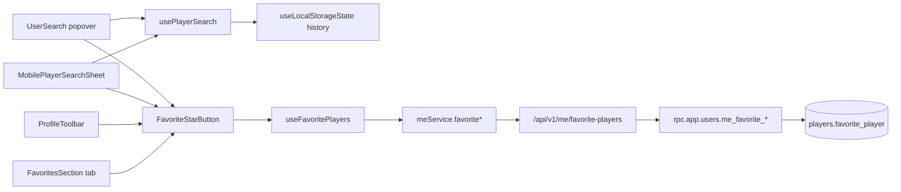

# Player Search (Mobile) + Search History + Favorite Players — Design

**Status:** accepted (2026-08-17)
**Plan:** `docs/superpowers/plans/2026-08-17-player-search-history-favorites.md`

---

## 1. Understanding Summary

- **What:** (a) restore player search on the mobile header, currently fully hidden; (b) a client-side "recent searches" list surfaced in the search UI on both mobile and desktop; (c) account-scoped "favorite players" — a star toggle on a player's profile and in search results, with a full list under a new tab in the account settings modal.
- **Why:** `UserSearch` was deliberately hidden below `md` in commit `3151b920` ("fix: keep mobile header controls within viewport") to stop the header from overflowing on narrow screens, but no mobile-appropriate replacement shipped — mobile visitors currently have no way to search players at all. History/favorites are a natural extension for a stats site where visitors repeatedly look up the same players.
- **Who:** search + history work for every visitor, anonymous or not (mirrors today's public `GET /api/v1/users/search`). Favorites require an account — this is not new scope invention: `ProfileToolbar.tsx` already carries the comment *"Follow is a later backend phase"*, i.e. the team already earmarked an account-scoped follow/favorite feature.
- **Constraints (verified against code):**
  - The mobile header already overflowed once; any new control must not reintroduce that.
  - One shared Alembic history across the whole backend monorepo (`backend/migrations/versions`); `cd backend && rtk uv run alembic heads` is authoritative for `down_revision`, never assumed from a file scan.
  - `frontend/src/i18n/messages/en.json` and `ru.json` change together.
  - `players.user` (the player row) is owned by **app-service** (`rpc.app.users.*`, gateway `/api/v1/users/*`); self-service "my own account" actions already live under `/api/v1/me/*` (`me_social_list`, `me_set_stream_visibility`) with a private helper (`_account_gate`, `_resolve_my_player_id[_or_none]`) in `backend/app-service/src/rpc/users_admin.py`.
  - Gateway route tables are declarative (`[]edge.RouteSpec`); the OpenAPI manifest (`gateway/internal/openapi/schemas.json`) is generated from each service's `src/openapi_schemas.py` via `bash backend/scripts/export_openapi_schemas.sh` and is CI-gated against staleness.
- **Non-goals:** no notifications/activity feed on a favorited player, no team/tournament favorites, no server-side "recently viewed" (history is *searches*, not arbitrary profile visits), no change to desktop search UX beyond adding the shared history/favorite affordances it already has room for.

## 2. Current State (verified against code)

`UserSearch.tsx` is a single component: debounced query (300ms) → `userService.searchUsers` → Radix `Popover` anchored to the input, `Command`/`CommandItem` result rows, full keyboard nav (Escape/Arrow/Enter). It is mounted once, in `Header.tsx`:

```tsx
<div className="hidden min-w-0 md:ml-auto md:block md:flex-initial">
  <UserSearch />
</div>
```

`git log -L` on that block confirms the `hidden md:block` wrapper was added in `3151b920` specifically to fix mobile overflow — there was no mobile fallback in that commit or since.

`ProfileToolbar.tsx` (player profile header) already has a fixed two-button toolbar (`Share`, `Compare`) with a comment reserving a third, backend-dependent "Follow" action — the natural third slot for a favorite star.

`AccountSettingsModal.tsx` is a `Tabs`-based dialog with `TAB_CONFIG: {id: SettingsTab; icon}[]` (`profile | preferences | sessions`), each tab a `TabsContent` rendering a dedicated `*Section` component (`MyAccountSection.tsx`, `AccountSessionsSection.tsx`). Adding a `favorites` tab is additive to this list.

`meService.ts` (`frontend/src/services/me.service.ts`) is the existing "self-service" client: thin `apiFetch` wrappers over `/api/v1/me/*` and `/api/auth/me/*`. `useLocalStorageState` (`frontend/src/hooks/useLocalStorageState.ts`) is the existing localStorage-with-zustand-adjacent-ergonomics hook, already used for durable client-only UI state (`TeamDistributionPanel`, `useRankHistoryGranularity`).

### 2.1 Fact table

| Claim | Verified where |
| --- | --- |
| Mobile hides `UserSearch` entirely, no fallback | `Header.tsx:127-133`, `git log -L 127,133:.../Header.tsx` → `3151b920` |
| `/api/v1/users/search` is public (`AuthNone`) | `gateway/internal/app/routes.go:47` |
| `players.user` lives in schema `players`, 1:0..1 to `auth.user` | `backend/shared/models/identity/user.py:15-55` |
| Self-service "my player" pattern already exists (`me_social_*`) | `backend/app-service/src/rpc/users_admin.py:66-83, 337-368`; gateway `users_admin_routes.go:35-43` |
| An `AuthUser`-scoped preference table already exists as precedent (`EncounterSavedView`) | `backend/shared/models/preferences/encounter_saved_view.py` |
| OpenAPI manifest is generated, not hand-written, and CI-gated | `backend/scripts/export_openapi_schemas.sh:1-9`, `gateway/internal/openapi/openapi.go:1-11` |
| One shared Alembic history, short mnemonic revision ids | `backend/migrations/versions/owemerald01_*.py` header |
| No existing favorite/follow/bookmark feature anywhere in the repo | grep across `frontend/src`, `backend` — only the `ProfileToolbar` comment and unrelated matches (`Bookmark` icon on `EncountersRedesignClient`'s saved views) |

## 3. Assumptions

| # | Assumption | Confirmed |
| --- | --- | --- |
| A1 | "Search history" = players selected from search results (click/Enter), not raw query strings or arbitrary profile visits. Capped at 8, deduplicated (re-selecting moves an entry to front), with a "clear all" affordance. | yes |
| A2 | History and favorites render in **both** surfaces — the existing desktop popover and the new mobile sheet — sharing one hook/state, not two parallel implementations. | yes |
| A3 | Favoriting is a pure quick-access bookmark: no notifications, no effect on stats/rankings. | yes |
| A4 | Scale is a non-issue (a niche tournament stats site) — no pagination/perf work needed for the favorites list. | yes |
| A5 | Search + history stay anonymous-friendly (unchanged auth mode); only favorites require login, gated through the existing `useAuthModalStore`. | yes |

## 4. Design

### 4.1 Phase 0 — Mobile search (frontend-only, ships independently)

Extract the query/debounce/fetch/keyboard-nav state currently inlined in `UserSearch.tsx` into a shared hook `usePlayerSearch()` (`frontend/src/hooks/usePlayerSearch.ts`), so the desktop `Popover` UI and a new full-screen mobile UI consume identical behavior instead of forking it. `UserSearch.tsx` becomes a thin view over the hook.

New `MobilePlayerSearchSheet.tsx` — a Radix `Sheet` (`side="top"`, near-fullscreen, reusing the primitive already used for the mobile nav in `Header.tsx`) opened from a `Search` icon button rendered only `md:hidden` in the header row (next to the existing hamburger `SheetTrigger`, not replacing it — two independent sheets). Renders the same result list, full width, no fixed popover width math (the fixed-width classes on desktop's `Input` — `sm:w-[300px] md:w-[200px] lg:w-[300px]` — are exactly what made a mobile inline version cramped; the sheet sidesteps that by not living in the header row at all).

### 4.2 Phase 1 — Search history (client-only, no backend)

`useLocalStorageState<RecentPlayer[]>("player-search-history", [])`, `RecentPlayer = { id: number; name: string }`. Recorded inside the shared `usePlayerSearch()` hook's select handler (so both surfaces get it for free per A2). Rendered as a "Recent" `CommandGroup` above results when the query is empty and history is non-empty, in both the popover and the sheet — an ✕ per row plus a "Clear all" action, mirroring the existing empty/loading `CommandEmpty` states already in `UserSearch.tsx`.

### 4.3 Phase 2 — Favorite players (account-scoped, full stack)

**Data.** `FavoritePlayer` in `backend/shared/models/preferences/favorite_player.py` (registered in that package's `__init__.py`), schema `players` (co-located with `players.user`, matching how `EncounterSavedView` took the schema of its *subject domain* — `tournament` — rather than the literal "preferences" package name):

```python
class FavoritePlayer(db.TimeStampIntegerMixin):
    __tablename__ = "favorite_player"
    __table_args__ = (
        UniqueConstraint("auth_user_id", "player_id", name="uq_favorite_player_auth_user_player"),
        Index("ix_favorite_player_auth_user", "auth_user_id"),
        {"schema": "players"},
    )
    auth_user_id: Mapped[int] = mapped_column(ForeignKey(AuthUser.id, ondelete="CASCADE"), index=True)
    player_id: Mapped[int] = mapped_column(ForeignKey(User.id, ondelete="CASCADE"), index=True)
```

One Alembic revision, `down_revision` resolved from `alembic heads` at implementation time (never assumed).

**Backend RPC** (app-service, appended to the existing self-service section of `backend/app-service/src/rpc/users_admin.py`, reusing `_account_gate`):

- `rpc.app.users.me_favorites_list` — list of `MinimizedUserRead` (id, name) for the caller's `auth_user_id`, ordered `created_at desc`.
- `rpc.app.users.me_favorite_add` — idempotent add by player id (404 if the player id does not exist).
- `rpc.app.users.me_favorite_remove` — idempotent remove by player id, 204.

**Gateway** (appended to `gateway/internal/app/users_admin_routes.go`, `/api/v1/me/*` block):

```go
{Method: "GET",    Pattern: "/api/v1/me/favorite-players",     Queue: "rpc.app.users.me_favorites_list", Auth: edge.AuthRequired},
{Method: "POST",   Pattern: "/api/v1/me/favorite-players/{id}", Queue: "rpc.app.users.me_favorite_add",    IDParam: "id", Auth: edge.AuthRequired},
{Method: "DELETE", Pattern: "/api/v1/me/favorite-players/{id}", Queue: "rpc.app.users.me_favorite_remove",  IDParam: "id", Auth: edge.AuthRequired, Success: 204},
```

OpenAPI entries added to `src/openapi_schemas.py`/`openapi_docs.py`, manifest regenerated via `bash backend/scripts/export_openapi_schemas.sh`.

**Frontend.** `meService` gains `getFavoritePlayers/addFavoritePlayer/removeFavoritePlayer`. A single react-query hook `useFavoritePlayers()` (`frontend/src/hooks/useFavoritePlayers.ts`) exposes `{ favoriteIds: Set<number>, isFavorited, toggle, isLoading }` — every consumer (search rows, profile toolbar, settings tab) shares one cache entry, so a toggle anywhere updates everywhere without prop drilling. A single presentational `FavoriteStarButton` (`frontend/src/components/FavoriteStarButton.tsx`, props `{ playerId: number; size?: "sm" | "md"; className?: string }`) encapsulates the toggle + the anonymous-visitor path (opens `useAuthModalStore` instead of calling the API). It is dropped into: `ProfileToolbar.tsx` (third button, replacing the deferred-Follow comment), each search result row (both surfaces, Phase 0's shared row rendering), and a new `favorites` tab (`FavoritesSection.tsx`) in `AccountSettingsModal.tsx` / `account-settings-modal.store.ts`'s `SettingsTab` union.



## 5. Decision Log

| Decision | Alternatives considered | Why this one |
| --- | --- | --- |
| Mobile trigger: icon → full-screen sheet | Inline expanding field in the header; move search into the hamburger menu | The header already overflowed once from a fixed-width inline field; a sheet needs no header-row width budget and is the standard mobile search pattern. |
| History: `localStorage` only, not account-scoped | Server-persisted, synced across devices | Works anonymously (search itself is public), reuses the existing `useLocalStorageState` hook, and ephemeral "recent" data does not justify a backend round-trip. |
| Favorites: account-scoped, backend-persisted | `localStorage`-only | Matches the pre-existing "Follow is a later backend phase" intent in `ProfileToolbar.tsx`; a bookmark list that survives a browser wipe or device change is the point of "favorites" as opposed to "history". |
| Favorites list surface: a tab in `AccountSettingsModal` | New `/users/favorites` route; inline-only in search, no dedicated list | Reuses the existing Dialog/Tabs shell and its mobile-responsive layout instead of adding a route + nav entry. |
| One shared `usePlayerSearch` hook instead of forking desktop/mobile logic | Duplicate the debounce/fetch/keyboard logic in a new mobile-only component | History (A2) and any future search change would otherwise need to be implemented twice and drift. |
| `FavoritePlayer` in `players` schema, package `shared.models.preferences` | `auth` schema; folding into `shared.models.identity` | Mirrors `EncounterSavedView`, which took the schema of the *subject domain* (`tournament`) over its owning package name (`preferences`); `favorite_player` is fundamentally about players. |

Understanding Lock confirmed; design approved as-is (user: "Все верно"); assumptions A1–A5 confirmed; Decision Log complete.
