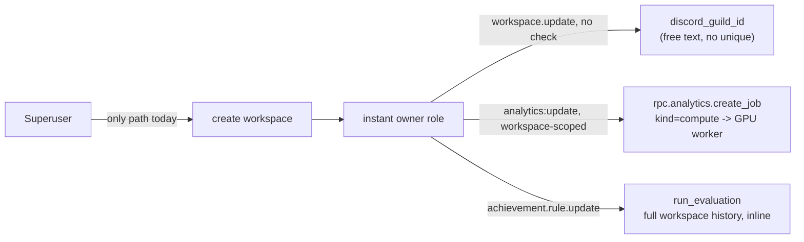

# Workspace Self-Service Creation — Design

**Status:** accepted (2026-08-26)
**Plan:** `docs/superpowers/plans/2026-08-26-workspace-self-service.md`
**Related:** `docs/superpowers/specs/2026-08-04-workspace-discord-guild-design.md` (introduced `Workspace.discord_guild_id`, no ownership proof, no uniqueness — this design closes both gaps), `docs/superpowers/specs/2026-08-03-subscription-entitlements-design.md` (the fail-open guild gate this design must not silently widen)

---

## 1. Understanding Summary

- **What:** open `rpc.app.workspaces.create` to any active authenticated user (today: `require_superuser` only), gated by two new protections so self-service does not open two abuse channels: (a) proof of Discord-guild ownership before a workspace can claim a guild, (b) a `verification_status` tier that blocks GPU-backed ML compute and defers achievement full-recompute for brand-new workspaces.
- **Why:** organizers currently wait on a superuser to create their workspace by hand. Removing that gate without the two protections below hands any new account (1) the ability to squat someone else's Discord guild (no ownership check, no uniqueness constraint today) and (2) unmetered access to a physically-limited GPU worker and to a full-history achievement recompute, both reachable today by any workspace `owner`/`admin` with zero quota.
- **Who:** tournament organizers who want to self-onboard; superusers, who keep override/downgrade power but stop being a required step for every new workspace.
- **Constraints:** SQLAlchemy 2 + Alembic (hand-written revision ids, `alembic heads` authoritative — chain head at time of writing is `anlcln02`, confirmed by walking all 30 `down_revision` links in `backend/migrations/versions/`, hint only); FastStream RPC over RabbitMQ, one broker per service; RBAC via `shared.rpc.identity.ensure_workspace_permission`; Discord OAuth today requests `scope=identify email` only (`identity-service/src/services/oauth_providers.py:94`); the GPU worker is one physical resource (`docker-compose.gpu.yml`), not a logical limit.
- **Explicit non-goals:** billing/paid tiers; multiple Discord guilds per workspace; changing the RBAC role model; a general-purpose priority-queue primitive (RabbitMQ `x-max-priority` is not used anywhere in this codebase today — introducing it here would be a new, unprecedented mechanism for one call site; a second named queue, which the codebase already does three times over — `ANALYTICS_JOB_QUEUE`/`ANALYTICS_TRAIN_QUEUE`/`ANALYTICS_INFER_QUEUE` — is the boring fit).

## 2. Current State (verified against code)

| Claim | Verified where |
| --- | --- |
| `create` is superuser-only | `backend/app-service/src/rpc/workspaces.py:230`, `c.require_superuser(user)` |
| `provision()` grants `owner` to whoever calls it, no moderation step | `backend/app-service/src/services/workspace/service.py:486-511` |
| `discord_guild_id` is a free-text snowflake, format-checked only, editable by anyone with `workspace.update` | `schemas/workspace.py:73,111,159-166`; `WorkspaceUpdate` has no ownership check |
| `discord_guild_id` has **no UNIQUE constraint** | `shared/models/tenancy/workspace.py:71` — plain `String(32) nullable`, unlike `subdomain`/`custom_domain` which are `unique=True` |
| Discord OAuth requests `identify email` only, no `guilds` scope | `identity-service/src/services/oauth_providers.py:94` |
| A missing/wrong Discord guild on the Boosty provider **fails open** | `shared/subscriptions/providers/discord_role.py:101-102` → `unknown("guild_not_configured")`; Kleene composition treats `unknown` as pass (already flagged as a risk in `2026-08-04-workspace-discord-guild-design.md:221`) |
| `rpc.analytics.train` / `.infer` gate on a **global** `analytics:update` permission, not workspace-scoped | `analytics-service/src/rpc/jobs_control.py:180-229`, marked deprecated in the module docstring in favour of `create_job` |
| `rpc.analytics.create_job` / `.recalculate` / `.points` all funnel through one chokepoint, `_dispatch` → `create_analytics_job` | `jobs_control.py:82-136,138-178`; kind `compute` "also runs ML inference like every other compute job" (module docstring line 8) |
| `train_ml` kind is already superuser-only | `jobs_control.py:64-70`, `_require_actor` |
| `analytics-worker` is GPU-backed, one physical service | `docker-compose.gpu.yml:23-34`, `nvidia` device reservation |
| Achievement full-history evaluation runs **synchronously inline** in the RPC handler for `manual` and `rule_version_bump` triggers | `parser-service/src/rpc/achievements.py:107,354`; `services/achievement/rule_service.py:75` |
| `EvaluationRunStatus` is a plain `String()` column, not a Postgres native enum | `shared/models/achievements/achievement.py:214` — adding a new Python `StrEnum` member needs no migration |
| `EvaluationRunTrigger` has exactly three values | `achievement.py:71-74`: `parse_complete`, `manual`, `rule_version_bump` |
| `WorkspaceMember` has no `auth_user_id`; "linked" membership is `player.auth_user_id IS NOT NULL` | `shared/models/tenancy/workspace.py:105-112`, cross-referenced against `docs/users-identity.md:142-143` |
| A global, key-namespaced tunable-config table already exists | `shared/models/tenancy/settings.py` — `Settings(key unique, value JSON)`, `SettingsRepository` |
| `team_rate_limits.py` is the only precedent for an authenticated per-actor rate limit in this stack | `tournament-service/src/services/registration/team_rate_limits.py`, discussed in `docs/plans/2026-08-20-team-registration.md:864-908` — fail-closed for operations that mint a new entity |

### 2.1 Abuse surface today vs. after self-service



Today this whole chain is gated by one manual human step (`require_superuser`). Removing that step without touching the three downstream edges turns each of them into an open primitive.

## 3. Assumptions

| # | Assumption | Confirmed |
| --- | --- | --- |
| A1 | A Discord guild is bound **after** workspace creation, via a separate verify step — not required in the create form | Confirmed by user |
| A2 | Any `is_active` authenticated user may call `create`, bounded by a **per-user cumulative cap** on owned workspaces (default 1), not a time-window rate limit | Revised by user — see §4.4 |
| A3 | GPU compute (`kind=compute` job, `train`/`infer`) is a **hard block** for `unverified` workspaces | Confirmed by user |
| A4 | Achievement full-recompute (`manual`, `rule_version_bump` triggers) is **deferred** (low-priority queue), not blocked, for `unverified` workspaces | Confirmed by user |
| A5 | No auto-upgrade in this iteration. `verification_status` moves `unverified → verified/trusted` **only** through a superuser RPC. The linked-member-count primitive is written (so a later auto-verify pass is a small follow-up) but **no call site invokes it** | Revised by user — see §4.3 |
| A6 | Existing production workspaces backfill to `verified` on migration — no retroactive gating of current organizers | New, follows from A5's intent (gate new entrants, not incumbents) — flagged in Risks §6 for explicit sign-off |
| A7 | The public/anonymous workspace listing (home page) shows **only `trusted`** workspaces for now — `verified` is a compute/achievement gate, not a discoverability gate | New, confirmed by user — see §4.5 |

## 4. Design

### 4.1 Discord guild ownership verification

**Proof of rights (identity-service).** Add `guilds` to the Discord OAuth scope (`oauth_providers.py:94`: `"identify email"` → `"identify email guilds"`). New method on the Discord provider / a small service wrapping it: `GET https://discord.com/api/users/@me/guilds` using the stored OAuth access token (refreshed through the existing refresh-token path if expired). Discord returns, per guild and **without any privileged intent**, `owner: bool` and `permissions: str` (a bitfield encoded as a string — must be parsed as `int`). A user administers a guild iff `owner is True or (int(permissions) & 0x20) != 0` (`MANAGE_GUILD`).

New RPC `rpc.identity.oauth.discord_guilds` (identity-service): `{auth_user_id} -> {guilds: [{guild_id, name, owner, can_manage}]}`. No persistence — computed live, so it can never go stale between calls. (A background re-check job is explicitly **not** built in this iteration: nothing today reads `discord_guild_verified_at` as a live gate — see Risks §6 for the residual staleness this leaves.)

**Binding (app-service).** New RPC `rpc.app.workspaces.discord_guild_verify`: `{workspace_id, guild_id}`.
1. `ensure_workspace_permission(actor, workspace_id, "workspace", "update")` — same permission that already governs the workspace edit screen.
2. Call `rpc.identity.oauth.discord_guilds` for the actor; reject with 403 `discord_guild_not_administered` if `guild_id` is absent from the `can_manage`/`owner` set.
3. `UPDATE workspace SET discord_guild_id=?, discord_guild_verified_at=now(), discord_guild_verified_by_auth_user_id=? WHERE id=?` inside the actor's transaction. The new UNIQUE index on `discord_guild_id` (§4.2) turns a guild already claimed by another workspace into a clean `IntegrityError` → mapped to 409 `discord_guild_already_claimed`, never a silent overwrite.
4. `record_audit(..., action="workspace.discord_guild_verified", ...)` — same audit primitive already used for custom-domain verification (`workspace_service.py:614-636`).

**`WorkspaceUpdate.discord_guild_id` is retired.** Today `PATCH /workspaces/{id}` lets anyone with `workspace.update` set the field with only a regex check — that path bypasses the whole point of this design and must be removed in the same change, not left as a parallel unverified route. `WorkspaceRead` keeps `discord_guild_verified_at` (nullable, same public-exposure precedent as `custom_domain_verification_token` — a guild id is not a secret, every Discord message link already contains it).

**Bot presence stays separate.** `rpc.app.workspaces.discord_guild` (`workspaces.py:471`, backed by `discord-service`'s `_lookup_guild`) already answers "is the bot in this guild" — that is a **readiness** signal for log ingestion/roles, not an identity proof, and is unchanged by this design.

### 4.2 Data model

```python
# backend/shared/models/tenancy/workspace.py — Workspace
discord_guild_id: Mapped[str | None] = mapped_column(String(32), unique=True, nullable=True)  # was: nullable=True only
discord_guild_verified_at: Mapped[datetime | None] = mapped_column(DateTime(timezone=True), nullable=True)
discord_guild_verified_by_auth_user_id: Mapped[int | None] = mapped_column(
    ForeignKey("auth.user.id", ondelete="SET NULL"), nullable=True
)
# Not a DB enum, matching the newcomer_scope precedent (workspace.py:82-89) — values are a
# convention, not a constraint, so a fourth tier never needs a migration:
verification_status: Mapped[str] = mapped_column(String(16), server_default="unverified", nullable=False)
# Accountability, not permission. Decoupled on purpose from the RBAC "owner" role
# (auth.roles, per-workspace-scoped) — a workspace can have zero, one, or several
# co-owners via RBAC, and that set can be reassigned any time by an existing owner.
# owner_id answers a narrower, more stable question: who is this workspace's
# create-time accountable party, for the self-service create cap (§4.4) and for
# a future "my workspaces" surface. SET NULL on account deletion, same direction
# as discord_guild_verified_by_auth_user_id above — an orphaned workspace simply
# stops counting against anyone's cap, it is not deleted or reassigned automatically.
owner_id: Mapped[int | None] = mapped_column(
    ForeignKey("auth.user.id", ondelete="SET NULL"), nullable=True, index=True
)
```

Values: `unverified` (default for every newly self-service-created workspace), `verified` (auto-reachable, or superuser-set), `trusted` (superuser-only escape hatch — always passes every tier gate, never auto-downgraded, reserved for organizers with off-platform reputation such as a migrated existing org).

Existing production rows backfill to `verified`, not `unverified` — this migration must never gate a currently-running tournament (A6). `owner_id` backfills from the current RBAC "owner" grants **only where a workspace has exactly one holder** — see §4.4 for why a join through `auth.roles` is the wrong *ongoing* mechanism, but it is exactly the right one-time signal to seed `owner_id` from, since it is what `provision()` has been setting via `assign_workspace_system_role` all along. Workspaces with zero or multiple current owner-role holders backfill `owner_id` to `NULL` — flagged in Risks §6, not silently guessed.

### 4.3 Tier gate — one chokepoint, two policies, manual-only for now

No auto-upgrade in this pass (A5). The gate is a pure status check; the linked-member-count primitive is written alongside it so a later auto-verify iteration is additive, not a rewrite — but nothing calls it yet.

```python
# backend/shared/services/workspace_tier.py (new, shared — both app-service RBAC-adjacent
# helpers and analytics-service/parser-service need it, mirroring how
# ensure_workspace_permission already lives in shared.rpc.identity for the same reason)

def is_verified_or_trusted(workspace: Workspace) -> bool:
    """The only gate check wired to a call site in this iteration. Pure — no
    query, no side effect, no auto-upgrade. Superuser-set status only.
    """
    return workspace.verification_status in ("verified", "trusted")


# --- Written, not wired: groundwork for a later auto-verify pass. No caller in
# this iteration touches these two; a regression test in the plan (Task 8)
# pins that absence so a future edit doesn't wire them in by accident without
# a deliberate decision to do so. ---

_AUTO_VERIFY_SETTINGS_KEY = "workspace_verification.auto_verify_min_linked_members"


async def count_linked_members(session, workspace_id: int) -> int:
    """workspace_member rows whose player has a linked auth account
    (``players.user.auth_user_id IS NOT NULL``) — the candidate metric for a
    future auto-verify threshold. Defined now so the metric and its data shape
    are pinned by test before anything depends on them.
    """
    ...
```

**Manual verification (superuser-only).** New RPC `rpc.app.admin.workspace_verification_set`: `{workspace_id, verification_status}`.
1. `c.require_superuser(user)`.
2. Validate `verification_status in ("unverified", "verified", "trusted")`.
3. `UPDATE workspace SET verification_status=? WHERE id=?`.
4. `record_audit(..., action="workspace.verification_status_set", before={"verification_status": ...}, after={"verification_status": ...})` — same audit primitive as custom-domain verification and the Discord-guild bind (§4.1).

This is, for this iteration, the **only** way a workspace leaves `unverified`. There is no automatic path, no scheduler, no event consumer — a brand-new self-service workspace stays `unverified` until a superuser looks at it.

**GPU gate (hard block).** Single call site: `analytics-service/src/rpc/jobs_control.py::_dispatch` (reached by `create_job`, `recalculate`, `points` — the docstring already states `compute` "runs ML inference like every other compute job", so gating this one function covers all three). After the existing `_require_actor` RBAC check, when `body.kind == JOB_KIND_COMPUTE` and `workspace_id is not None`: `if not is_verified_or_trusted(workspace): raise HTTPException(403, "workspace_not_verified")`. The deprecated `train`/`infer` RPCs get the same check for defense in depth since they are still live endpoints, not yet removed. `train_ml` is untouched — it is already gated stricter (superuser-only) than "verified".

**Achievement gate (deferred, not blocked).** Single chokepoint: `AchievementEvaluationRunnerService.run_evaluation` (`runner.py:47`). Only the two triggers that recompute the **entire** workspace history are in scope — `manual` and `rule_version_bump`; `parse_complete` (the normal per-match production path) is untouched, it was never the abuse vector. When triggered by one of those two and `not is_verified_or_trusted(workspace)`:
1. Create an `EvaluationRun` row with a new status `queued` (extend `EvaluationRunStatus` — plain `String()` column, §2 fact table, no migration needed for the value itself).
2. Publish the same event shape (`AchievementEvaluateEvent`) onto a **new** queue, `ACHIEVEMENT_EVALUATE_DEFERRED_QUEUE` — mirrors the existing pattern of separate named queues per purpose (`ANALYTICS_JOB_QUEUE`/`ANALYTICS_TRAIN_QUEUE`/`ANALYTICS_INFER_QUEUE`) rather than introducing AMQP message priority, which has zero precedent in this codebase.
3. That queue is consumed by the same `handle_achievement_evaluate` logic, bound with a single low-concurrency consumer (`prefetch_count=1`, one replica) so it can never contend with the normal `parse_complete` path or with verified workspaces' inline manual runs.
4. Callers (`rpc/achievements.py:107,354`, `rule_service.py:75`) return the `queued` run instead of waiting — the same 202-shaped async-job pattern `analytics-service` already established for `create_job` (module docstring: "the legacy synchronous 200 behaviour is intentionally replaced by the unified async job").

Verified/trusted workspaces get **zero behavioural change** — same inline synchronous run as today. An `unverified` workspace with no superuser attention stays deferred indefinitely — that is intended for this iteration (A5), not a bug: the deferred queue drains it eventually (design keeps it functional, just low-priority), it never silently drops it.

### 4.4 Self-service create

```python
# backend/app-service/src/rpc/workspaces.py::_create
c.require_active(user)  # was: c.require_superuser(user)
await ensure_create_limit(session, user)  # new, DB-locked cumulative cap — see below
body = schemas.WorkspaceCreate.model_validate(c.payload(data))  # discord_guild_id field removed
_reject_reserved_slug(body.slug)  # new, static denylist
workspace = await workspace_service.provision(session, payload=body.model_dump(), owner_auth_user_id=user.id)
# provision() now also stamps workspace.owner_id = owner_auth_user_id, in the same
# transaction as the RBAC "owner" role grant it already performs — two distinct
# writes for two distinct concerns (§4.2), not a replacement of one by the other.
# New workspaces still default verification_status="unverified" via the column's
# server_default; no special-casing by actor needed.
```

**Create limit — cumulative cap, not a time-window rate.** User's explicit call: default **one owned workspace per user**, not a daily quota. This is a `COUNT`, not a Redis `INCR`/`EXPIRE`: "one owned workspace per user" is a standing invariant on current state, not a rate over time, so a TTL counter is the wrong primitive — a plain DB check inside the same transaction as `provision()` is simpler and needs no new infrastructure (Settings table already exists for the tunable, no Redis dependency added).

**Counted via `Workspace.owner_id`, not the RBAC "owner" role.** The first draft of this design counted `auth.user_roles` rows joined to the per-workspace `owner` role — that is the wrong join for a cap. RBAC "owner" is a **permission** grant: `invite_member`/`change_member_roles` can hand it to any number of co-owners, and a workspace can freely reassign or revoke it without touching who is "accountable" for having created the tenant. Counting through it means (a) a workspace with two co-owners inflates *both* their counts even though only one of them created it, and (b) an actor can create a workspace, grant `owner` to a second account, then have that role revoked from themselves — freeing their own count back to zero while the workspace still exists, defeating the cap's entire purpose without touching a single line of create-path code. `owner_id` is a plain FK stamped once, at creation, immune to later RBAC changes:

```python
# backend/shared/repository/tenancy.py (or wherever WorkspaceRepository already lives)
async def count_by_owner(self, session, *, owner_id: int) -> int:
    return int(await session.scalar(
        sa.select(sa.func.count(models.Workspace.id)).where(models.Workspace.owner_id == owner_id)
    ) or 0)
```

`ensure_create_limit`: `SELECT * FROM auth.user WHERE id = :user_id FOR UPDATE` first — serializes two concurrent `create` calls from the same actor onto one lock, the same "lock the parent row, then count, then act" shape already used for team-registration slot accounting (`docs/plans/2026-08-20-team-registration.md:545-554`); without it two racing requests could both read `count == 0` and both succeed, breaching a cap whose whole point is "at most one." Then `count_by_owner` against the `Settings`-sourced threshold `workspace_creation.max_owned_per_user` (default `1`). Superusers are exempt (they already had unrestricted create before this change; capping them adds friction with no abuse-reduction benefit, since they are the same actors who administer the cap). Over the limit → `HTTPException(403, "workspace_create_limit_reached")` — `403`, not `429`: this is a standing entitlement check, not a transient rate limit, so "retry later" would be a lie.

**Reserved slugs.** Static list (`admin`, `api`, `www`, `app`, `static`, `docs`, `status`, `support`, plus the platform's own root slug if it has one) checked before the existing uniqueness check in `provision()` — 400 `slug_reserved`.

**`WorkspaceCreate.discord_guild_id` is removed** — binding only happens through `discord_guild_verify` (§4.1), after the workspace exists and is owned.

### 4.5 Public visibility — trusted-only homepage

`WorkspaceService.get_all` (`service.py:89-106`) already backs the public directory ("home page + anonymous `/api/v1/workspaces` list", per the `is_hidden` column comment) and already special-cases a viewer's own membership: `not w.is_hidden or w.id in member_ids`. Extend the non-member branch with a trust check, same shape:

```python
async def get_all(self, session, *, user=None):
    workspaces = await self.workspace_repo.list_ordered(session)
    if user is not None and user.is_superuser:
        return workspaces
    member_ids = set(user.get_workspace_ids()) if user is not None else set()
    return [
        w for w in workspaces
        if w.id in member_ids or (not w.is_hidden and w.verification_status == "trusted")
    ]
```

A member always sees their own workspace regardless of tier — this is not a visibility punishment, it only affects the **public** directory. Direct lookups (`get_by_id`, `get_by_slug`, `get_by_subdomain`, `get_by_custom_domain`) are untouched, exactly like the existing `is_hidden` carve-out: a fresh `unverified` self-service workspace is fully reachable and usable by slug/subdomain the moment it is created, it just does not appear on the home page until a superuser marks it `trusted`. Explicitly temporary (user's own framing, "пока что") — the natural follow-up once auto-verify (A5) lands is to widen this to `verification_status != "unverified"`, tracked as a follow-up, not built speculatively now (YAGNI).

### 4.6 Gateway and docs

New RPC subjects need Go gateway routes + `apidocs/groups.go` entries (auto-generated manifest, per the existing convention — no hand-editing): `discord_guild_verify` (`AuthRequired`, `POST /api/v1/workspaces/{id}/discord-guild`), and the internal `rpc.identity.oauth.discord_guilds` stays service-internal (no gateway route — it is not client-facing). `docs/database_erd.md` and its mirror `frontend/src/app/docs/diagrams.ts` gain the four new `WORKSPACE` columns (`discord_guild_verified_at`, `discord_guild_verified_by_auth_user_id`, `verification_status`, `owner_id`) and the bumped alembic head, in both places it appears (the same two-place discipline noted in the Discord-guild-to-workspace design, `2026-08-04-...-design.md:200`).

## 5. Decision Log

| Decision | Alternatives considered | Why |
| --- | --- | --- |
| `verification_status: str` on `Workspace`, three conventions not a DB enum | Postgres native enum; separate `workspace_tier` table | Matches `newcomer_scope` precedent exactly (`workspace.py:82-89`) — a fourth tier is a data change, not a migration |
| No auto-upgrade in this pass; manual superuser RPC only | Live threshold check on every gated call (original design); nightly batch job like `nightly_drift_check` | Explicit user revision — operator wants direct control while the platform is small; the metric primitive (`count_linked_members`) is still written so the follow-up is additive |
| Auto-verify metric, when it lands, will be **linked member count**, not tournament count | Tournament count; a blended score | Still the user's stated preference for the eventual auto path, even though nothing calls it yet — recorded so the follow-up doesn't re-litigate it |
| Achievement deferral = a second named RabbitMQ queue with low concurrency | AMQP message priority (`x-max-priority`) on the existing queue | Zero precedent for AMQP priority anywhere in this codebase; a second queue is the same pattern already used three times for analytics (`ANALYTICS_JOB_QUEUE`/`_TRAIN_QUEUE`/`_INFER_QUEUE`) |
| GPU gate lives in `_dispatch`, one chokepoint | Gate each of `create_job`/`recalculate`/`points`/`train`/`infer` individually | `_dispatch` is already the one function all three modern RPCs funnel through (mirrors the `load_configs` single-chokepoint precedent from the workspace-Discord-guild design) |
| Existing production workspaces backfill to `verified` | Backfill to `unverified`, force every current organizer through manual review | A6 — self-service must gate new entrants, not retroactively degrade running tournaments; this is a live-incident risk if inverted |
| `discord_guild_id` binding removed entirely from `WorkspaceUpdate`, only reachable via `discord_guild_verify` | Keep `PATCH` as a fallback for superusers | A superuser fallback recreates exactly the unverified-write path this design closes; a superuser can still call `discord_guild_verify` on the actor's behalf or use a dedicated admin override, out of scope for this pass |
| Discord OAuth `guilds` scope fetched live, not persisted/cached | Store a `discord_administered_guilds` table with a TTL, refreshed by a periodic job | No caller needs it between verify calls; persisting it is speculative infrastructure for a signal used exactly once per binding attempt — flagged as a residual staleness risk instead (§6), not solved preemptively |
| `Workspace.owner_id` FK, counted with a plain `COUNT`, not the RBAC `owner` role joined through `auth.user_roles` | RBAC-role join (original draft); Redis time-window counter | RBAC `owner` is a mutable permission grant (co-owners, reassignment, revocation) — counting through it is gameable and double-counts co-owned workspaces; a dedicated FK stamped once at creation is immune to later role changes and needs no new infrastructure (§4.4) |
| Homepage/public list shows `trusted` only, not `verified` | Show `verified` too (matches the compute/achievement gate exactly); show everything except `is_hidden` (today's behaviour) | Explicit user decision — discoverability is a stricter bar than "safe to run compute on," deliberately, while the platform is small |

## 6. Risks

- **No periodic re-check of Discord guild ownership.** If an organizer loses `MANAGE_GUILD` (transferred the server, was demoted) after binding, the workspace keeps `discord_guild_id` and `discord_guild_verified_at` unchanged — verification is a point-in-time proof, not a standing invariant. Mitigation deferred deliberately (Decision Log) since nothing today reads the verified state as a live capability check beyond bot-presence (§4.1) — re-evaluate if a feature starts trusting it as an ongoing fact.
- **Existing-row backfill to `verified` is a one-time trust decision.** Every workspace created before this ships gets grandfathered. Correct per A6.
- **Manual-only verification is an operational bottleneck by construction.** Every new self-service workspace sits `unverified` — GPU-blocked, achievement-deferred, absent from the home page — until a superuser explicitly reviews it via `workspace_verification_set`. Acceptable and intended for this iteration (A5); if self-service volume grows, the written-but-unwired `count_linked_members` primitive is the documented on-ramp for an auto-verify follow-up, not a redesign.
- **Reserved-slug list and the `max_owned_per_user` default are judgment calls, not derived from data.** Both live in the `Settings` table specifically so they are tunable without a deploy if they prove wrong in practice.
- **The deferred achievement queue adds a second consumer process to operate.** One more thing that can silently stop consuming (mirrors the existing "queue has no reader" failure class already documented for `discord_channel.guild_id`) — mitigated by reusing the exact same event-consumer function, not a parallel implementation, so there is only one code path to keep correct.
- **`discord_guild_verify`'s dependency on identity-service being reachable mid-request.** Unlike the Boosty resolver (which fails open by design), this RPC must fail **closed** — a Discord API/identity-service outage should reject the bind attempt with 503, never silently skip the ownership check. Must be pinned by test.
- **`workspace_verification_set` is a new superuser-only capability with real blast radius** (it is the sole switch that unblocks GPU compute and homepage visibility) — must be audited (already specified, §4.3) and should be reviewed alongside other superuser-only actions if this platform ever adds a second class of trusted operators.
- **`owner_id` backfill is ambiguous for workspaces with zero or multiple current RBAC `owner` holders.** Both cases resolve to `NULL`, which is harmless for the cap (a `NULL`-owner workspace never counts against anyone) but means some pre-existing workspaces will show no accountable owner in any future "my workspaces" surface until a superuser sets one by hand. The pre-flight query (plan Task 1) must report how many rows this affects before the migration ships, same discipline as the `discord_guild_id` collision check.

## 7. Exit Criteria

Understanding Lock confirmed (this session, via targeted multiple-choice questions rather than free-form dialogue); one design approach accepted per concern (§4.1–§4.5); assumptions A1–A7 confirmed or flagged; risks recorded (§6); Decision Log complete (§5). A second confirmation round revised A2 and A5 and added A7 after the first pass — recorded as revisions, not silently overwritten, per the "prior decisions are ground truth until explicitly changed" discipline the rest of this codebase's specs follow.
