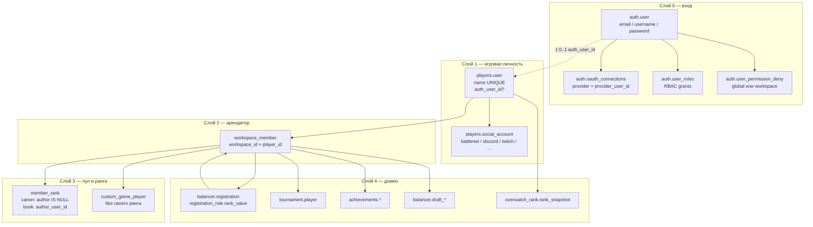
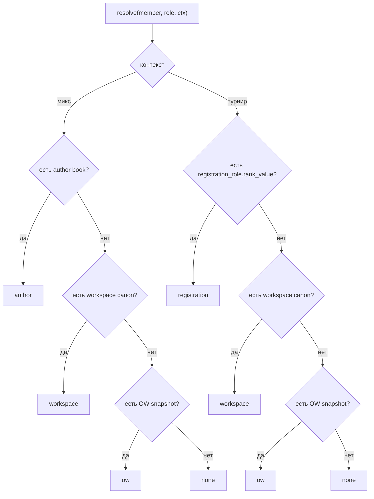
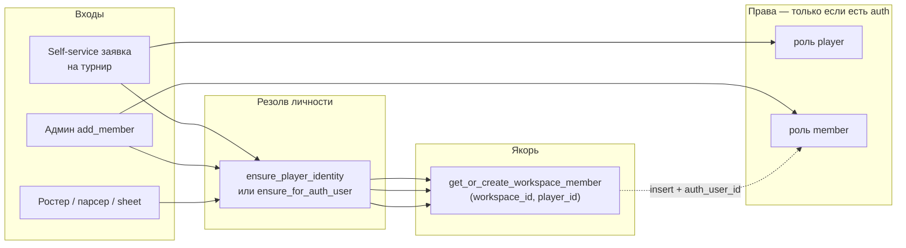
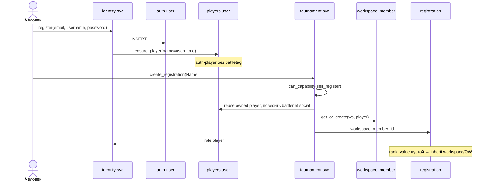
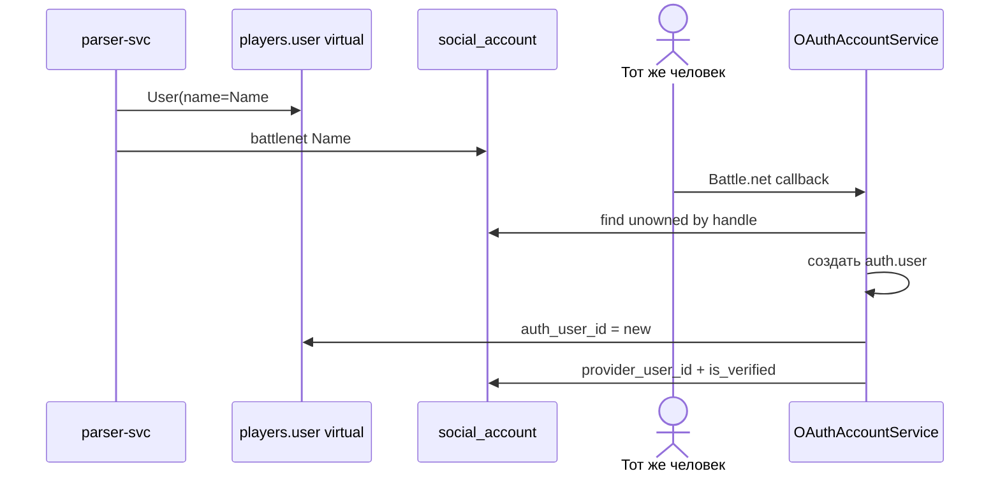
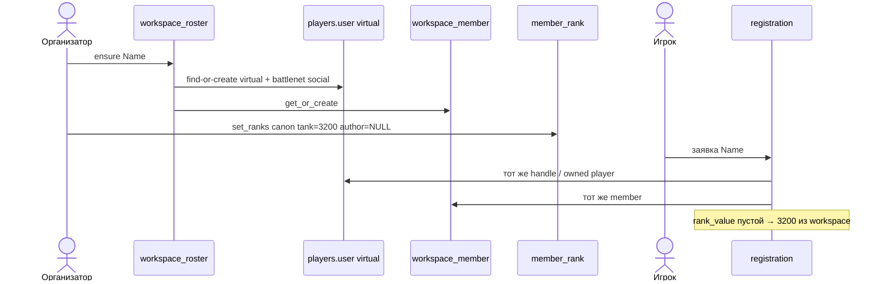

# Пользователи, игроки и членство в workspace

Канонический справочник идентичности OWT: кто такой «пользователь», чем `auth.user` отличается от `players.user`, что такое virtual player и auth-player, как человек попадает в workspace, и как аккаунт привязывается к игровому профилю.

Состояние — текущий код после identity/workspace-рефактора и переработки рангов (`balancer.member_rank`). Исторические ТЗ (`docs/tz_identity_workspace_refactor.md`, `docs/superpowers/specs/2026-07-01-identity-workspace-refactor-design.md`) описывают *почему* identity; этот документ описывает *как есть*.

**Смежные документы**

- Обзор системы: [`docs/architecture.md`](./architecture.md)
- ERD: [`docs/database_erd.md`](./database_erd.md)
- ТЗ рефактора: [`docs/tz_identity_workspace_refactor.md`](./tz_identity_workspace_refactor.md)
- Справочник миксов: [`docs/plans/2026-08-24-workspace-players-and-custom-games.md`](./plans/2026-08-24-workspace-players-and-custom-games.md)

**Маршруты чтения**

| Кто | Что читать |
|---|---|
| Новый разработчик | §1 → §2 → §3 → §8 |
| Архитектор / ревьюер | §1 → §2 → §4 → §7 |
| Трогает логин / OAuth / link | §5 → §6 → §10 |
| Трогает регистрацию / ростер / достижения | §3.3 → §8.3 → §9 |
| Трогает балансер / кастомки / ранги | §3.4 → §3.5 → §8.3 |
| Операции / саппорт | §10 → §11 → глоссарий |

---

## 1. Executive summary

В системе нет одной сущности «пользователь». Есть **четыре независимых слоя**, которые иногда сходятся в одного человека, а иногда живут годами порознь.

| Слой | Таблица | Вопрос, на который отвечает |
|---|---|---|
| Логин | `auth.user` | Кто может войти и какие права у сессии? |
| Игровая личность | `players.user` | Кто этот человек в турнирах, логах, статистике? |
| Членство в арендаторе | `public.workspace_member` | Этот игрок существует *в этом* workspace? Справочник миксов — те же строки. |
| Ранги | `balancer.member_rank` + `registration_role.rank_value` | Какой SR у члена в роли: книга автора, канон workspace, заявка, снимок OW. |

Инвариант, ради которого всё это разведено:

> Игрок может существовать без аккаунта. Аккаунт без игрока — дыра: на него нельзя повесить `workspace_member`. Поэтому каждый signup сразу создаёт голый `players.user`.

Связь аккаунта с игроком — **биекция 1:0..1**:

```
auth.user  1 ────── 0..1  players.user
                          ▲
                          │ auth_user_id UNIQUE NULL
```

- `players.user.auth_user_id IS NULL` — **virtual player**: личность из логов, CSV, sheet-импорта, добавления в справочник миксов. Войти нельзя.
- `players.user.auth_user_id = N` — **auth-player**: тот же игровой профиль, которым владеет конкретный `auth.user`. У аккаунта не может быть двух игроков.

`workspace_member` якорится на `player_id`, не на `auth_user_id`. Поэтому virtual-игрок может стоять в ростере, иметь регистрации и достижения — без логина. RBAC (`user_roles`) остаётся на `auth.user`: права появляются только после линка.

Справочник миксов — не отдельная таблица. Организатор добавляет BattleTag через `workspace_roster.ensure_member_for_battle_tag`: virtual `players.user` + `workspace_member`. RBAC не выдаётся (нет `auth_user_id`).

---

## 2. Architecture overview



**Границы владения**

| Сервис | Что пишет |
|---|---|
| `identity-service` | `auth.user`, OAuth, RBAC, self-service / admin player-link, signup-провижининг `players.user` |
| `app-service` | CRUD `players.user` и social accounts, CSV-импорт, user-merge, `workspace.add_member` |
| `tournament-service` | `ensure_player_identity`, `get_or_create_workspace_member` на регистрации, резолв турнирных рангов |
| `parser-service` | Создание / реюз `players.user` из матч-логов, якорение ростера через `workspace_member` |
| `balancer-service` | Ростер workspace, `member_rank`, custom games |

Один PostgreSQL, одна SQLAlchemy metadata. Схемы: `auth`, `players`, `public` (`workspace` / `workspace_member`), `balancer`.

---

## 3. Ментальная модель

Слова «virtual player» и «auth_player» в коде не являются именами классов. Это разговорные ярлыки поверх колонок. Ниже — канонический словарь.

### 3.1. `players.user` — глобальный backbone

Модель: `backend/shared/models/identity/user.py`. Таблица `players.user`.

```
id              BigInteger PK
name            UNIQUE          — отображаемое имя; при signup = username/email
avatar_url
stream_visible  bool default true
auth_user_id    UNIQUE NULL FK auth.user(id) ON DELETE SET NULL
```

Это **не** аккаунт. Это человек как игрок платформы: к нему висят social handles, статистика матчей, OpenSkill, публичный профиль `/users/:id`.

| Состояние | Имя в этом документе | Как появляется |
|---|---|---|
| `auth_user_id IS NULL` | **virtual player** | CSV, sheet, парсер логов, админ создал профиль, не-primary link при миграции с `auth.user_player` |
| `auth_user_id = N` | **auth-player** | Signup (`ensure_player`), OAuth-реконсиляция на существующий virtual, self-service / admin link |

Инварианты:

1. Один `auth.user` владеет **не более чем одним** `players.user` (`UNIQUE(auth_user_id)`).
2. Один `players.user` принадлежит **не более чем одному** аккаунту.
3. Удаление аккаунта **не** удаляет игрока: `ON DELETE SET NULL` → игрок становится virtual, история сохраняется.
4. `name` уникален глобально. `UserRepository.ensure_for_auth_user` при коллизии суффиксирует hint auth-id, а не падает.

### 3.2. `auth.user` — логин

Модель: `backend/shared/models/identity/auth_user.py`. Таблица `auth.user`.

```
id, email UNIQUE, username UNIQUE
hashed_password     NULL у чистых OAuth-аккаунтов
is_active, is_superuser, is_verified
first_name, last_name, avatar_url
```

Связи:

- `player: User | None` — `uselist=False`, обратная сторона `players.user.auth_user_id`
- `oauth_connections` — доказанные внешние субъекты
- `roles` через `auth.user_roles` — гранты, не членство
- `refresh_tokens`

JWT / `/validate` кладёт в инстанс кэш RBAC (`set_rbac_cache`): роли, permissions, workspaces, workspace_rbac, denies. Методы `has_workspace_permission`, `can_capability`, `is_denied` читают этот кэш, а не ORM.

`is_workspace_member(workspace_id)` = superuser **или** workspace id есть в кэше ролей. Это **не** то же самое, что наличие строки `workspace_member`. Virtual-участник турнира в этом смысле «не член».

### 3.3. `workspace_member` — якорь входа в workspace

Модель: `backend/shared/models/tenancy/workspace.py`. Таблица `public.workspace_member`.

```
id
workspace_id   FK workspace.id CASCADE
player_id      FK players.user.id CASCADE
display_name   NULL = взять players.user.name
UNIQUE (workspace_id, player_id)
UNIQUE (id, workspace_id)          — для составных FK из домена
```

Колонок `auth_user_id` и `role` **нет**. Роль живёт в `auth.user_roles`. Членство — факт «этот `players.user` существует в этом workspace».

На `workspace_member.id` ссылаются:

| Таблица | NULL? | Смысл |
|---|---|---|
| `balancer.registration.workspace_member_id` | да | NULL = sheet/CSV без личности / коллизия main+smurf |
| `balancer.member_rank.workspace_member_id` | нет | Канон workspace и личная книга хоста |
| `balancer.custom_game_player.workspace_member_id` | нет | Состав микса; своего ранга нет |
| `tournament.player.workspace_member_id` | нет | Ростерный слот всегда принадлежит члену |
| `draft_team` / `draft_player` / `draft_pick` | — | Драфт |
| `achievements.evaluation_result` / `override` | нет | Достижения скоуплены членом, не глобальным игроком |

Создаётся **идемпотентно** через `get_or_create_workspace_member` (`INSERT … ON CONFLICT DO NOTHING` по `uq_workspace_member_workspace_player`). Конкурентные регистрации не ловят `IntegrityError`.

При **реальном INSERT**, если у `player` уже есть `auth_user_id`, автоматом выдаётся системная роль `member` — но только если у аккаунта в этом workspace ещё нет ни одной роли (`assign_default_member_role_if_roleless`). Аддитивно: `player` / `admin` / кастом не даунгрейдятся.

Админский список членов (`list_by_workspace`) фильтрует `auth_user_id IS NOT NULL`. Virtual-`workspace_member` существует, но **не виден** как RBAC-member и не управляется через auth-keyed `get_member`.

### 3.4. Справочник миксов = те же `workspace_member`

Отдельной таблицы `workspace_player` больше нет. Пул, который видит балансер, — `workspace_roster`: член + BattleTag + `display_name`.

`ensure_member_for_battle_tag` (`backend/shared/services/workspace_roster.py:159`):

1. Найти `players.user` по battlenet handle.
2. Иначе создать virtual `players.user(name=tag)` и unverified battlenet social.
3. `get_or_create_workspace_member`. RBAC `member` не выдаётся — у нового игрока нет `auth_user_id`.

`display_name` на `workspace_member` — локальный ник workspace; иначе берётся `players.user.name`.

### 3.5. Ранги

Одна таблица `balancer.member_rank` заменила `workspace_player_rank`, `host_player_rank` и пин на `custom_game_player`. Субъект — `workspace_member`, не отдельная «строка каталога».

Модель: `backend/shared/models/member_rank/member_rank.py`.

```
workspace_id
workspace_member_id     FK workspace_member CASCADE
author_user_id          NULL = канон workspace; иначе личная книга auth.user
role                    tank / dps / support
rank_value              NOT NULL
```

Два частичных unique index (Postgres считает NULL в unique различными, обычный constraint допустил бы два канона):

- `uq_member_rank_canon` — `(workspace, member, role) WHERE author_user_id IS NULL`
- `uq_member_rank_author` — `(workspace, author, member, role) WHERE author_user_id IS NOT NULL`

Колонки `scope` нет: дискриминатор — nullable `author_user_id`. Второй источник правды запрещён.

Четвёртый слой **не** в этой таблице:

| Слой (`RankScope`) | Где лежит | Кто видит |
|---|---|---|
| `author` | `member_rank.author_user_id = этот аккаунт` | Только миксы этого хоста |
| `workspace` | `member_rank.author_user_id IS NULL` | Все в workspace |
| `registration` | `registration_role.rank_value` | Этот турнир |
| `ow` | `overwatch_rank.rank_snapshot` на `players.user` | Фолбэк, нормализуется в DivisionGrid |

Резолвер: `pick_rank(layers)` (`backend/shared/domain/member_rank.py`). Первый слой с **числом** побеждает. `None` / нет строки = провал на следующий слой. Поэтому «следовать канону» — **отсутствие** строки, не копия значения. `clear` на записи **удаляет** роль, не пишет 0.

Порядок задаёт вызывающий — два контекста не согласны:

| Контекст | Порядок | Почему |
|---|---|---|
| Микс (`MIX_ORDER`) | `author → workspace → ow` | Баланс на *чтении хоста*, не на официальном каноне |
| Турнир (`TOURNAMENT_ORDER`) | `registration → workspace → ow` | Число, которое поставил организатор на заявке |



Пустой `registration_role.rank_value` **наследует** канон/OW. Раньше пустая клетка читалась как unranked и выкидывала игрока из пула балансера.

`custom_game_player` ранга не хранит. Поправка хоста идёт в его слой `member_rank` и переживает игру.

Запись: `MemberRankService.set_ranks(..., author_user_id=)`. `author_user_id=None` пишет канон; иначе — книгу этого аккаунта. RPC `players.set_ranks` берёт автора **только** из актёра: с провода переписать чужую книгу нельзя. Читать чужую книгу можно (`author_user_id` в query) — колонка «что думает хост».

Турнирный вход: `resolve_registration_ranks` (`backend/tournament-service/src/services/registration/rank_resolution.py`). Без `workspace_member_id` или без `workspace_id` отвечает только слой заявки — угадывать арендатора хуже, чем не наследовать.

OW подтягивается только там, где более дешёвые слои оставили дыру. Снимки схлопываются в лучший ранг на роль на `players.user`, затем (если передана сетка) нормализуются в DivisionGrid.


## 4. Design decisions

| Решение | Отклонено | Почему |
|---|---|---|
| Биекция `players.user.auth_user_id` | M2M `auth.user_player` + `is_primary` | Код и так запрещал «два игрока на аккаунт». M2M был мёртвым костылём. |
| `workspace_member` на `player_id` | Якорь на `auth_user_id` | Virtual-игроки должны стоять в ростере / аналитике без логина. |
| Роль не денормализуется в `workspace_member` | Колонка `role: str` | Рассинхрон с RBAC. Источник прав — `user_roles`. |
| Signup сразу создаёт `players.user` | Ленивое создание на первой заявке | Иначе `add_member` / `workspace_member.player_id NOT NULL` ломаются для организатора без турнирной истории. |
| OAuth-reuse только по `provider_user_id` | Match по email | Email не доказательство владения → account takeover. |
| Handle-match только на **unowned** virtual | Автолинк любого игрока по battletag/discord | Handle атакуемый. Чужой auth-linked игрок — конфликт для merge, не для молчаливого overwrite. |
| Identity-collapse на регистрации ≠ full merge | Автоматический `user_merge` при коллизии тега | Статы/достижения virtual остаются на старом id. Полный перенос — сознательное действие админа. |
| Пул = `workspace_member`, ранги в `member_rank` | `workspace_player` + host book + пин на игру | Один якорь с регистрацией; микс и турнир задают разный порядок слоёв |
| Пустая `registration_role.rank_value` наследует | Пустая клетка = unranked | Иначе канон-ранговые игроки выпадали из пула балансера |
| Unlink блокируется ролями `member+`, не `player` | Блокировать любое членство | Роль `player` = участник турнира, не операционный член. Иначе нельзя отвязать профиль, пока висит старая заявка. |

---

## 5. Data models — детали

### 5.1. Social identity

`players.social_account` (`backend/shared/models/identity/social.py`) заменил отдельные таблицы battle_tag / discord / twitch / external_account.

```
user_id                 FK players.user CASCADE
provider                battlenet | discord | twitch | boosty | vk | youtube | …
username / username_normalized
url
provider_user_id        NULL пока не доказан OAuth-субъектом
is_verified             true после завершённого OAuth
is_primary
```

Уникальность:

- `(user_id, provider, username_normalized)` — один handle на игрока
- частичный unique `(provider, provider_user_id) WHERE provider_user_id IS NOT NULL` — один внешний субъект на всю платформу
- частичный unique на `lower(btrim(username))` при `username_normalized IS NULL` — закрывает NULL-обход

`social_account_visibility`: наличие строки = видно в скоупе. `workspace_id IS NULL` = глобальный профиль; иначе — поверхность конкретного workspace.

Нормализация и upsert — `backend/shared/services/social_identity.py`. Конфликт handle → `SocialHandleConflict`.

### 5.2. OAuth connection vs social account

Две таблицы про «внешний аккаунт», разные владельцы:

| | `auth.oauth_connections` | `players.social_account` |
|---|---|---|
| Чей | `auth.user` | `players.user` |
| Ключ | `(provider, provider_user_id)` unique | handle + опциональный subject |
| Зачем | Войти / привязать провайдера к сессии | Показать battletag на профиле, сматчить логи |
| Токены | да | нет |

OAuth **не** пишет handle как достаточное доказательство. Автолинк игрока на логине:

1. `find_player_by_subject(provider, provider_user_id)` — криптографически подтверждённый субъект.
2. Иначе `_find_unowned_player_by_handle` — ровно один `players.user` с этим handle **и** `auth_user_id IS NULL`.
3. Иначе новый `auth.user` + голый `ensure_player`.

Email в reuse **не участвует** (fail-closed, review C1/C2).

Один аккаунт может привязать **несколько** аккаунтов одного провайдера (два Battle.net). Уникальности `(auth_user_id, provider)` нет. Блокируется только «этот `provider_user_id` уже сидит на другом `auth.user`».

### 5.3. RBAC рядом с идентичностью

Системные роли workspace (`WORKSPACE_SYSTEM_ROLE_NAMES`): `owner`, `admin`, `member`, `player`.

| Роль | Permissions | Как появляется | Блокирует unlink игрока? |
|---|---|---|---|
| `player` | пусто | self-service регистрация (`assign_workspace_system_role(..., "player")`) | нет |
| `member` | каталог member | `add_member` / autofill при создании auth-linked `workspace_member` | да |
| `admin` / `owner` | каталог | явное назначение | да |
| кастомная | свои | админ | да |

`registration.self_register` — capability allow-by-default. Бан в workspace = `user_permission_deny(user_id, permission=self_register, workspace_id=…)`. Глобальный deny (`workspace_id IS NULL`) режет везде.

Deny бьёт даже superuser/admin bypass на *этом* `(resource, action)`.

JWT несёт denies. Старый токен без `workspace_id` в записи трактуется как глобальный deny.

### 5.4. Прочие сущности, завязанные на auth, не на player

Остаются на `auth.user.id`, потому что это сессия / оператор, не игровая личность:

- `auth.api_key` — `(auth_user_id, workspace_id)`
- `auth.refresh_token`
- `subscriptions.entitlement`
- `tournament.preview_access`, `scrim_room.created_by_auth_user_id`
- `draft_session.captain_auth_user_id`, audit `actor_auth_user_id`
- `favorite_player` — `(auth_user_id, player_id)`: аккаунт отмечает чужой игровой профиль
- `encounter_saved_view`

`overwatch_rank.rank_snapshot` остаётся на `players.user.id` (факт про battletag, не про членство). Это слой `ow` резолвера, не канон workspace.

---

## 6. Связка аккаунта с игроком

Единственное хранилище линка — колонка `players.user.auth_user_id`. Таблицы `auth.user_player` больше нет. Параметр `is_primary` на RPC — shim: всегда `true`, игнорируется.

Сервис: `backend/identity-service/src/services/players.py` (`PlayerLinkService`).

### 6.1. Провижининг при создании аккаунта

**Password signup** (`AuthUserService.register`, `backend/identity-service/src/services/auth_users.py:116`):

1. Создать `auth.user`.
2. Выдать глобальную роль `user`, если она есть в деплое.
3. `ensure_player` → `UserRepository.ensure_for_auth_user(name_hint=username|email)`.
4. Battletag ещё нет. Реконсиляция — на первой заявке или OAuth-link.

**OAuth signup** (`OAuthAccountService.find_or_create_user`):

```
есть oauth_connections(provider, subject)?
  → войти в этот auth.user, обновить токены, _attach_verified_social_account
иначе _find_existing_auth_user:
  1. player по verified provider_user_id
  2. иначе ровно один unowned player по handle
  → если у player уже есть auth_user_id — переиспользовать тот аккаунт
  → если player без владельца — создать AuthUser и _link_player_if_unowned
иначе создать AuthUser + ensure_player (голый)
создать oauth_connections
```

`_link_player_if_unowned` **никогда** не переписывает чужой `auth_user_id`. Конфликт оставляется админскому merge.

### 6.2. Self-service link

RPC: пользователь уже залогинен, выбирает существующий `players.user`.

Предусловия:

1. У аккаунта есть OAuth Discord **или** Battle.net. Иначе 400: *«Link Discord or Battle.net OAuth account before linking a player»*.
2. Ownership: нормализованное пересечение handle'ов OAuth-connection и `social_account` игрока (discord username/global_name/email **или** battletag). Иначе 403.
3. Игрок свободен или уже принадлежит этому аккаунту. Чужой владелец → 409.

После успешного `UPDATE players.user SET auth_user_id = …`:

- `_autofill_member_roles`: в каждом workspace, где уже есть `workspace_member` на этого player, выдать `member`, если ролей нет. Турнирное участие, случившееся *до* аккаунта, становится видимым RBAC-членом.

### 6.3. Admin link / unlink

`admin_link` / `admin_unlink` — без ownership-проверки. Тот же `_link_to_auth_user` / `_unlink_from_auth_user`. `auth_user_id` в unlink-сигнатуре — совместимость; чистится колонка игрока.

### 6.4. Unlink

Идемпотентен, если уже `NULL`.

Блокируется (409 + список имён workspace), если у аккаунта есть роль **кроме** `player` (`workspace_names_blocking_player_unlink`). Причина: `workspace_member` останется, но `list_by_workspace` его спрячет (`auth_user_id IS NOT NULL`), и auth-keyed управление сломается.

Роль `player` unlink **не** блокирует: это участник турнира, не операционный член.

После unlink игрок снова virtual. История, ростер, регистрации остаются на `player_id`.

### 6.5. Authenticated OAuth link (привязка провайдера)

Не путать с player-link. `OAuthAccountService.link_to_user` вешает `oauth_connections` на уже известный `auth.user`.

- Тот же subject на том же аккаунте → обновить токены.
- Тот же subject на другом аккаунте → 409, выхода из UI нет: войти тем провайдером, удалить связь в настройках, привязать снова.
- Новый subject → insert + `_attach_verified_social_account(..., claim_subject=True)`.

`claim_subject=True` снимает stale verification/pin с *другого* `players.user` (удалённый аккаунт, админский unlink, недомерженный профиль) и вешает verified social на игрока *этого* auth-user. Без release линк «успешен», а профиль линкера пустой.

На custom domain линк не делается в apex-callback: выпускается одноразовый ticket, redeem на домене воркспейса из *его* сессии (`OAuthService.link` / `link_complete`). Иначе cookie apex и cookie кастомного домена — разные люди.

### 6.6. Что link **не** делает

- Не мержит статистику, достижения, прошлые регистрации. Это `UserMergeService` (`backend/app-service/src/services/admin/user_merge.py`).
- Не создаёт `workspace_member`. Членство появляется из регистрации / `add_member` / импорта ростера.
- Не пишет `member_rank`. Канон и книга хоста — отдельный RPC `players.set_ranks`.

---

## 7. Как связаны сущности вступления в workspace

«Вступить в workspace» — не одна операция. Есть три независимых входа, которые сходятся в `workspace_member`.



### 7.1. Self-service регистрация на турнир

`RegistrationService.create_registration` (`backend/tournament-service/src/services/registration/service.py:526`).

1. Capability `registration.self_register` в этом workspace. Deny → 403.
2. Создать `balancer.registration` (без `auth_user_id` / `workspace_id` на строке — их сняли в dbarch02).
3. `ensure_player_identity(..., auth_user_id, workspace_id)`:
   - резолвит `players.user`;
   - `get_or_create_workspace_member`;
   - пишет `registration.workspace_member_id`.
4. `assign_workspace_system_role(..., "player")` — идемпотентно.
5. Заявка якорится на `workspace_member`. Ранги заявки — `registration_role.rank_value` (пустое = inherit канона/OW).
6. Commit. Коллизия «этот member уже имеет живую заявку в турнире» → unique index → 409.

Без battle_tag `ensure_player_identity` может вернуть `None` (кроме случая «якорим owned player»). Тогда auto-enroll роли `player` пропускается.

### 7.2. Админ добавляет члена

`WorkspaceService.add_member(workspace_id, auth_user_id)` (`backend/app-service/src/services/workspace/service.py:357`).

Сигнатура по-прежнему принимает `auth_user_id`. Внутри:

1. `ensure_for_auth_user` — на случай легаси-аккаунта без игрока.
2. `get_or_create_workspace_member`.
3. На INSERT auth-linked игрока — роль `member`.

`add_member_with_roles` затем `replace_user_workspace_roles`. Снять последнего `owner` нельзя.

`get_member_auth_user_id` — мост обратно: у member есть только `player_id`, RBAC живёт на auth. Если player virtual → 500: этой строкой нельзя управлять как аккаунтом.

### 7.3. Sheet / парсер / админский ростер

Нет сессии игрока. `ensure_player_identity` вызывается с `auth_user_id=None`:

- дедуп по нормализованному battletag;
- иначе новый virtual `players.user(name=battle_tag)`;
- якорь `workspace_member`;
- при коллизии member в том же турнире (main + smurf) якорь **пропускается** с warning — одна битая строка не валит весь sync (`defer_member_collision_to_db=False`).

Парсер и admin player CRUD используют `resolve_workspace_member_id(tournament_id, player_id)`: workspace берётся из турнира, затем тот же `get_or_create`.

### 7.4. `ensure_player_identity` — приоритет резолва

Источник: `backend/tournament-service/src/services/registration/service.py:382`.

```
1. registration.workspace_member_id уже стоит
     → этот player_id. Не переигрываем.
2. У регистрирующего auth_user уже есть players.user
     → берём его.
     Если ДРУГОЙ virtual владеет этим battletag
       → _move_battle_tag_identity (только battlenet social rows).
         Статы/ачивки virtual НЕ переезжают.
3. Иначе найти player по battletag (исторический дедуп).
4. Иначе создать User(name=battle_tag, auth_user_id=?).
Затем upsert social battlenet на main + smurfs.
Затем якорь workspace_member, если ещё не тот.
```

`known_handles` — кэш sheet-sync: если якорь есть и все теги уже известны этому player, **ноль** запросов (`session.get` бьёт identity map). Не заменять на repository-get.

### 7.5. Регистрация и справочник миксов

Регистрация больше не создаёт отдельную строку каталога. Identity уже на `workspace_member`. Эффективный ранг клетки — `resolve_registration_ranks` под `TOURNAMENT_ORDER`.

---

## 8. Потоки end-to-end

### 8.1. Новый человек регистрируется паролем и идёт на турнир



Итог: один `auth.user`, один `players.user`, один `workspace_member`, роль `player`, заявка якорится на member.

### 8.2. Virtual-игрок из логов потом логинится Battle.net



Следующий логин идёт по `oauth_connections` / verified subject — быстрый путь. Handle-match больше не нужен.

Если virtual уже кто-то залинковал другим аккаунтом — новый OAuth **не** крадёт игрока: создаётся второй `auth.user` + голый `ensure_player`. Дальше админский merge.

### 8.3. Организатор добавляет игрока в пул, тот потом подаёт заявку



Две заявки / два тега на одного `player_id` в одном workspace сходятся в один `workspace_member` (`UNIQUE(workspace_id, player_id)`). Отдельного merge каталога нет.

### 8.4. Админ мержит двух `players.user`

`UserMergeService` переносит ссылки с source на target:

- `workspace_member` репоинтится per-workspace (в целевом ws member может уже быть / его надо создать).
- `tournament.player`, achievements, `balancer.registration` — через `workspace_member_id`, не через старый `user_id`.
- Прямые FK на `players.user` (статистика, kill-feed, captain, …) — `REFERENCE_CONFIG`.
- Аудит в `user_merge_audit`.

Это единственный легальный способ «два человека оказались одним». Автолинк и identity-collapse на регистрации **намеренно** этого не делают.

---

## 9. Интеграции и API-формы

### 9.1. Token / `/me`

Access token по-прежнему отдаёт `linked_players` как массив длины 0 или 1 (`LinkedPlayer`: `player_id`, `player_name`, `is_primary=true`, `linked_at`). Поле `is_primary` и список — совместимость с фронтом до выпила multi-link UI.

`WorkspaceMembership` в токене: `workspace_id`, `slug`, `rbac_roles`, `rbac_permissions`. Строки `role` больше нет в БД; если контракт ещё отдаёт одно имя — оно **выводится** из набора ролей, не читается с `workspace_member`.

### 9.2. Члены workspace (app-service)

`WorkspaceMemberRead`: `auth_user_id`, username/email/имя, `rbac_roles`. Virtual-строки в этот read model не попадают.

`WorkspaceMemberCreate`: `auth_user_id` + опционально `role` (`owner|admin|member`) или `role_ids`.

### 9.3. Публичный игрок (app-service)

`UserRead` = `players.user` + social accounts (+ visibility в админке). Это страница `/users/:id`, не аккаунт.

### 9.4. Gateway

`gateway/internal/auth` резолвит JWT или API key в `AuthUser`. API key скоуплен `(auth_user_id, workspace_id)`. Доменные сервисы получают уже регидратированный auth-user с RBAC-кэшем.

---

## 10. Security model

| Угроза | Защита |
|---|---|
| Забрать чужой аккаунт через тот же email на OAuth | Email не используется для reuse. Только `provider_user_id` или явный authenticated link. |
| Забрать чужой auth-player по совпадению discord/battletag | Автолинк на логине только для `auth_user_id IS NULL`. Чужой линк не переписывается. |
| Self-service link чужого профиля | Нужен OAuth Discord/BN **и** пересечение handle'ов. Иначе 403. |
| Два аккаунта, один Battle.net subject | Unique `(provider, provider_user_id)` на `oauth_connections` и на verified social subject. |
| Custom-domain OAuth link привязывает apex-сессию | Ticket несёт только provider identity; redeem на домене из его cookie. |
| Бан на регистрацию | `user_permission_deny` + `can_capability`; deny побеждает грант. |
| Unlink оставляет «призрачного» RBAC-member | 409, пока висят роли `member+`. Сначала leave. |
| Переписать чужую книгу рангов | `players.set_ranks` берёт `author_user_id` только из актёра, не с провода |
| Superuser обходит deny avatar/social/self_register | Нет: `is_denied` проверяется первым. |


---

## 11. Troubleshooting

| Симптом | Что смотреть |
|---|---|
| После логина появился второй `/users/id`, старый virtual жив | Handle не совпал (нормализация / другой тег) **или** virtual уже owned. Нужен admin merge, не повторный логин. |
| Заявка прошла, в Members человека нет | Выдана только роль `player`. Members-экран = auth-linked + роли, которые туда попадают как RBAC-member. Добавить через `add_member` или дождаться autofill на link. |
| `Cannot unlink … member of workspace(s): X` | Сначала снять `member`/`admin`/`owner` / выйти из X. Роль `player` не мешает. |
| OAuth «account linked», на профиле пусто | Stale verified subject на другом player. Явный link теперь делает `release_foreign_subject`; старые логины без `claim_subject` могут проглотить конфликт (`SocialHandleConflict` → rollback, логин жив). |
| Sheet-строка без `workspace_member_id` | Скорее всего main+smurf: два тега резолвятся в одного player, вторая живая заявка в том же турнире. Смотри warning в логе `ensure_player_identity`. |
| Игрок с каноном выпал из пула турнира | Пустой `rank_value` должен наследовать. Смотри `resolve_registration_ranks` / `TOURNAMENT_ORDER`, не сырой `registration_role`. |
| Хост видит не тот ранг, что канон | Микс читает `author` выше `workspace`. Книга пишется только своим `set_ranks(scope=author)`. |
| 500 `workspace_member N has no linked auth user` | Админ дергает RBAC-операцию на virtual-member. Сначала link player↔auth, потом роли. |
| Signup 409 «OAuth email already belongs…» | `auth.user.email` unique, синтетический `id@provider.oauth` или реальный email занят. Войти в существующий аккаунт и link провайдера. |
| Два `players.user` с одним визуальным тегом | Разный `username_normalized` или один тег как smurf. Дедуп ищет нормализованный battlenet handle, не `user.name`. |

Проверочные SQL (те же инварианты, что в design-спеке):

```sql
-- Биекция: один auth → не больше одного player
SELECT auth_user_id, COUNT(*) FROM players."user"
WHERE auth_user_id IS NOT NULL
GROUP BY auth_user_id HAVING COUNT(*) > 1;          -- 0 rows

-- Член без личности
SELECT COUNT(*) FROM workspace_member WHERE player_id IS NULL;  -- 0

-- Ростер без якоря
SELECT COUNT(*) FROM tournament.player WHERE workspace_member_id IS NULL;  -- 0

-- Два канона на одного члена+роль
SELECT workspace_member_id, role, COUNT(*) FROM balancer.member_rank
WHERE author_user_id IS NULL
GROUP BY workspace_member_id, role HAVING COUNT(*) > 1;          -- 0 rows
```

---

## 12. Эволюционная история

1. **До рефактора.** `auth.user_player(auth_user_id, player_id, is_primary)` формально M2M. `workspace_member(auth_user_id, role:str)`. Регистрации и ростер мешали `auth_user_id` и `players.user.id`. `players.user` создавался лениво на заявке.
2. **Фаза A.** Колонка `players.user.auth_user_id`, signup-провижининг, workspace-scoped deny. Не-primary линки стали virtual.
3. **Фаза B.** `workspace_member` переехал на `player_id`, колонка `role` умерла, появилась системная роль `player` и capability `self_register`.
4. **Фаза C / dbarch02+.** `balancer.registration` и `tournament.player` (и достижения/драфт) якорятся на `workspace_member_id`.
5. **Workspace roster.** Пул миксов = `workspace_member` + `workspace_roster`. Таблица `workspace_player` снята.
6. **Ранги (`member_rank`).** Одна таблица вместо `workspace_player_rank` / `host_player_rank` / пина на игру. Резолвер с порядком слоёв: микс `author → workspace → ow`, турнир `registration → workspace → ow`. Пустая клетка заявки наследует.

Старые имена в коде, которые нельзя принимать за модель:

| Имя | Реальность |
|---|---|
| `is_primary` на link RPC | Всегда true, no-op |
| `linked_players: list` | 0 или 1 элемент |
| `User` в shared.models | Это `players.user`, не аккаунт |
| `AuthUserPlayer` / `user_player` | Удалены |
| `registration.auth_user_id` / `registration.workspace_id` | Удалены |
| `tournament.player.user_id` | Удалён, читать `workspace_member.player_id` |
| `workspace_player` / `workspace_player_rank` / `host_player_rank` | Сняты; пул = member, ранги = `member_rank` |
| `pick_rank(override, host, canon, ow)` | Снято; `pick_rank([(scope, value), …])` |

---

## Appendix A. Глоссарий

| Термин | Определение |
|---|---|
| **Auth user / аккаунт** | Строка `auth.user`. Сессия, JWT, RBAC. |
| **Player / `players.user`** | Глобальная игровая личность. Может не иметь аккаунта. |
| **Auth-player** | `players.user` с заполненным `auth_user_id`. |
| **Virtual player** | `players.user` без `auth_user_id`. Логи, CSV, импорт, добавление в справочник миксов. |
| **Workspace member** | Строка `(workspace_id, player_id)`. Пул миксов и якорь рангов/заявок/ростера. |
| **Канон / workspace rank** | `member_rank` с `author_user_id IS NULL`. Виден всем. |
| **Книга автора / author rank** | `member_rank` с конкретным `author_user_id`. Только миксы этого хоста. |
| **Роль `player`** | Системная RBAC-роль «участник турниров». Пустые permissions. Не делает человека видимым операционным членом. |
| **Роль `member`** | Базовый операционный член. Autofill при INSERT auth-linked member и при player-link на уже существующие якоря. |
| **Social account** | Handle на `players.user`. Verified = доказан OAuth-субъектом. |
| **OAuth connection** | Доказанный внешний аккаунт на `auth.user`. Нужен, чтобы войти и чтобы self-service link прошёл ownership. |
| **Identity collapse** | Перенос battlenet social с virtual на owned player при заявке. Не merge. |
| **User merge** | Админский перенос всех доменных ссылок source → target. |
| **Capability** | Allow-by-default право (`registration.self_register`, `account.avatar`, `account.social`), которое можно только запретить. |

В комментариях и логах кода virtual player часто назван `shadow`. Это то же самое, не второй вид.

---

## Appendix B. Карта файлов

| Тема | Путь |
|---|---|
| `players.user` | `backend/shared/models/identity/user.py` |
| `auth.user` | `backend/shared/models/identity/auth_user.py` |
| Social | `backend/shared/models/identity/social.py`, `backend/shared/services/social_identity.py` |
| OAuth connection | `backend/shared/models/identity/oauth.py` |
| `workspace_member` | `backend/shared/models/tenancy/workspace.py` |
| `get_or_create_workspace_member` | `backend/shared/repository/workspace.py:425` |
| Ростер workspace | `backend/shared/services/workspace_roster.py` |
| Ранги (модель) | `backend/shared/models/member_rank/member_rank.py` |
| Ранги (резолвер) | `backend/shared/domain/member_rank.py`, `backend/shared/services/member_rank.py` |
| Турнирные ранги | `backend/tournament-service/src/services/registration/rank_resolution.py` |
| Player link | `backend/identity-service/src/services/players.py` |
| Signup + `ensure_player` | `backend/identity-service/src/services/auth_users.py` |
| OAuth match / link | `backend/identity-service/src/services/oauth_accounts.py` |
| OAuth HTTP/state/tickets | `backend/identity-service/src/services/oauth.py` |
| Регистрация + identity | `backend/tournament-service/src/services/registration/service.py` |
| `add_member` | `backend/app-service/src/services/workspace/service.py` |
| User merge | `backend/app-service/src/services/admin/user_merge.py` |
| RBAC catalog / autofill / unlink guard | `backend/shared/rbac/catalog.py`, `backend/shared/rbac/bootstrap.py` |
| Тесты линка | `backend/identity-service/tests/test_player_link_service.py` |
| Тесты OAuth-match | `backend/identity-service/tests/test_oauth_account_matching.py` |
| Тесты реконсиляции заявки | `backend/tournament-service/tests/test_ensure_player_identity_reconciliation.py` |
| Тесты якоря member | `backend/shared/tests/test_workspace_member_player_anchor.py` |
| Тесты резолва рангов | `backend/balancer-service/tests/test_member_rank_resolve.py`, `backend/tournament-service/tests/test_registration_rank_resolution.py` |

---

## Appendix C. Инварианты, которые нельзя «упростить»

1. **Два слоя User.** Склеить `auth.user` и `players.user` нельзя: история virtual-игрока и публичный профиль переживают удаление аккаунта.
2. **Member на player, RBAC на auth.** Любой код, который пишет `workspace_member.auth_user_id` или читает `member.role`, смотрит в удалённую схему.
3. **Не матчить логин по email и не автолинковать owned player по handle.** Оба пути — takeover.
4. **Не подменять identity-collapse полным merge** на горячем пути заявки. Молчальный перенос статов необратим и ломает чужие турнирные страницы.
5. **Не якорить регистрацию на `players.user.id` напрямую.** Единственная identity-колонка заявки — `workspace_member_id`.
6. **Ранг без строки = inherit.** Не писать 0 «чтобы очистить». `clear` удаляет слой. Не хардкодить `override > host > canon > ow`.
